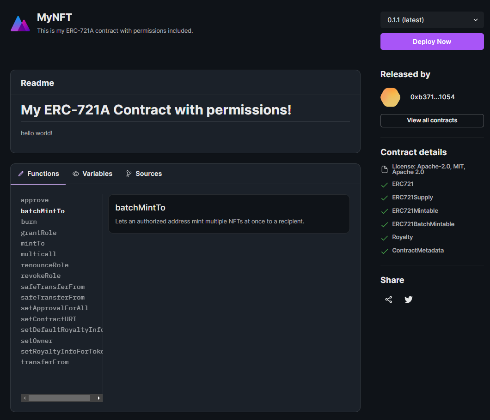

import QuickstartCard from "../../../src/components/QuickstartCard";

# Releasing Contracts with the CLI

Now our contract is built, let's use the [CLI](/cli) to release it, by running the following command:

```bash
npx thirdweb release
```

:::tip Detect Contract Extensions

Before you release, you can check what contract extensions you've implemented by running:

```bash
npx thirdweb detect
```

:::

This compiles and uploads our contract code to IPFS, and generates a URL for us to release it:


Open the generated link in your browser to go to the dashboard:


Click **Create Release**, and approve the [gasless transaction](/web3-sdk/advanced-features/gasless-transactions) to create a
versioned release of your contract.

By releasing it into our registry, we automatically create a landing page for your contract.
This page is publicly available for anyone to learn more about your contract and the functions available in it, and
anyone you share this page with can deploy their own copy of it too!



## Deploying Your Contract

Select a version of your contract and click **Deploy Now** to deploy it to one of our [supported blockchains](https://blog.thirdweb.com/guides/which-network-should-you-use).

Populate the fields of the `constructor`, select your desired network and click **Deploy Now**!

In our case, we are going to populate the contract parameters like so:

- `_name`: The name of our contract
- `_symbol`: The symbol or "ticker" given to our contracts tokens
- `_royaltyRecipient`: The address of the account that will receive the royalties from secondary sales
- `_royaltyBps`: The **basis points** (bps) that will be given to the royalty recipient for each secondary sale, e.g. 500 = 5%


### Contract Dashboard

When your contract is deployed, you'll be able to configure all of the
contract's unlocked features as we described in the [Configuring Smart Contracts](/getting-started/configuring-contracts) section.


You will also unlock the **Contract Explorer** where you can view all of the contracts' functions, see how to call them in the SDK, and run them directly from the dashboard.


