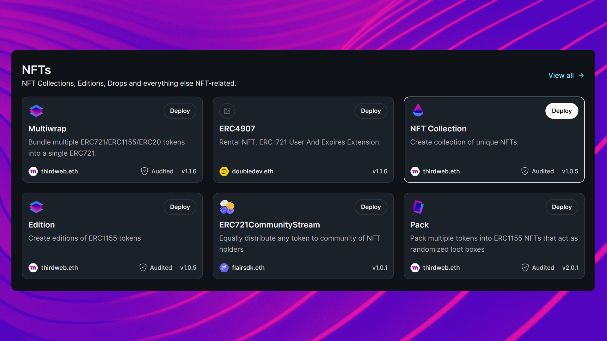
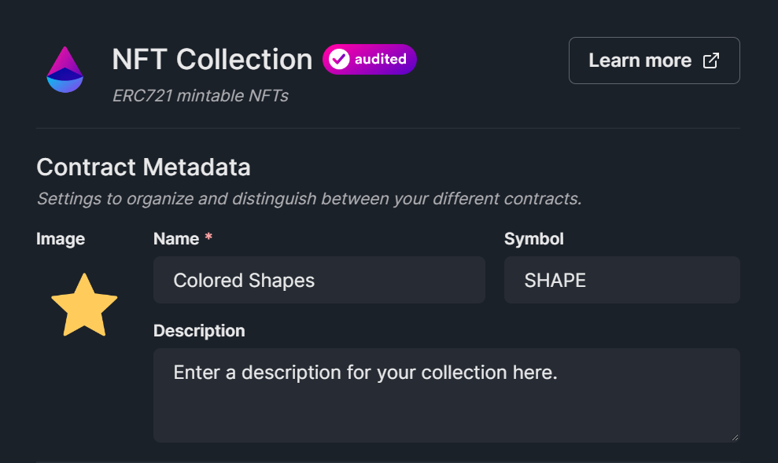

import QuickstartCard from "@components/QuickstartCard";
import TwitterCard from "@components/ShareOnTwitterCard";
import BeginContractJourney from "@components/getting-started/BeginContractJourney";

You may want to build a smart contract from the ground up,
or deploy a prebuilt solution that meets your needs;
we provide solutions for creating and deploying _any_ smart contract.

### Begin Your Journey

Select which card best describes your contract needs below.

<BeginContractJourney />

<!-- Selects Custom Contract -->

<div id="custom-contract-section">

<h3>Creating A Project</h3>

We can use the [CLI](/cli) to create a new project with a smart contract inside,
and [Solidity SDK]](/solidity) installed for us.

```bash
npx thirdweb create contract
```

This will kick off an interactive series of questions to help you get started:

- Give your project a name
- Select [`Hardhat`](https://hardhat.org/) as the framework
- Select `ERC721` as the [base contract](/solidity/base-contracts/erc-721/erc721base)
- Select `None` for optional [extensions](/solidity/extensions)

<h3 style={{ marginTop: 48 }}>Exploring The Project</h3>

The `create` command generates a new directory with your project name.
Open this directory in your text editor.

Inside the `contracts` folder, you'll find a `Contract.sol` file; this is our smart contract written in Solidity!

If we take a look at the code, you can see that our contract is inheriting the functionality of [ERC721Base](/solidity/base-contracts/erc-721/erc721base),
by:

1. [Importing](https://solidity-by-example.org/import/) the contract
2. [Inheriting](https://docs.soliditylang.org/en/v0.8.17/contracts.html#inheritance) the contract; by declaring that our contract `is ERC721Base`
3. Implementing any [required methods](/solidity/base-contracts/erc-721/erc721base#implementing-the-contract) such as the [`constructor`](https://docs.soliditylang.org/en/v0.8.17/contracts.html#constructors).

```solidity title="contracts/Contract.sol"
// SPDX-License-Identifier: MIT
pragma solidity ^0.8.0;

import "@thirdweb-dev/contracts/base/ERC721Base.sol";

contract Contract is ERC721Base {
    constructor(
        string memory _name,
        string memory _symbol,
        address _royaltyRecipient,
        uint128 _royaltyBps
    ) ERC721Base(_name, _symbol, _royaltyRecipient, _royaltyBps) {}
}
```

This inheritance pattern lets us use functionality from other contracts inside of ours, modify it, and add custom logic.

For example, our contract currently implements all of the logic inside
the [ERC721Base.sol](https://github.com/thirdweb-dev/contracts/blob/main/contracts/base/ERC721Base.sol) contract; which
implements the [ERC721A](https://github.com/thirdweb-dev/contracts/blob/main/contracts/eip/ERC721A.sol) standard with several useful [extensions](/solidity/extensions).

<h3 style={{ marginTop: 48 }}>Adding Extensions</h3>

[Extensions](/solidity/extensions) are a great way to add individual pieces of
functionality to your contract, such as [Permissions](/solidity/extension-contracts/permissions).

You can follow the same pattern as we did with the base contract to add an extension:

**Import**

```solidity
import "@thirdweb-dev/contracts/extension/PermissionsEnumerable.sol";
```

**Inherit**

```solidity
contract Contract is ERC721Base, PermissionsEnumerable {
    // ...
}
```

**Implement**

```solidity
contract Contract is ERC721Base, PermissionsEnumerable {
    constructor(
        string memory _name,
        string memory _symbol,
        address _royaltyRecipient,
        uint128 _royaltyBps
    ) ERC721Base(_name, _symbol, _royaltyRecipient, _royaltyBps) {
        // Give the contract deployer the "admin" role when the contract is deployed.
        _setupRole(DEFAULT_ADMIN_ROLE, msg.sender);
    }

    // Example: Only allow the "admin" role to call this function.
    function helloWorld() external onlyRole(DEFAULT_ADMIN_ROLE) {
        // ...
    }
}
```

That's it! 🥳 You just made an ERC721A NFT collection smart contract with permission controls!

<h2 style={{ marginTop: 64 }}>Deploying</h2>

Let's [deploy](/deploy) our contract to the blockchain, by running the following command:

```bash
yarn deploy
```

That's it! 🥳 This command does the following:

- Compiles your contract
- Uploads your contract source code ([ABI](https://docs.soliditylang.org/en/v0.8.17/abi-spec.html)) to
  [IPFS](https://docs.ipfs.tech/concepts/what-is-ipfs/)
- Opens the [dashboard](/dashboard) for you to select one of our
  [supported networks](https://blog.thirdweb.com/guides/which-network-should-you-use/) to deploy to


First, we need to enter the values for our contract's constructor:

- `_name`: The name of our contract
- `_symbol`: The symbol or "ticker" given to our contracts tokens
- `_royaltyRecipient`: The wallet address that will receive the royalties from secondary sales
- `_royaltyBps`: The **basis points** (_bps_) that will be given to the royalty recipient for each secondary sale, e.g. 500 = 5%

Finally, select the [network](https://blog.thirdweb.com/guides/which-network-should-you-use/)
you want to deploy to _(we recommend the Goerli test network)_, and click "Deploy Now".


Once your contract is deployed, you'll be redirected to your contract's dashboard:

<div className="row" style={{ marginBottom: 16 }}>
  <div className="col col--12" style={{ padding: 8, paddingBottom: 0 }}>
    <QuickstartCard
      name="Next Up: Welcome to Your Contract Dashboard"
      link="/getting-started/dashboard"
      image="/assets/product/dashboard.png"
    />
  </div>
</div>

</div>

<!-- Selects Prebuilt Contract -->

<div id="prebuilt-contract-section">

<h3>Explore Contracts</h3>

From the [explore page](https://thirdweb.com/explore), you can choose from
a curated collection of gas-optimized, audited, and
battle-tested smart contracts built by trusted open-source protocols and the thirdweb team;
ready to deploy in one click.

For example, let's select the [NFT Collection](https://thirdweb.com/thirdweb.eth/TokenERC721)
smart contract built by the thirdweb team:



From this page, we can discover the contract's features,
view its source code, see which [extensions](https://portal.thirdweb.com/solidity/extensions) it implements,
and deploy it to the [blockchain of our choice](https://blog.thirdweb.com/guides/which-network-should-you-use/).

Click the "Deploy Now" button to enter the deployment flow, and
enter the metadata of your smart contract; such as its name, symbol, image and description:



Finally, select the [network](https://blog.thirdweb.com/guides/which-network-should-you-use/) you want to deploy your
smart contract to and click "Deploy Now":


Once your contract is deployed, you'll be redirected to your contract's dashboard:

<div className="row" style={{ marginBottom: 16 }}>
  <div className="col col--12" style={{ padding: 8, paddingBottom: 0 }}>
    <QuickstartCard
      name="Next Up: Welcome to Your Contract Dashboard"
      link="/getting-started/dashboard"
      image="/assets/product/dashboard.png"
    />
  </div>
</div>
</div>

<!-- Selects Deploy Existing -->

<div id="deploy-contract-section">

<h3>Deploy Your Smart Contract</h3>

Use the [CLI](/cli) to [deploy](/deploy) your smart contract to the blockchain.

From the same directory as your `.sol` smart contract file, run the following command:

```bash
npx thirdweb deploy
```

That's it! 🥳 This command does the following:

- Compiles your contract
- Uploads your contract source code ([ABI](https://docs.soliditylang.org/en/v0.8.17/abi-spec.html)) to
  [IPFS](https://docs.ipfs.tech/concepts/what-is-ipfs/)
- Opens the [dashboard](/dashboard) for you to select one of our
  [supported networks](https://blog.thirdweb.com/guides/which-network-should-you-use/) to deploy to


Open the generated URL in your browser, and populate the fields of
your smart contract's [`constructor`](https://docs.soliditylang.org/en/v0.8.17/contracts.html#constructors).

Finally, select the [network](https://blog.thirdweb.com/guides/which-network-should-you-use/)
you want to deploy to _(we recommend the Goerli test network)_, and click "Deploy Now".


Once your contract is deployed, you'll be redirected to your contract's dashboard:

<div className="row" style={{ marginBottom: 16 }}>
  <div className="col col--12" style={{ padding: 8, paddingBottom: 0 }}>
    <QuickstartCard
      name="Next Up: Welcome to Your Contract Dashboard"
      link="/getting-started/dashboard"
      image="/assets/product/dashboard.png"
    />
  </div>
</div>
</div>
