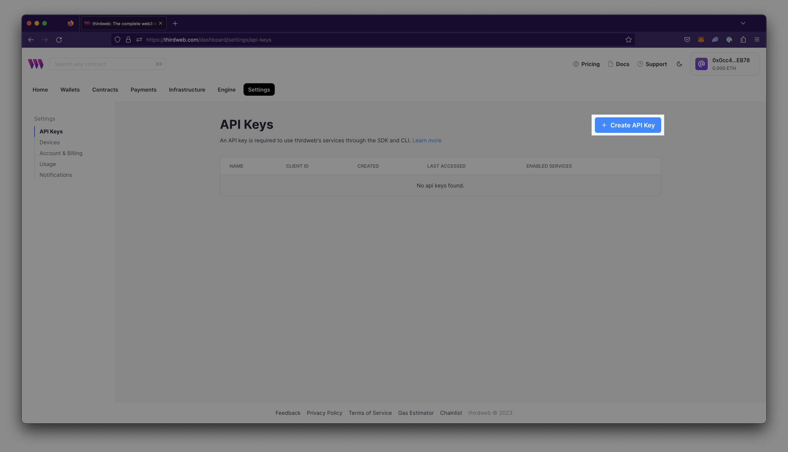
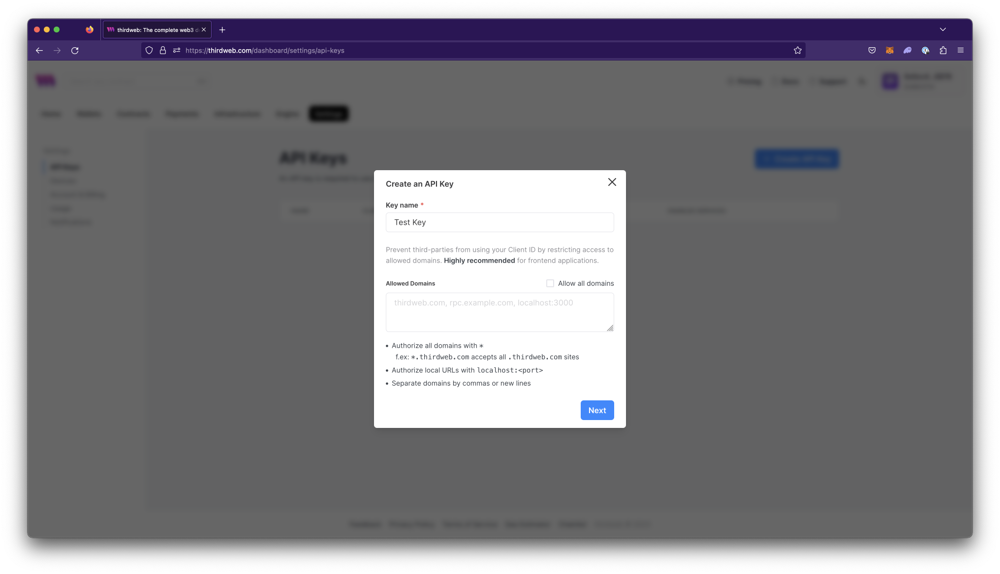
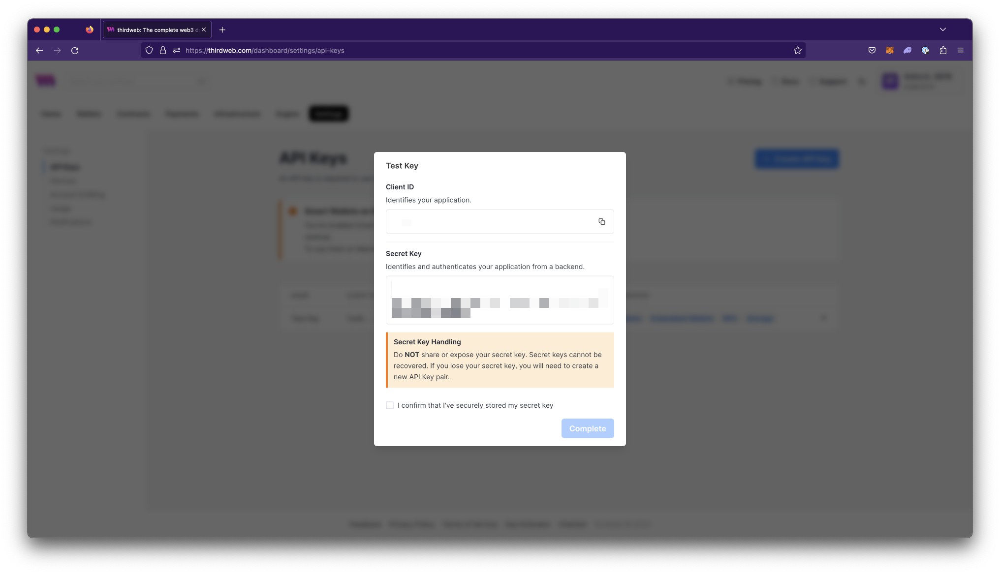
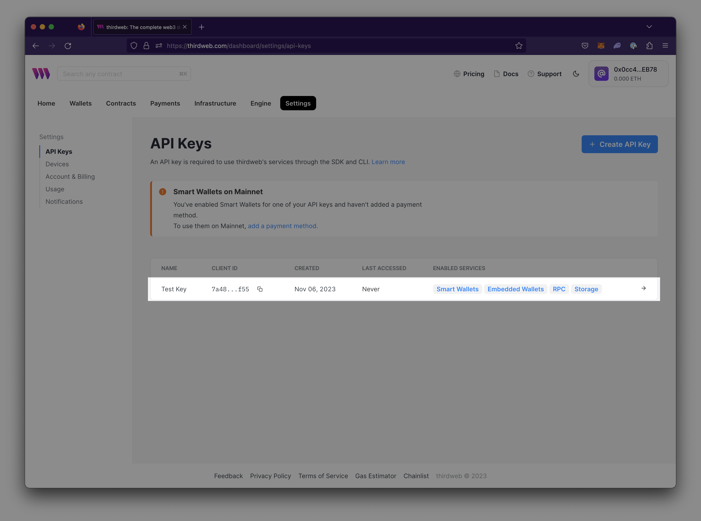
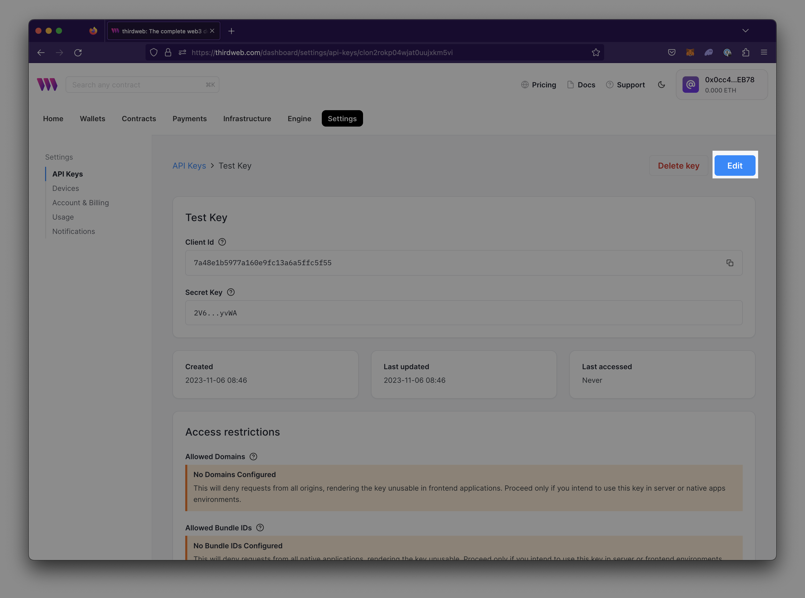
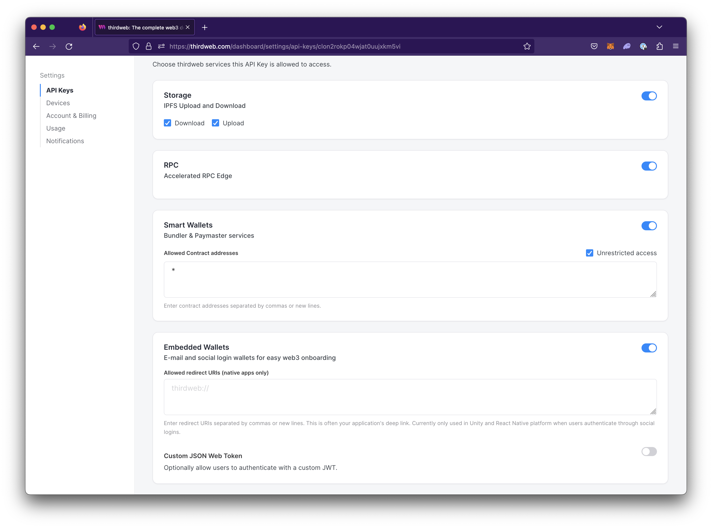
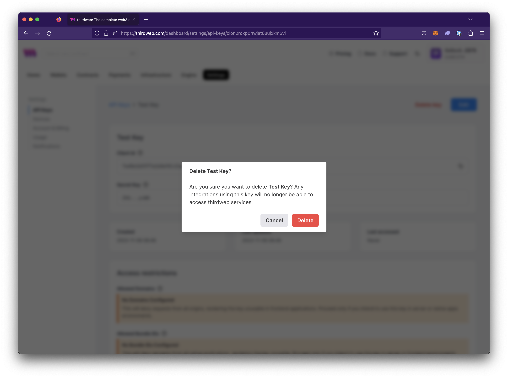
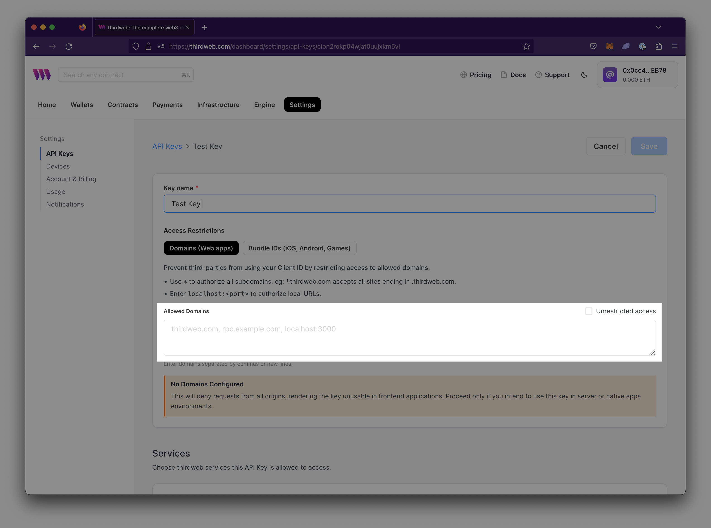
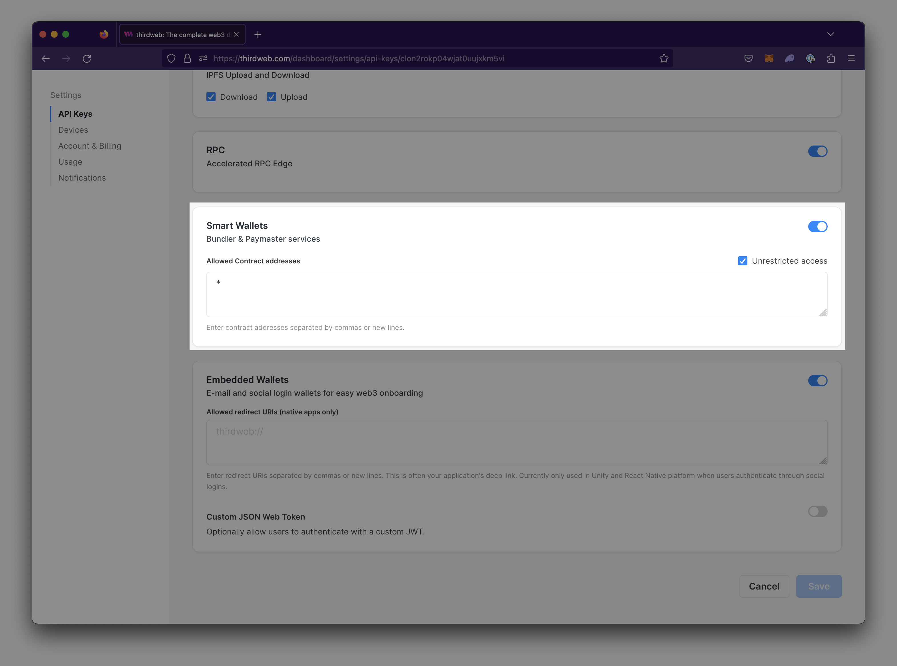

import Tabs from "@theme/Tabs";
import TabItem from "@theme/TabItem";

API Keys are required to use thirdweb’s infrastructure services including [Storage](/storage), [RPC Edge](/rpc-edge), [Smart Wallets](/smart-wallet), and [Embedded Wallets](/embedded-wallet).

API Keys allow you to:

- Upload and download assets to IPFS using Storage via dashboard, CLI, or SDKs
- Use a dedicated RPC Edge service in your application
- Use Bundler & Paymaster services for your Smart Wallets
- Enable various services such as signing in with Google, Facebook, Apple, Email, and Custom JWT when using Embedded wallets.

API Keys consists of two components:

- **Client ID**- Used to access the enabled thirdweb infrastructure services and identify your application using an app bundle ID (identifier for native apps) or domain (identifier for websites). Client IDs can be restricted to allow only specified domains and app bundle IDs to access the enabled services.
- **Secret Key**- Used to access the enabled thirdweb infrastructure services by identifying and authenticating your application from a backend. **Sharing or exposing this key to others is unsafe because it grants access to all services.**

---

### Create an API Key

To create an API key:

1.  Log in to the dashboard and navigate to **[Settings > API Keys](https://thirdweb.com/dashboard/settings/api-keys)** view.
2.  Select `Create API Key`

    

3.  Assign a descriptive name to the API Key.

4.  Input the domains you want to restrict your application to in Allowed Domains then select Next. **Restricting domains is highly recommended for any applications with client-side code or frontend applications.**

    1. Authorize all domains by selecting the checkbox or inputting `*` into the text field
    2. Authorize local URLs with `localhost:<port>`

    

5.  Store your secret key in a secure location and confirm that you have stored it by checking the checkbox then select Complete.

    

    :::warning
    Do not share secret keys. They grant access to all thirdweb services. Secret keys should only be used in backend environments like CLI, scripts, and servers. Never expose secret keys in client-side code due to the lack of access restrictions.\*\*
    :::

---

### Edit enabled services on API Keys

All services on API keys are enabled by default. If you want to disable any services or edit settings for each service:

1. Navigate to **[Settings > API Keys](https://thirdweb.com/dashboard/settings/api-keys)** on the dashboard.
2. Choose the API Key from which you want to enable or disable a Service.

   

3. Select `Edit` to enter the editor view.

   

4. Navigate to the Services section and enable the service and modify any services as needed.

   

5. Save changes.

---

### Use API keys in your application

<Tabs>
  <TabItem value="Typescript" label="Typescript" default>

When writing backends or scripts, you can use the secret key to instantiate the SDK:

```ts
// Read-only mode
const readOnlySdk = new ThirdwebSDK("goerli", {
  secretKey: "YOUR_SECRET_KEY", // Use secret key if using on the server, get it from dashboard settings
});
```

When using the Typescript SDK for frontend applications, use the client id:

```ts
import { ThirdwebSDK } from "@thirdweb-dev/sdk";
// Read-only mode
const readOnlySdk = new ThirdwebSDK("goerli", {
  clientId: "YOUR_CLIENT_ID", // Use client id if using on the client side, get it from dashboard settings
});
```

  </TabItem>
  <TabItem value="React" label="React">

When using the React SDK, you can use the client id to instantiate the SDK:

```jsx
import { ThirdwebProvider } from "@thirdweb-dev/react";

function MyApp() {
  return (
    <ThirdwebProvider
      activeChain="ethereum"
      // highlight-start
      clientId="your-client-id"
      // highlight-end
    >
      <YourApp />
    </ThirdwebProvider>
  );
}
```

  </TabItem>
  <TabItem value="Unity" label="Unity">

When using the Unity SDK, you can use the client id to instantiate the SDK:

```csharp
  ThirdwebSDK sdk = new ThirdwebSDK("goerli", 5, new ThirdwebSDK.Options()
  {
    clientId = "my-client-id", // you can get client id from dashboard settings
  });
```

  </TabItem>
  <TabItem value="Python" label="Python">

When using the Python SDK, you can use the secret key to instantiate the SDK:

```python
  from thirdweb import ThirdwebSDK
  from thirdweb.types import SDKOptions
  from dotenv.main import load_dotenv
  import os

    load_dotenv()
    secret_key = os.environ['SECRET_KEY']
    private_key = os.environ['PRIVATE_KEY']

    sdk = ThirdwebSDK.from_private_key(private_key, "mumbai", SDKOptions(secret_key=secret_key))
```

  </TabItem>
  <TabItem value="GO" label="GO">

When using the GO SDK, you can use the secret key to instantiate the SDK:

```go
  package main

  import (
	    "fmt"

	    "github.com/thirdweb-dev/go-sdk/v2/thirdweb"
  )

  func main() {
	    // Your secret key from the thirdweb api keys dashboard
	    secretKey := "..."

	    // Creates a new SDK instance to get read-only data for your contracts, you can pass:
	    // - a chain name (mainnet, rinkeby, goerli, polygon, mumbai, avalanche, fantom)
	    // - a custom RPC URL
	    sdk, err := thirdweb.NewThirdwebSDK("mumbai", &thirdweb.SDKOptions{
		    SecretKey: secretKey,
	    })
	    if err != nil {
		    panic(err)
    }

	    // Now we can interact with the SDK, like displaying the connected chain ID
	    chainId, err := sdk.GetChainID()
	    if err != nil {
		    panic(err)
	    }

	    fmt.Println("New SDK instance create on chain", chainId)
  }
```

  </TabItem>
</Tabs>

---

### Delete an API Key

To delete an API key:

1. Navigate to **[Settings > API Keys](https://thirdweb.com/dashboard/settings/api-keys/)** on the dashboard.
2. Choose the API Key you want to delete.

   

3. To delete an API key, select `Delete key` and confirm your intention to delete the key. The key will then be deleted.

   

Deleting an API key will invalidate it, making it no longer usable.

## Access Restrictions

API Keys provide two forms of access restrictions:

- Domain IDs: A domain ID is used to restrict access to the enabled thirdweb infrastructure services based on a specific domain. It serves as an identifier for websites.
- Bundle IDs: A bundle ID is a unique identifier used to restrict the Client ID to your Unity native or mobile application.

To modify the allowed Domain Id or Bundle Ids:

1. Navigate to **[Settings > API Keys](https://thirdweb.com/dashboard/settings/api-keys/)** on the dashboard.
2. Choose the API Key you want to modify restrictions on.

   

3. Select `Edit` to enter editor mode.

   

4. Enter the allowed domains the "Allowed Domains" field or switch to Bundle IDs to enter allowed Bundle IDs.

   

5. Save changes.

---

## Services

### Storage

By default, Storage services are enabled upon creation of the API Key.

Storage provides two sub-settings enabled by default on API Key creation.

- Upload - Enable uploading to Storage
- Download - Enable downloading from Storage

To disable Upload or Download:

1. Navigate to Settings > API Keys
2. Toggle the checkboxes in the Services > Storage settings

### RPC Edge

By default, RPC Edge services are enabled upon creation of the API Key.

To use RPC Edge in your application, see our [RPC Edge QuickStart](https://portal.thirdweb.com/rpc-edge/get-started) article.

### Smart Wallets

By default, Smart Wallet services are enabled upon creation of the API Key.

**Smart Wallet Destination Address**
A smart wallet destination address is allowed to send transactions to or interact with. These addresses can be smart contracts, EOAs (Externally Owned Accounts), or other smart wallet addresses. This feature is useful for restricting the smart wallet to only send transactions to your own contracts.

To restrict the contracts that Smart Wallet can interact with:

1. Navigate to Settings > API Keys
2. Locate Smart Wallet under Services
3. Input the contract address(es) into the 'Allowed Contract Addresses' field.

   

4. Save your new settings by selecting `Save`

### Embedded Wallets

By default, Embedded Wallet services are enabled upon creation of the API Key.

---

## FAQs

### Is the API Key free to use?

Yes, API Keys are free to create and use.

### Can I use thirdweb SDKs without an API key?

Yes, you can use thirdweb SDKs without an API key to override the default infrastructure. You will need to provide and pass in your own services to the SDKs.

### How do I get my bundle Id for a Unity Native or mobile (React Native) application?

If you are developing a Unity native or mobile application, you will need to obtain a `bundleId` to restrict the Client ID to your application.

- **Unity Native**, use either of the following options:
  - Log `Utils.GetBundleId()`.
  - Check the platform-specific options in your Project Settings. It is usually formatted as `com.companyName.productName` based on your top-level Project Settings.
- **Mobile (React Native)**

  - **Android**
    - Open the file `<Project>/android/app/build.gradle` and search for the term `applicationId`:
      ```jsx
      android {
          defaultConfig {
          applicationId "com.example.yourproject"
          ...
          }
        }
      ```
  - **iOS**
    - Open the file `<Project>/ios/<Project>/Info.plist` and search for `CFBundleIdentifier`:
      ```jsx
      <key>CFBundleIdentifier</key>
      <string>com.example.yourproject</string>
      ```
  - Programmatically retrieve `bundleId` for iOS or Android

    - Use the `expo-application` package from the `@thirdweb-dev/react-native sdk`

      ```jsx
      import * as Application from "expo-application";

      const bundleId = Application.applicationId;
      ```
