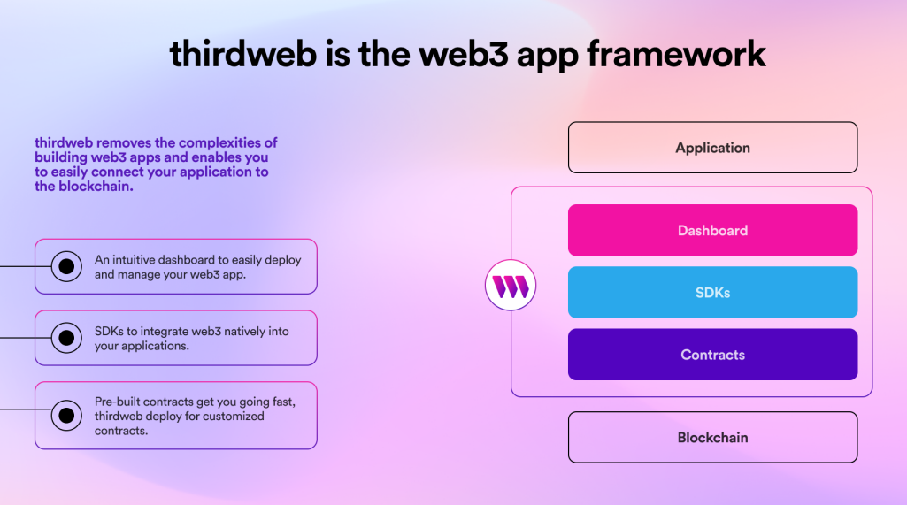
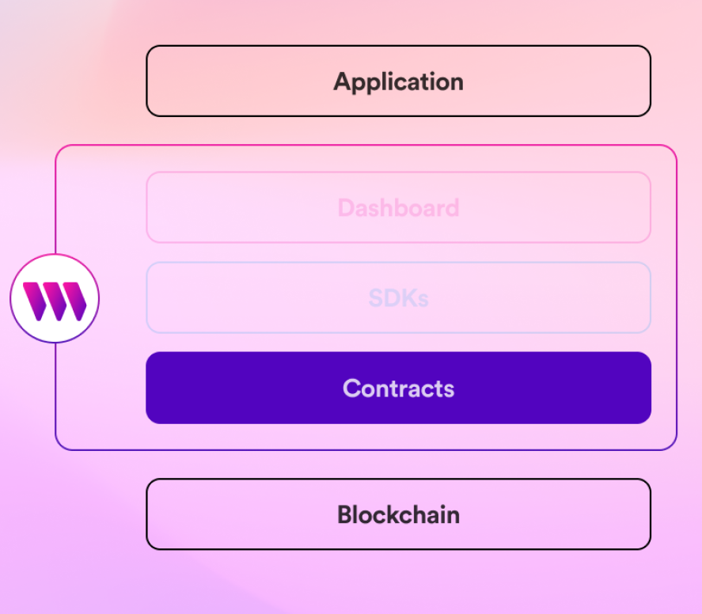
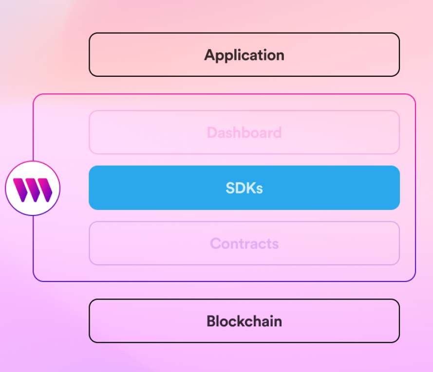
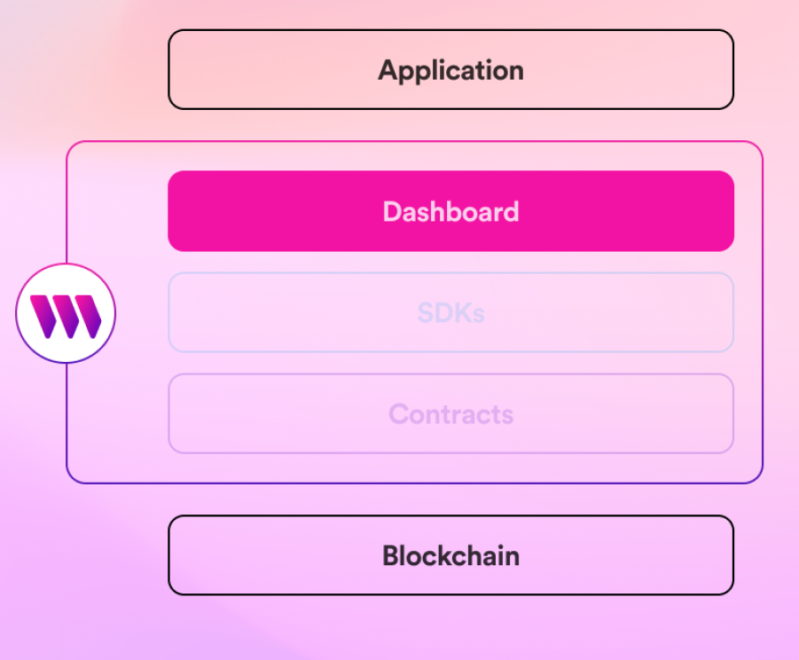

import SupportedLanguagesSection from "../../src/components/SupportedLanguagesSection";

# Welcome to thirdweb

thirdweb is a web3 application framework that enables you to easily build powerful, blockchain-based applications.

thirdweb offers **three core pillars**:

1. **Contracts**: Smart contracts for you to deploy and tooling to support building them.
2. **SDKs**: Ways to interact with your smart contract in your favorite languages.
3. **Dashboards**: Interfaces to easily view, configure, and interact with your smart contracts.

:::note

Want to just get started?
**[Here's the link to the installation page.](/installation)**

:::

## Contracts

Smart Contracts are the fundamental layer of any web3 project.

They’re responsible for storing your applications’ data on the blockchain.

You can deploy one of our [pre-built contracts](/pre-built-contracts), or use [thirdweb deploy](/thirdweb-deploy)
to give you all of thirdweb's capabilities in your own contract.

Our pre-built contracts are:

- 100% open source on GitHub
- Consistently audited by trusted firms
- Fully owned by the wallet used to deploy them
- **10x cheaper** to deploy (through the use of proxy contracts)

## SDKs

We provide SDKs to interact directly with your smart contracts in your favorite languages, including:

<SupportedLanguagesSection />

thirdweb's SDKs are the connection between your application and your smart contracts.

Our SDKs are designed to do the heavy lifting, including:

- Connecting to the blockchain via RPC
- Configuring networks you want to support
- Resolving metadata from IPFS
- Caching results for faster responses

## Dashboard

The [dashboard](https://thirdweb.com/dashboard) is an interface where you can deploy and interact with your smart contracts.

Within the dashboard, you can perform the most common admin operations for your projects without any code, such as:

- **Deploying** new smart contracts
- **Viewing** & **Configuring** your smart contracts
- **Performing common operations** such as minting NFTs or creating listings
- **Sharing** access to your smart contracts with your team

We also provide simple code snippets for you to get started, and give you visual representations of what is happening on your smart contract; like all the NFTs that have been minted in your collection, or what is currently listed on your marketplace.

