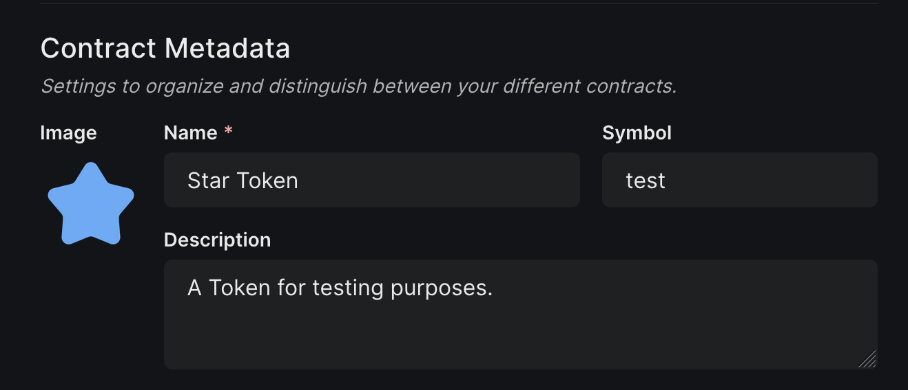
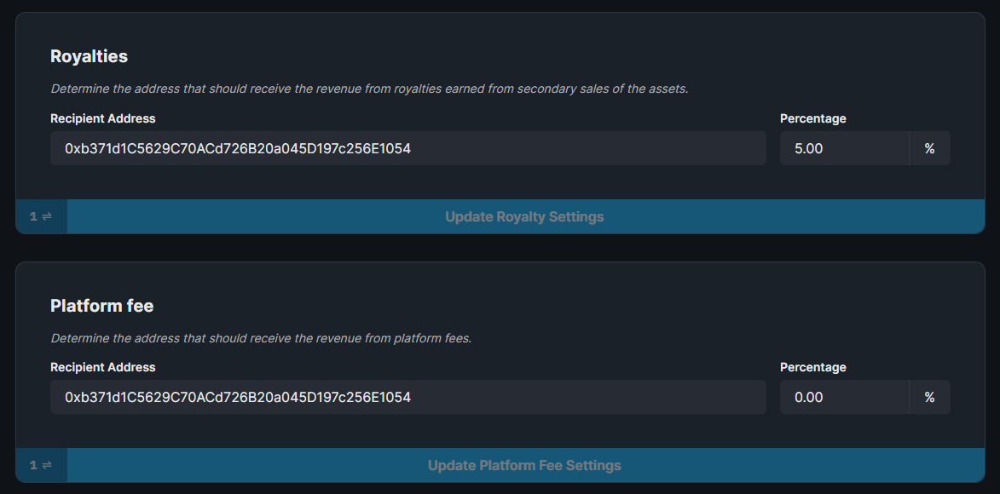

import DeployThisContractButton from "../../../../src/components/DeployThisContractButton";
import QuickstartCard from "../../../../src/components/QuickstartCard";

  <DeployThisContractButton
    link={"https://thirdweb.com/contracts/new/pre-built/token/signature-drop"}
    contractType="signature-drop"
  />

The Signature Drop contract uses the [ERC-721A](https://www.erc721a.org/) standard to
release a collection of unique one-of-one NFTs with lower gas fees for your community
compared to the regular ERC-721 standard used in the [NFT Drop](/pre-built-contracts/nft-drop).

You **lazy-mint** your NFTs by uploading the metadata and configuring a **single** claim phase, laying out the rules for how your users can claim
NFTs from your drop; such as an allowlist, release date, or [delayed reveal](/web3-sdk/advanced-features/delayed-reveal).

The "signature" in the name refers to the [signature-based minting](/web3-sdk/advanced-features/on-demand-minting) feature,
that allows you to grant users the ability to mint NFT(s) based on a custom set of criteria, checked
on-demand. This feature is **optional** and separate from the claim phase conditions.

  <QuickstartCard
    name="Learn more about signature-based minting"
    link="/web3-sdk/advanced-features/on-demand-minting"
    image="/assets/icons/sdks.png"
  />

## Use Cases & Examples

You could use the Signature Drop contract to:

- Release a gas-optimized PFP Collection where each NFT has a different combination of traits

- Allow users that meet certain criteria to be able to claim NFTs from your drop

  

    <QuickstartCard
      name="Video - Build An ERC-721A NFT Drop with signature-based Minting"
      link="/web3-sdk/advanced-features/on-demand-minting"
      image="/assets/icons/education.png"
    />
  

  

    <QuickstartCard
      name="Guide: Release An ERC-721A NFT Drop Using the Signature Drop Contract"
      link="/web3-sdk/advanced-features/on-demand-minting"
      image="/assets/icons/education.png"
    />
  

## Smart Contract Design

For a detailed exploration of how the signature drop smart contract works, why it was built,
and it's limitations, visit our [Signature Drop Design Doc](/contracts/design/SignatureDrop)!

  

    <QuickstartCard
      name="Signature Drop Smart Contract Design Document"
      link="/contracts/design/SignatureDrop"
      image="/assets/icons/drop.png"
    />
  

## Using the Contract in the SDK

This page outlines how you can create and configure your signature drop contract using the [dashboard](https://thirdweb.com/dashboard).

Once deployed, you can use our [Web3 SDK](/web3-sdk) to interact with your contract.

  

    <QuickstartCard
      name="Using the Signature Drop Contract in the Web3 SDK"
      link="/web3-sdk/interacting-with-contracts/signature-drop"
      image="/assets/icons/drop.png"
    />
  

## Creating & Configuring the Signature Drop

Learn how to create and configure your smart contract using the [dashboard](https://thirdweb.com/dashboard).

### Creating a Signature Drop Contract

Deploy the signature drop contract to any of our
[supported networks](/guides/which-network-should-you-use) using the button below.

  <DeployThisContractButton
    link={"https://thirdweb.com/contracts/new/pre-built/token/signature-drop"}
    contractType="signature-drop"
  />

### Lazy Minting NFTs

Lazy minting is the process of uploading your metadata for your NFT(s) without minting them _yet_.

This is useful for when you want _other_ wallets to mint NFTs from your drop into their own wallets.

To lazy mint NFT(s), click **Create** to lazy-mint a single NFT, or **Batch Upload** to lazy-mint multiple NFTs at once.

To get started, you can use one of our example files for [CSV](https://thirdweb.com/example.csv) or [JSON](https://nightly.thirdweb.com/example.json) metadata.

### Delayed Reveals

Delayed reveals allow you to reveal the contents of the NFT to the user later at a specific date and show a placeholder asset in the meantime.

- **Reveal upon mint**: Collectors will immediately see the final NFT when they complete the minting.
- **Delayed Reveal**: Collectors will mint your placeholder image, then you reveal it at a later time.

You have the option to add a delayed reveal to a batch of NFTs after you batch upload them.

### Setting the Claim Phase

A claim phase is a set of conditions that define when and how your users can claim an NFT from your drop.

**The signature drop contract only supports one claim phase**, (this claim phase can be edited later).

Within a claim phase, you can define:

- When the claim phase will start
- How many NFTs do you want to drop
- How much do you want to charge per NFT
- What currency do you want to use
- Which wallet addresses are allowed to mint (allowlist)
- How many NFTs can be claimed per transaction
- How many seconds do wallets have to wait between claims

To configure the claim phase, click the **Claim Phases** tab and **Add Claim Phase**.

### Contract Metadata

To configure the image, name, and description of the contract, click the **Settings** tab:

### Royalty & Platform Fees

From the **Settings** tab, you also configure both the [royalty fee](/dashboard/contract-settings) and [platform fee](/dashboard/contract-settings).

