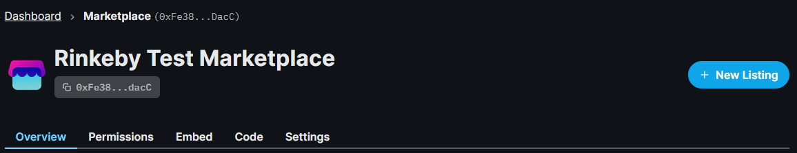

import DeployThisContractButton from "../../../src/components/DeployThisContractButton";
import QuickstartCard from "../../../src/components/QuickstartCard";

# Marketplace

  <DeployThisContractButton
    link={
      "https://thirdweb.com/contracts/new/pre-built/marketplace/marketplace"
    }
    contractType="marketplace"
  />

A Marketplace is a contract where you can buy and sell NFTs, such as OpenSea or Rarible.

The Marketplace contract allows users to list your NFTs for direct sale or auction.
Other users can place offers/bids or buy the NFTs for the specified amount in your listing.
Users can also list _their_ NFTs for sale on the marketplace if you allow them to.

## Use Cases & Examples

You could use the Marketplace contract to:

- Sell your NFTs on your marketplace
- Create auctions where the highest bidder, after a certain period, wins the NFT
- Create an open marketplace where any user can list NFTs for sale, like OpenSea.

  

    <QuickstartCard
      name="Guide: Create an NFT Marketplace with the SDK"
      link="https://portal.thirdweb.com/guides/nft-marketplace-with-typescript-next"
      image="/assets/icons/education.png"
    />
  

  

    <QuickstartCard
      name="Guide: List an NFT For Auction and Place a Bid with the SDK"
      link="https://portal.thirdweb.com/guides/auction-button-react"
      image="/assets/icons/education.png"
    />
  

## Smart Contract Design

For a detailed exploration of how the marketplace smart contract works, why it was built,
and it's limitations, visit our [Marketplace Design Doc](/contracts/design/Marketplace)!

  

    <QuickstartCard
      name="Marketplace Smart Contract Design Document"
      link="/contracts/design/Marketplace"
      image="/assets/icons/drop.png"
    />
  

## Using the Contract in the SDK

This page outlines how you can create and configure your marketplace contract using the [dashboard](https://thirdweb.com/dashboard).

You can also use our [SDK](/sdk) to create and interact with your contract.

  

    <QuickstartCard
      name="Using the Marketplace Contract in the SDK"
      link="/sdk/interacting-with-contracts/marketplace"
      image="/assets/icons/marketplace.png"
    />
  

## Creating & Configuring the Marketplace

Learn how to create and configure your smart contract using the [dashboard](https://thirdweb.com/dashboard).

### Creating a Marketplace Contract

Deploy the marketplace contract to any of our
[supported networks](/guides/which-network-should-you-use) using the button below.

  <DeployThisContractButton
    link={
      "https://thirdweb.com/contracts/new/pre-built/marketplace/marketplace"
    }
    contractType="marketplace"
  />

## Direct & Auction Listings

There are two types of listings in our pre-built marketplace contract.

### Direct Listings

Direct listings are low commitment, high-frequency listings; people constantly list and de-list their NFTs
based on market trends. So, the listed NFTs and offer amounts are not escrowed in the Marketplace
to keep the seller's NFTs and the buyer's currency liquid.

This allows users to list NFTs for sale just by signing an approval; giving them the freedom to list the
same NFT in multiple marketplaces, e.g. this Marketplace contract, OpenSea, etc. at the same time.

**Key elements of a direct listing:**

- Sellers list their NFT for direct sale with the price users can buy it for.
- The NFT remains in your wallet, but you provide permission for the marketplace contract to move the NFT.
- If a user pays the asking price, the NFT will be transferred to them, and the seller will receive the funds.
- Users can make offers below the asking price, and the listing can have multiple offers. The seller can choose to accept an offer at any time.
- Users can cancel their bids at any time.

### Auction Listings

Auction listings are high commitment, low-frequency listings.
The seller and bidders respect the auction window, and recognize that their NFTs / bid amounts will be
illiquid for the auction duration, and expect a guaranteed payout at auction closing — the auctioned
items for the bidder, and the winning bid amount for the seller.

Both the NFTs that are listed for sale in an auction and the highest bid at any given moment are escrowed
in the market.

**Key elements of an auction listing:**

- Sellers list their NFT for auction with a minimum asking price.
- The NFT is transferred to escrow in the marketplace contract until the auction is canceled or finished.
- Other users can place bids until the auction is closed.
- Users can only make a bid if it is higher than the current highest bid (or asking price if there are no bids). Once made, bids cannot be withdrawn, and the auction contract holds the funds in escrow.
- At the end of the auction, no more bids can be placed.
- At the end of the auction, the `closeAuction` function needs to be called twice; once for the **buyer** and
  once for the **seller**.

## Creating a Listing

Create a new listing by clicking the **New Listing** button in the dashboard.

