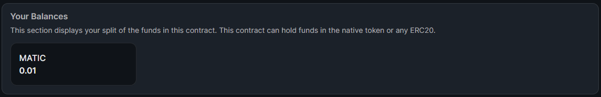

import DeployThisContractButton from "../../../src/components/DeployThisContractButton";
import QuickstartCard from "../../../src/components/QuickstartCard";

# Split

  <DeployThisContractButton
    link={"https://thirdweb.com/contracts/new/pre-built/governance/split"}
    contractType="split"
  />

The Split contract lets you specify multiple wallet addresses that are recipients of any revenue or royalty split.
You define what percentage of funds that are sent to this address to each recipient you specify.

For example, you could define 0x1 and 0x2 and configure them to receive 50% of the funds to this wallet.
The split contract will store the funds and will split the funds between the two recipients when a user
calls the `distribute` function.

This contract can also hold native currencies (ETH and MATIC) and any ERC20 tokens.

The Split contract is a way to quickly create a royalty split to hold and distribute funds securely.
You can use it to store funds by sending them directly to the contract,
using its address as the recipient address of other contracts,
or sending funds to a standard wallet.

## Use Cases & Examples

You could use the Split contract to:

- Use as a "team wallet", where funds are distributed between the members of your team with set percentages.
- Share revenue from your primary minting in an NFT drop
- Share revenue from our royalty sales with members of your team, such as an artist
- Any programmatic split of revenue

  

    <QuickstartCard
      name="Video: Build a Royalty Split with the Split Contract"
      link="https://www.youtube.com/watch?v=QDWlGOocKm8"
      image="/assets/icons/education.png"
    />
  

  

    <QuickstartCard
      name="Guide: Deploy an NFT Drop with Revenue Share"
      link="https://portal.thirdweb.com/guides/nft-drop-with-revenue-share"
      image="/assets/icons/education.png"
    />
  

## Using the Contract in the SDK

This page outlines how you can create and configure your split contract using the [dashboard](https://thirdweb.com/dashboard).

You can also use our [SDK](/sdk) to create and interact with your contract.

  

    <QuickstartCard
      name="Using the Split Contract in the SDK"
      link="/sdk/interacting-with-contracts/split"
      image="/assets/icons/split.png"
    />
  

## Creating & Configuring the Split

Learn how to create and configure your smart contract using the [dashboard](https://thirdweb.com/dashboard).

### Creating a Split Contract

Deploy the split contract to any of our
[supported networks](/guides/which-network-should-you-use) using the button below.

  <DeployThisContractButton
    link={"https://thirdweb.com/contracts/new/pre-built/governance/split"}
    contractType="split"
  />

### View Recipients

You can view the recipients of your Split contract in the **Overview** button on the dashboard.

### View Balance

In the **Overview** tab of your split in the dashboard, you can see **your** (the wallet you're currently connected with) split of the funds in this contract.

### Distribute Funds

**Any wallet** can distribute funds to the split recipients.

To do so, click the **Distribute Funds** button.

