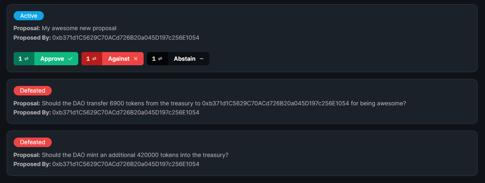

import DeployThisContractButton from "../../../src/components/DeployThisContractButton";
import QuickstartCard from "../../../src/components/QuickstartCard";

# Vote

  <DeployThisContractButton
    link={"https://thirdweb.com/contracts/new/pre-built/governance/vote"}
    contractType="vote"
  />

The Vote contract is designed for groups such as DAOs to vote on proposals.

To use the Vote contract, you also need to have an existing ERC-20 token,
such as our [token contract](/pre-built-contracts/token) to act as the governance token.

## Use Cases & Examples

You could use the Vote contract to:

- Vote to decide on organizational changes
- Vote on managing and distributing funds in a treasury
- Vote on any other proposal in an organization, such as a DAO

  

    <QuickstartCard
      name="Course: Build your own DAO with just JavaScript"
      link="https://buildspace.so/daos"
      image="/assets/icons/education.png"
    />
  

  

    <QuickstartCard
      name="Guide: Build a treasury and governance for your DAO"
      link="/guides/build-treasury-and-governance-for-your-dao"
      image="/assets/icons/education.png"
    />
  

## Using the Contract in the SDK

This page outlines how you can create and configure your vote contract using the [dashboard](https://thirdweb.com/dashboard).

You can also use our [Web3 SDK](/web3-sdk) to create and interact with your contract.

  

    <QuickstartCard
      name="Using the Vote Contract in the Web3 SDK"
      link="/web3-sdk/interacting-with-contracts/vote"
      image="/assets/icons/vote.png"
    />
  

## Creating & Configuring the Vote

Learn how to create and configure your smart contract using the [dashboard](https://thirdweb.com/dashboard).

### Creating a Vote Contract

Deploy the vote contract to any of our
[supported networks](/guides/which-network-should-you-use) using the button below.

  <DeployThisContractButton
    link={"https://thirdweb.com/contracts/new/pre-built/governance/vote"}
    contractType="vote"
  />

### Creating Proposals

To create a new proposal for people to vote on, click **Create Proposal**

### Viewing Proposals

You can view all the active and past proposals from the **Overview** tab.

### Voting on Proposals

If you hold the governance token, you can vote on active proposals from the **Overview** tab.

