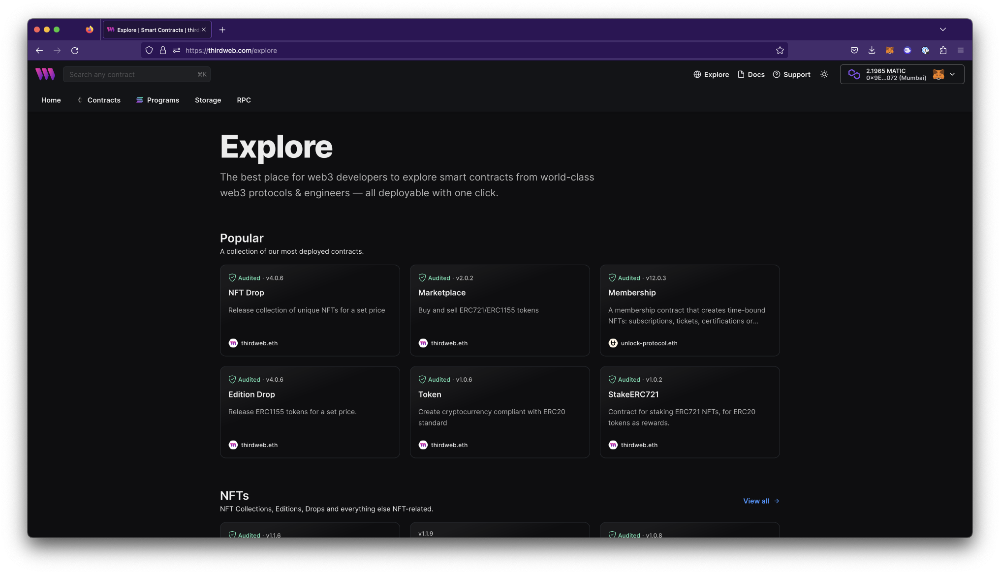
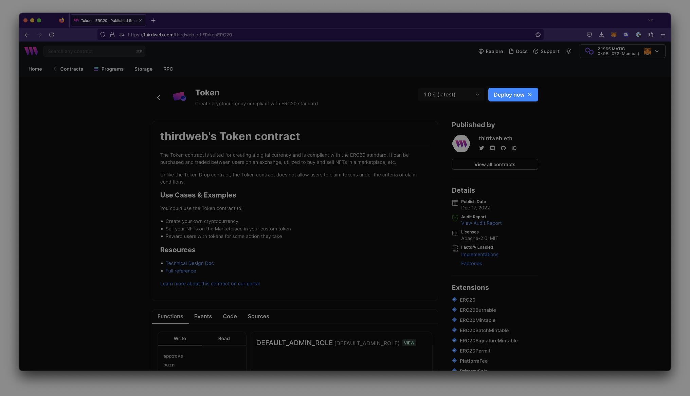
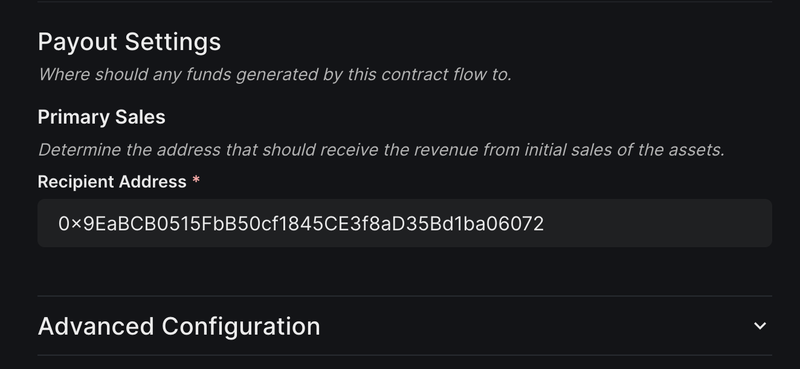
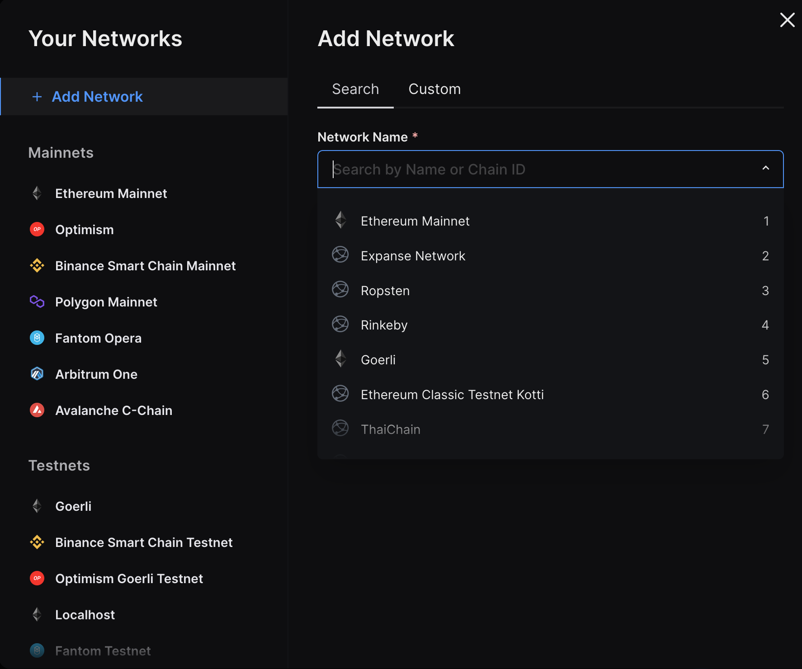
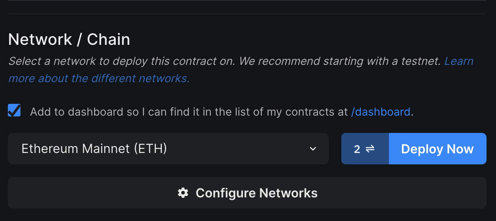

## Deploying a Contract From Explore

To get started, follow these steps:

### Step 1: Connect your Crypto Wallet

Navigate to the [Thirdweb Explore Directory](https://thirdweb.com/explore) and connect the crypto wallet you want to deploy from.

### Step 2. Choose a Contract to deploy.

Browse through the available contracts and choose the one you want to deploy. Clicking on a contract will take you to its overview page, where you can find additional details such as the publisher, audit report, available extensions, and more.

For this example, let's deploy a Token contract. Click the blue 'Deploy now' button on the top left to deploy the contract.

### Step 3. Configure contract metadata

After clicking the 'Deploy now' button, a screen will appear prompting you to fill out the contract's details. Fill out the metadata parameters such as its image, name, symbol, and description.

:::info
You can update your contract's metadata after deploying in the `settings` tab of the [dashboard](/dashboard).
:::

### Step 4. Configure payout settings

Some contracts will have options for payout settings. Choose a recipient for primary sales. The recipient for primary sales will default to the wallet connected, but you may change that if needed. To add platform fees, you may configure that in the advanced configuration dropdown.

:::info
You can update your contract's payout settings after deploying in the `settings` tab of the [dashboard](/dashboard).
:::

### Step 5. Configure network and deploy

Select the network you want to deploy to. If your wallet is not set to the network you want to deploy to, it will prompt you to switch your network in your wallet. If you want to deploy to a network not listed in the dropdown, click on 'Configure Networks' and search for or add a custom network.

After choosing your network, click the blue 'Deploy now' button. This will prompt you to sign a transaction in your crypto wallet.

### Step 6. Manage Your Contract

Your contract is now deployed and added to your [dashboard](/dashboard) where you can manage and configure additional extensions in your contract, view analytics, and view code snippets to start building your project.

## Need Help?

If you have any questions or need help getting started, please [contact our support team](https://support.thirdweb.com).
