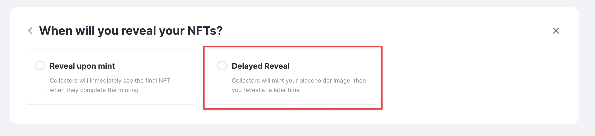
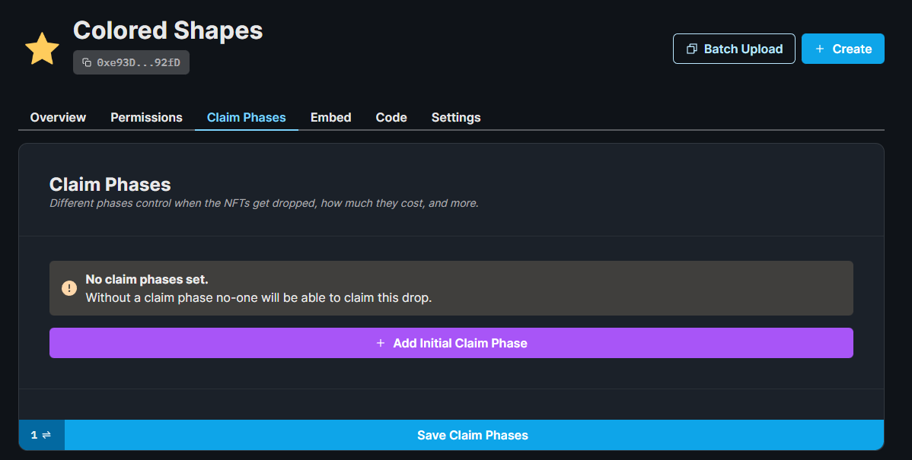
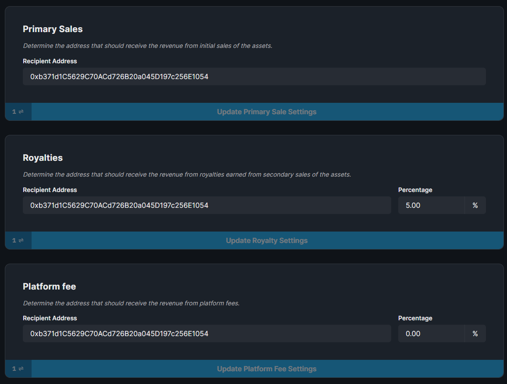

import DeployThisContractButton from "@components/DeployThisContractButton";
import QuickstartCard from "@components/QuickstartCard";
import YoutubeEmbed from "@components/YoutubeEmbed";

# NFT Drop

  <DeployThisContractButton
    link={"https://thirdweb.com/contracts/new/pre-built/drop/nft-drop"}
    contractType="nft-drop"
  />

  

    

      The NFT Drop contract is ideal when you want to release a collection of
      unique NFTs using the{" "}
      <a href="https://eips.ethereum.org/EIPS/eip-721">ERC721</a>.
    

    It allows you to define a set of conditions called <b>claim phases</b> in a sequence
    that defines when and how your users can claim an NFT from your drop; including
    allowlists, release dates, claim limits, and delayed reveals.
  

  

    <YoutubeEmbed link={"https://www.youtube.com/embed/11waisJqLik"} />
  

When you add NFTs to your drop contract, they are **not** minted at this point.
You prepare everything for your users by **lazy minting** them, so that other wallets can mint them

## Use Cases & Examples

You could use the NFT Drop contract to:

- Release a PFP Collection where each NFT has a different combination of traits
- Release NFTs of your artwork, and have your community mint them for a price
- Create a restricted-access NFT drop, where only a specified list of wallets can claim NFTs

  

    <QuickstartCard
      name="Guide: Create an NFT Drop with an Allowlist & Multiple Claim Phases"
      link="https://blog.thirdweb.com/guides/create-nft-drop-with-claim-phases"
      image="/assets/icons/education.png"
    />
  

  

    <QuickstartCard
      name="Guide: Create an NFT Drop with Delayed Reveal"
      link="https://blog.thirdweb.com/guides/nft-drop-with-delayed-reveal"
      image="/assets/icons/education.png"
    />
  

  

    <QuickstartCard
      name="Guide: Deploy An NFT Drop on the Optimism Network"
      link="https://blog.thirdweb.com/guides/how-to-create-and-setup-a-claimable-nft-drop-on-optimism/"
      image="/assets/icons/education.png"
    />
  

  

    <QuickstartCard
      name="Guide: Sell NFTs in a Custom ERC20 Token"
      link="https://blog.thirdweb.com/guides/how-to-sell-nfts-in-a-custom-erc20-token/"
      image="/assets/icons/education.png"
    />
  

## Smart Contract Design

For a detailed exploration of how our drop smart contracts work, why they were built,
and their limitations, visit our [Drop Design Doc](/contracts/design/Drop)!

  

    <QuickstartCard
      name="Drop Smart Contract Design Document"
      link="/contracts/design/Drop"
      image="/assets/icons/drop.png"
    />
  

## Using the Contract in the SDK

This page outlines how you can create and configure your NFT drop contract using the [dashboard](https://thirdweb.com/dashboard).

You can also use our [SDK](/sdk) to create and interact with your contract.

  

    <QuickstartCard
      name="Using the NFT Drop Contract in the SDK"
      link="/sdk/interacting-with-contracts/nft-drop"
      image="/assets/icons/drop.png"
    />
  

## Creating & Configuring the NFT Drop

Learn how to create and configure your smart contract using the [dashboard](https://thirdweb.com/dashboard).

### Creating a NFT Drop Contract

Deploy the NFT drop contract to any of our
[supported networks](https://blog.thirdweb.com/guides/which-network-should-you-use) using the button below.

  <DeployThisContractButton
    link={"https://thirdweb.com/contracts/new/pre-built/token/nft-drop"}
    contractType="nft-drop"
  />

### Lazy Minting NFTs

Lazy minting is the process of uploading your metadata for your NFT(s) without minting them _yet_.

This is useful for when you want _other_ wallets to mint NFTs from your drop into their own wallets.

To lazy mint NFT(s), click **Create** to lazy-mint a single NFT, or **Batch Upload** to lazy-mint multiple NFTs at once.

To get started, you can use one of our example files for [CSV](https://thirdweb.com/example.csv) or [JSON](https://nightly.thirdweb.com/example.json) metadata.

  

    <QuickstartCard
      name="Guide: Batch Upload NFT Metadata"
      link="https://blog.thirdweb.com/guides/how-to-batch-upload/"
      image="/assets/icons/education.png"
    />
  

### Delayed Reveals

Delayed reveals allow you to reveal the contents of the NFT to the user later at a specific date and show a placeholder asset in the meantime.

- **Reveal upon mint**: Collectors will immediately see the final NFT when they complete the minting.
- **Delayed Reveal**: Collectors will mint your placeholder image, then you reveal it at a later time.

  

    <QuickstartCard
      name="Guide: Release an NFT drop with Delayed Reveal"
      link="https://blog.thirdweb.com/guides/nft-drop-with-delayed-reveal/"
      image="/assets/icons/education.png"
    />
  

You have the option to add a delayed reveal to a batch of NFTs after you batch upload them.

### Setting Claim Phases

A claim phase is a set of conditions that define when and how your users can claim an NFT from your drop.

**The NFT Drop contract supports multiple sequential claim phases**.

Within a claim phase, you can define:

- When the claim phase will start
- How many NFTs do you want to drop
- How much do you want to charge per NFT
- What currency do you want to use
- Which wallet addresses are allowed to mint (allowlist)
- How many NFTs can be claimed per transaction
- How many seconds do wallets have to wait between claims

To configure the claim phase, click the **Claim Phases** tab and **Add Claim Phase**.

### Contract Metadata

To configure the image, name, and description of the contract, click the **Settings** tab:

### Royalty & Platform Fees

From the **Settings** tab, you also configure the [royalty fee](/dashboard/contract-settings),
[primary sales recipient](/dashboard/contract-settings#primary-sales-recipient)
and [platform fee](/dashboard/contract-settings).

