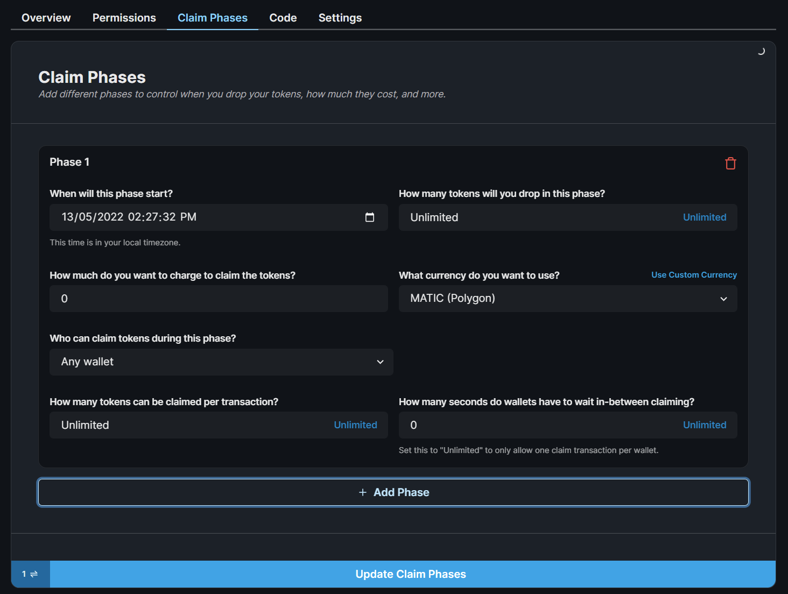

import DeployThisContractButton from "@components/DeployThisContractButton";
import QuickstartCard from "@components/QuickstartCard";

# Token Drop

  <DeployThisContractButton
    link={"https://thirdweb.com/contracts/new/pre-built/drop/token-drop"}
    contractType="token-drop"
  />

The Token Drop contract is a way of releasing your [ERC20](https://eips.ethereum.org/EIPS/eip-20)
tokens for a set price.
It allows you to define the conditions for when and how your users can claim
your tokens; including allowlists, release dates, and claim limits.

In the Token Drop, you define the price for your tokens in each claim phase and can set a
limit on how many tokens you want to release. Other users can then claim your tokens under
the conditions you defined.

## Use Cases & Examples

You could use the Token Drop contract to:

- Release your new cryptocurrency for a set price such as 1 MATIC per token.
- Allow a specific set of wallets to claim your ERC20 tokens before releasing them to the public.
- Allow users to claim your tokens up until a specific date.

  

    <QuickstartCard
      name="Guide: Create A Token Drop Claim Page"
      link="https://blog.thirdweb.com/guides/claim-erc20-token-nextjs"
      image="/assets/icons/education.png"
    />
  

  

    <QuickstartCard
      name="Example Repo: Token Drop"
      link="https://github.com/thirdweb-example/token-drop"
      image="/assets/icons/education.png"
    />
  

## Smart Contract Design

For a detailed exploration of how our drop smart contracts work, why they were built,
and their limitations, visit our [Drop Design Doc](/contracts/design/Drop)!

  

    <QuickstartCard
      name="Drop Smart Contract Design Document"
      link="/contracts/design/Drop"
      image="/assets/icons/drop.png"
    />
  

## Using the Contract in the SDK

This page outlines how you can create and configure your token drop contract using the [dashboard](https://thirdweb.com/dashboard).

You can also use our [SDK](/sdk) to create and interact with your contract.

  

    <QuickstartCard
      name="Using the Token Drop Contract in the SDK"
      link="/sdk/interacting-with-contracts/token-drop"
      image="/assets/icons/drop.png"
    />
  

## Creating & Configuring the Token Drop

Learn how to create and configure your smart contract using the [dashboard](https://thirdweb.com/dashboard).

### Creating a Token Drop Contract

Deploy the token drop contract to any of our
[supported networks](https://blog.thirdweb.com/guides/which-network-should-you-use) using the button below.

  <DeployThisContractButton
    link={"https://thirdweb.com/contracts/new/pre-built/token/token-drop"}
    contractType="token-drop"
  />

### Setting Claim Phases

A claim phase is a set of conditions that define when and how your users can mint your tokens.

You can have multiple claim phases that occur in sequence.

For each claim phase, you can define:

- When the claim phase will start
- How many tokens do you want to drop
- How much do you want to charge per token
- What currency do you want to charge in
- Which wallet addresses are allowed to claim tokens (allowlist)
- How many tokens can be claimed per transaction
- How many seconds do wallets have to wait between claims

You can configure the claim phases from the dashboard's **Claim Phases** tab.

