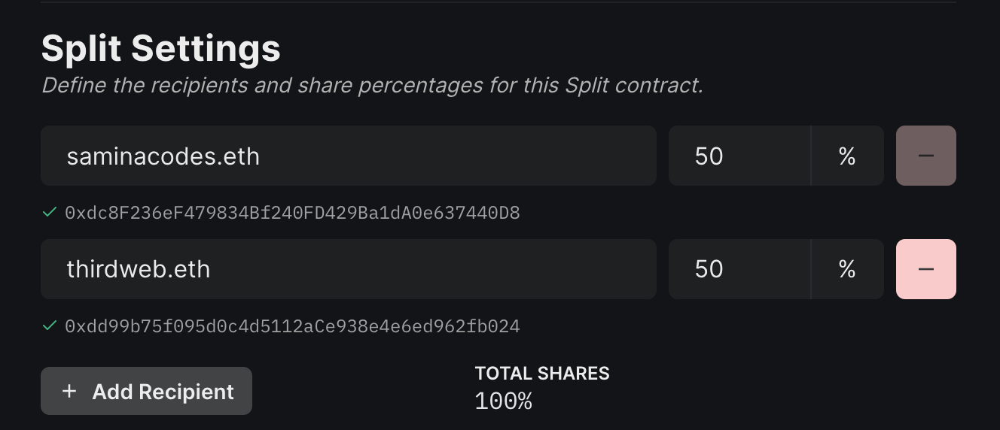
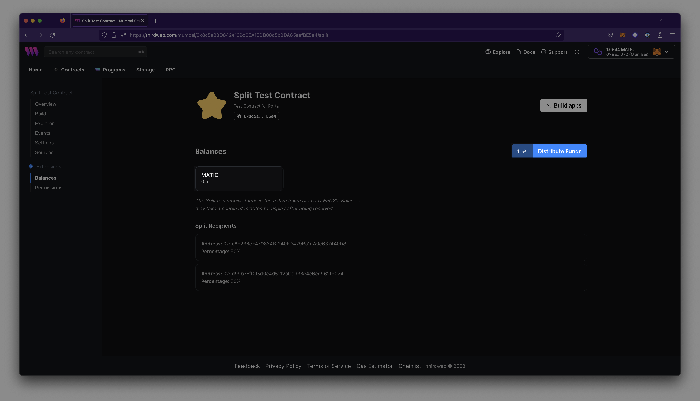

import DeployThisContractButton from "@components/DeployThisContractButton";
import ResourcesSection from "../../../src/components/landing-page/ResourcesSection";

  <DeployThisContractButton contractType="split" />

### Overview

With the Split contract, you can easily allocate revenue or royalty payments to multiple recipients by specifying their wallet addresses. You have the flexibility to set the percentage of funds each
recipient will receive, giving you complete control over how payments are distributed.

For instance, you can define recipients such as 0x1 and 0x2 and configure them to receive equal amounts of 50% of
the funds sent to the Split contract address. This feature streamlines the payment process, making it easier to manage and distribute funds to multiple parties.

Once funds are sent to the Split contract, they are securely stored until the distribute function is called. When this function is executed by a user, the contract will automatically distribute the funds to
the designated recipients based on the percentages that you have specified.

### Use Cases & Examples

The Split contract has a variety of practical use cases, including:

- Distributing funds among team members with set percentages, creating a "team wallet"
- Sharing revenue from a NFT drop primary sales with multiple parties
- Dividing revenue from royalty sales among team members, such as artists or contributors
- Automating programmatic revenue splits for any type of transaction

### Split Settings

During deployment of the Split contract, you will configure the split settings for each recipient by providing their wallet or [ENS](https://ens.domains/) address and respective percentage.

:::warning Immutable Settings
Please note that the Split contract is immutable, which means that once it is deployed, you will not be able to add or remove any recipient addresses. It is important to carefully configure the split settings during deployment to ensure that all necessary recipients are included.
:::

### Balances

Funds are held in the Split contract until manually distributed. Anyone with access to the contract may distribute funds, as long as they pay the associated gas fees. To distribute funds, navigate to the `Balances` tab on your contract's [dashboard](/dashboard) and click 'Distribute Funds'.
You can also verify recipients and view the contract balance on this tab.

:::info Native Token Transfer
If your contract is storing both native tokens like ETH, as well as ERC20 tokens such as Wrapped ETH, you will be prompted to accept two separate transactions to distribute the funds.
:::

## Split Extensions

<table>
  <tr>
    <th>Extension</th>
    <th>Description</th>
  </tr>
  <tr>
    <td>Permissions</td>
    <td>
      Assign roles to wallets; restrict your smart contract's functions based on
      the roles held or not held by a wallet.
    </td>
  </tr>
  <tr>
    <td>PermissionsEnumberable</td>
    <td>
      Same as Permissions but with added functionality - view all members with a
      given role, and total count of members.
    </td>
  </tr>
  <tr>
    <td>ContractMetadata</td>
    <td>
      Set metadata for your smart contract. This extension is necessary for NFT
      contracts that want royalties to get distributed on OpenSea.
    </td>
  </tr>
  <tr>
    <td>Gasless</td>
    <td>-</td>
  </tr>
</table>
 

<ResourcesSection />
