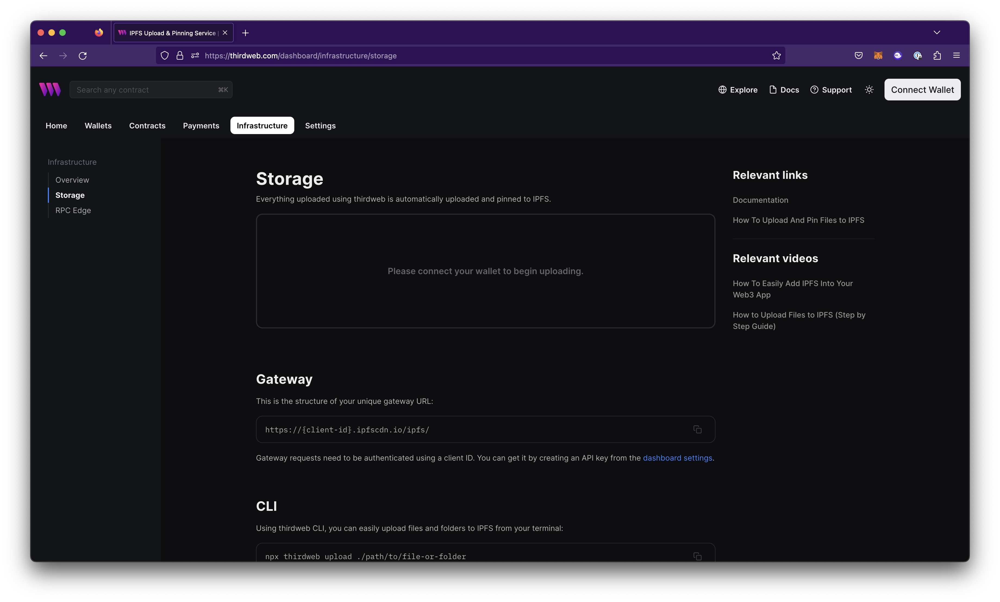
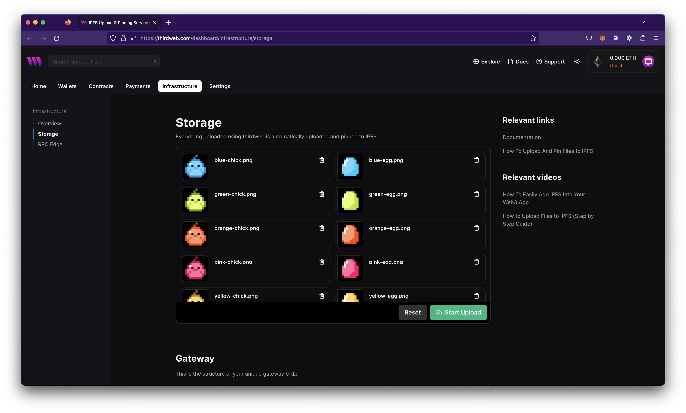
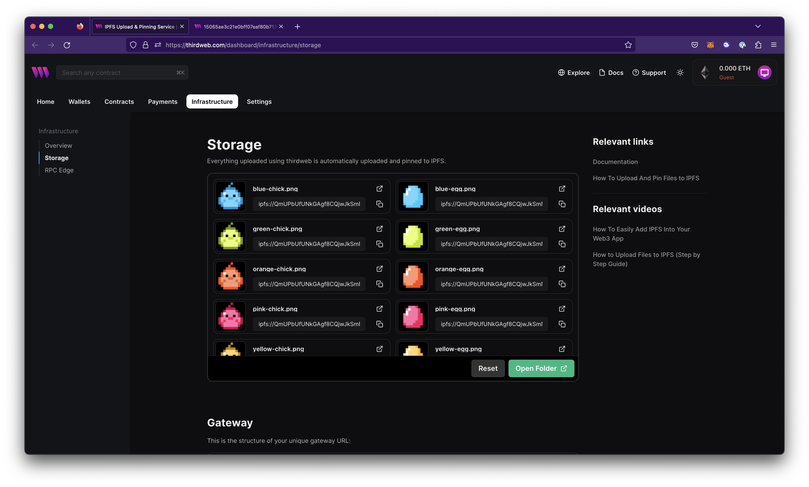

# Upload Files to IPFS

Upload and pin files and directories directly to IPFS using the dashboard, CLI or via a client or server environment using SDKs.

## Upload Files to IPFS Using Dashboard

To upload files using dashboard:

1. To authenticate to your account, connect your wallet.
2. Navigate to the [storage dashboard](https://thirdweb.com/dashboard/infrastructure/storage)

   

3. Select your files or drag them into the upload box. Confirm that your files are correct, and then select "Start Upload.”

   

:::info
The duration of this process will depend on the amount of data uploaded.
:::

4. Upon completion, the corresponding IPFS addresses refers to where your content is stored on the IPFS Network. You may access these files using your unique gateway URL.

   

## Upload Files to IPFS Using CLI

To upload files using the CLI, use the `upload` command and specify the relative path to the file name.

```json
npx thirdweb@latest upload path/to/file.extension
```

### Upload Multiple Files

To upload multiple files, specify all the file names separated with spaces:

```json
npx thirdweb upload image1.png image2.png image3.png
```

### Upload Directory

To upload an entire directory, specify the relative directory name:

```json
npx thirdweb upload directory_name
```

## Upload Files to IPFS Using JavaScript

```jsx
import { ThirdwebStorage } from "@thirdweb-dev/storage";

// First, instantiate the thirdweb IPFS storage
const storage = new ThirdwebStorage({
  secretKey: "YOUR_SECRET_KEY", // You can get one from dashboard settings
});

// Here we get the IPFS URI of where our metadata has been uploaded
const uri = await storage.upload(metadata);
// This will log a URL like ipfs://QmWgbcjKWCXhaLzMz4gNBxQpAHktQK6MkLvBkKXbsoWEEy/0
console.info(uri);

// Here we a URL with a gateway that we can look at in the browser
const url = await storage.resolveScheme(uri);
// This will log a URL like https://ipfs.thirdwebstorage.com/ipfs/QmWgbcjKWCXhaLzMz4gNBxQpAHktQK6MkLvBkKXbsoWEEy/0
console.info(url);

// You can also download the data from the uri
const data = await storage.downloadJSON(uri);
```

## Upload Files to IPFS Using React

```jsx
// Initialize your provider
import { ThirdwebProvider } from "@thirdweb-dev/react";

function Provider() {
  return (
    <ThirdwebProvider
      clientId="YOUR_CLIENT_ID" // You can get a client id from dashboard settings
      activeChain="goerli"
      >
      ...
    </ThirdwebProvider>
  );
}

// Upload files to IPFS
import { useStorageUpload } from "@thirdweb-dev/react";

function App() {
  const { mutateAsync: upload } = useStorageUpload();

  const uploadData = () => {
    // Get any data that you want to upload
    const dataToUpload = [...];

    // And upload the data with the upload function
    const uris = await upload({ data: dataToUpload });
  }
  ...
}

// Render files from IPFS
import { MediaRenderer } from "@thirdweb-dev/react";

function App() {
  return (
    // Supported types: image, video, audio, 3d model, html
    <MediaRenderer src="ipfs://QmamvVM5kvsYjQJYs7x8LXKYGFkwtGvuRvqZsuzvpHmQq9/0" />
  );
}
```

## Upload Files to IPFS Using Python

```python
from thirdweb import ThirdwebSDK
sdk = ThirdwebSDK("goerli")
metadata = {
  "name": "NFT",
  "image": "ipfs://..."
}
uri = sdk.storage.upload(metadata)
```

## Upload Files to IPFS Using Go

```go
package main

import (
    "context"
    "github.com/thirdweb-dev/go-sdk/v2/thirdweb"
)

func main() {
    sdk, _ := thirdweb.NewThirdwebSDK("goerli", nil)

    metadata := map[string]interface{}{
      "name": "NFT",
      "image": "ipfs://..."
    }
    uri, _ := sdk.Storage.Upload(context.Background(), metadata, "", "")
}
```
