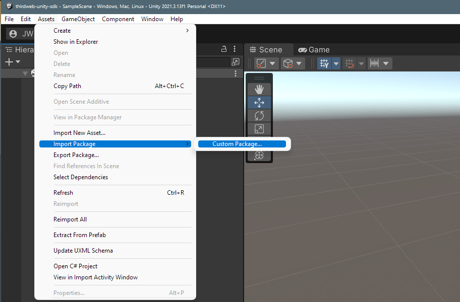

import QuickstartCard from "@components/QuickstartCard";

# Install The SDK

Our Unity SDK is distributed as a [Unity Package](https://docs.unity3d.com/Manual/PackagesList.html).

You can download the latest version of the SDK from our [GitHub releases page](https://github.com/thirdweb-dev/unity-sdk/releases).

<div className="row">
  <div className="col col--12" style={{ padding: 8 }}>
    <QuickstartCard
      name="Download The Unity Package File"
      link="https://github.com/thirdweb-dev/unity-sdk/releases"
      image="/assets/languages/unity.webp"
    />
  </div>
</div>

## Importing The Package

Import the `.unitypackage` file to your Unity project by clicking `Assets` > `Import Package` > `Custom Package`, and
selecting the `.unitypackage` file you downloaded.



After clicking `Import`, you can find the files in your `Project` window in the `Thirdweb` folder.


## Use the SDK in C# Scripts

Once you have imported the SDK, you can use it in your C# scripts by adding the following at the top of the file:

```csharp
using Thirdweb;
```
