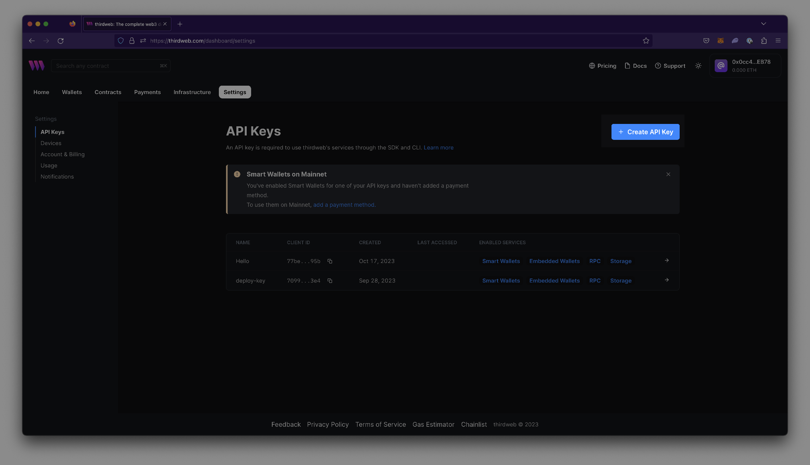
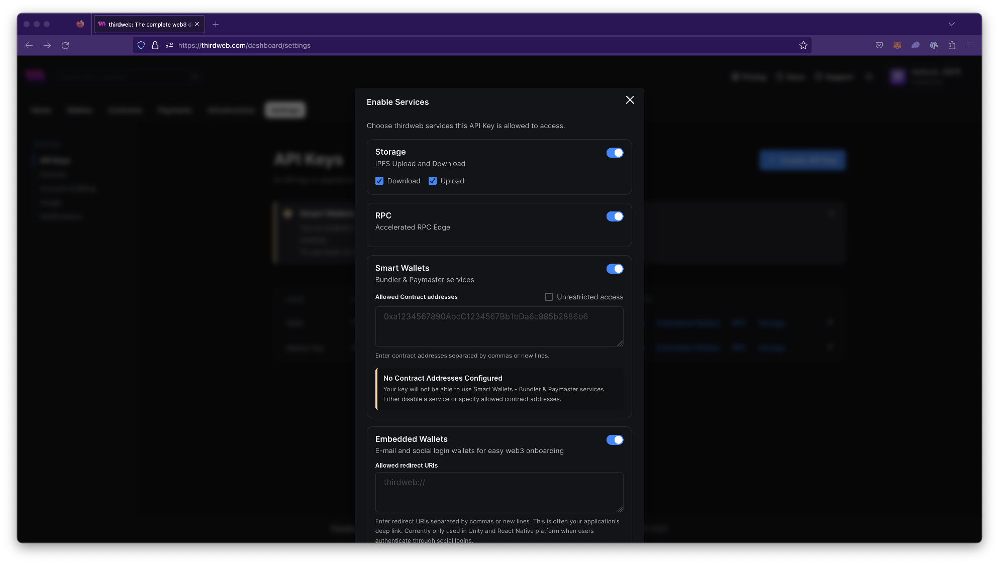
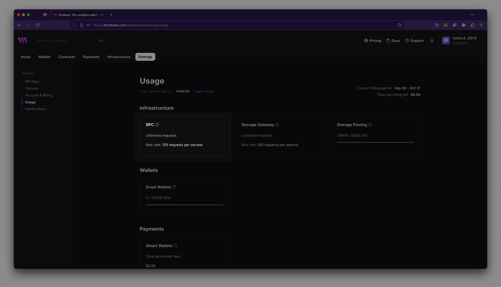

import Tabs from "@theme/Tabs";
import TabItem from "@theme/TabItem";

### Add RPC Edge to your application

To enable RPC Edge usage in an application, obtain a thirdweb Client ID & Secret Key with RPC Edge enabled and pass it into the app's configuration.

Obtain a Client ID & Secret Key by navigating to Settings > API Keys > `Create API Key`.



When navigating the prompts for key creation, ensure that RPC is enabled.



Pass in the Client ID and Secret Keys into the application’s configuration.

<Tabs>
  <TabItem value="Typescript" label="Typescript" default>

When writing backends or scripts, you can use the secret key to instantiate the SDK:

```ts
// Read-only mode
const readOnlySdk = new ThirdwebSDK("<chain_id>", {
  secretKey: "<your_secret_key>",
});
```

When using the Typescript SDK for frontend applications, use the client id:

```ts
const readOnlySdk = new ThirdwebSDK("<chain_id>", {
  clientId: "<your_client_id>",
});
```

  </TabItem>
  <TabItem value="React" label="React">

```jsx
import { ThirdwebProvider } from "@thirdweb-dev/react";

function MyApp() {
  return (
    <ThirdwebProvider clientId="<your_client_id>">
      <YourApp />
    </ThirdwebProvider>
  );
}
```

  </TabItem>
  <TabItem value="Unity" label="Unity">

When using the Unity SDK, you can use the client id to instantiate the SDK:

```csharp
  ThirdwebSDK sdk = new ThirdwebSDK("<chain_id>", 5, new ThirdwebSDK.Options()
  {
    clientId = "<your_client_id>",
  });
```

  </TabItem>
  <TabItem value="Python" label="Python">

When using the Python SDK, use the secret key to instantiate the SDK:

```python
sdk = ThirdwebSDK.from_private_key(
    <private_key>,
    "<chain_id>",
    SDKOptions(secret_key=<your_secret_key>)
)
```

  </TabItem>
  <TabItem value="GO" label="GO">

When using the GO SDK, you can use the secret key to instantiate the SDK:

```go
  func main() {
	    // Your secret key from the thirdweb api keys dashboard
	    secretKey := "<your_secret_key"
	    sdk, err := thirdweb.NewThirdwebSDK("<chain_id>", &thirdweb.SDKOptions{
		    SecretKey: <your_secret_key>,
	    })
    }
```

  </TabItem>
</Tabs>

---

### Override default RPC

To override the default RPC for any given chain:

<Tabs>
  <TabItem value="Typescript" label="Typescript" default>

```ts
import { ThirdwebSDK } from "@thirdweb-dev/sdk";

const sdk = new ThirdwebSDK({
  rpc: ["https://<your-rpc-to-use>.com"],
});
```

  </TabItem>
  <TabItem value="React" label="React">

```jsx
import { ThirdwebProvider } from "@thirdweb-dev/react";

const App = () => {
  return (
    <ThirdwebProvider
      activeChain={{
        rpc: ["https://<your-rpc-to-use>.com"],
      }}
    >
      <YourApp />
    </ThirdwebProvider>
  );
};
```

  </TabItem>

</Tabs>

:::info
Public RPCs can be used without an API Key. Refer to the [configured chains page](https://thirdweb.com/dashboard/infrastructure/rpc-edge).
:::

### View RPC usage

[View RPC request usage](https://thirdweb.com/dashboard/settings/usage) in the dashboard settings.


