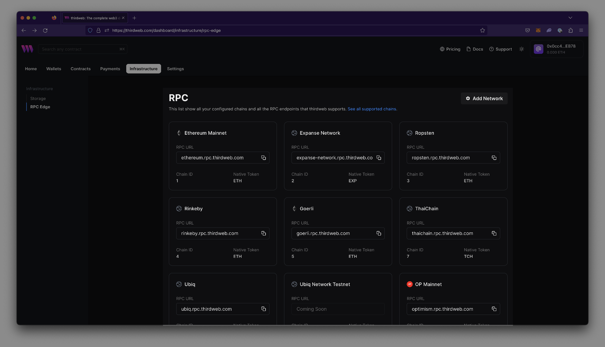

import Tabs from "@theme/Tabs";
import TabItem from "@theme/TabItem";

### Add RPC Edge through SDKs

To enable RPC Edge usage in an application, obtain a thirdweb client ID & Secret Key with RPC Edge enabled and pass it into the app's configuration.

Obtain a Client ID & Secret Key by navigating to Settings > API Keys > `Create API Key`.


When navigating the prompts for key creation, ensure that RPC is enabled.


Pass in the Client ID and Secret Keys into the application’s configuration.

<Tabs>
  <TabItem value="Typescript" label="Typescript" default>

When writing backends or scripts, you can use the secret key to instantiate the SDK:

```ts
// Read-only mode
const readOnlySdk = new ThirdwebSDK("goerli", {
  secretKey: "YOUR_SECRET_KEY", // Use secret key if using on the server, get it from dashboard settings
});
```

When using the Typescript SDK for frontend applications, use the client id:

```ts
import { ThirdwebSDK } from "@thirdweb-dev/sdk";
// Read-only mode
const readOnlySdk = new ThirdwebSDK("goerli", {
  clientId: "YOUR_CLIENT_ID", // Use client id if using on the client side, get it from dashboard settings
});
```

  </TabItem>
  <TabItem value="React" label="React">

When using the React SDK, you can use the client id to instantiate the SDK:

```jsx
import { ThirdwebProvider } from "@thirdweb-dev/react";

function MyApp() {
  return (
    <ThirdwebProvider
      activeChain="ethereum"
      // highlight-start
      clientId="your-client-id"
      // highlight-end
    >
      <YourApp />
    </ThirdwebProvider>
  );
}
```

  </TabItem>
  <TabItem value="Unity" label="Unity">

When using the Unity SDK, you can use the client id to instantiate the SDK:

```csharp
  ThirdwebSDK sdk = new ThirdwebSDK("goerli", 5, new ThirdwebSDK.Options()
  {
    clientId = "my-client-id", // you can get client id from dashboard settings
  });
```

  </TabItem>
  <TabItem value="Python" label="Python">

When using the Python SDK, you can use the secret key to instantiate the SDK:

```python
  from thirdweb import ThirdwebSDK
  from thirdweb.types import SDKOptions
  from dotenv.main import load_dotenv
  import os

    load_dotenv()
    secret_key = os.environ['SECRET_KEY']
    private_key = os.environ['PRIVATE_KEY']

    sdk = ThirdwebSDK.from_private_key(private_key, "mumbai", SDKOptions(secret_key=secret_key))
```

  </TabItem>
  <TabItem value="GO" label="GO">

When using the GO SDK, you can use the secret key to instantiate the SDK:

```go
  package main

  import (
	    "fmt"

	    "github.com/thirdweb-dev/go-sdk/v2/thirdweb"
  )

  func main() {
	    // Your secret key from the thirdweb api keys dashboard
	    secretKey := "..."

	    // Creates a new SDK instance to get read-only data for your contracts, you can pass:
	    // - a chain name (mainnet, rinkeby, goerli, polygon, mumbai, avalanche, fantom)
	    // - a custom RPC URL
	    sdk, err := thirdweb.NewThirdwebSDK("mumbai", &thirdweb.SDKOptions{
		    SecretKey: secretKey,
	    })
	    if err != nil {
		    panic(err)
    }

	    // Now we can interact with the SDK, like displaying the connected chain ID
	    chainId, err := sdk.GetChainID()
	    if err != nil {
		    panic(err)
	    }

	    fmt.Println("New SDK instance create on chain", chainId)
  }
```

  </TabItem>
</Tabs>

---

### Use publicly available RPC URLs

Publicly available RPCs can be used without the need for an API Key. To find an RPC, refer to the [configured chains page](https://thirdweb.com/dashboard/infrastructure/rpc-edge) with RPC endpoints thirdweb supports.



### View RPC usage

[View RPC request usage](https://thirdweb.com/dashboard/settings/usage) in the dashboard settings.


