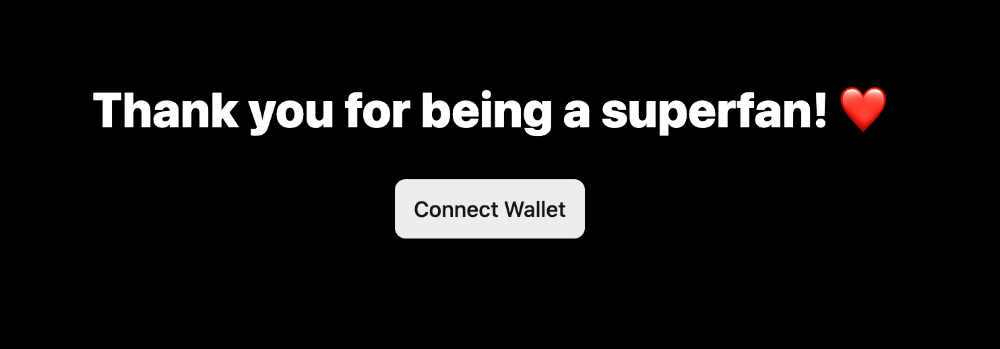
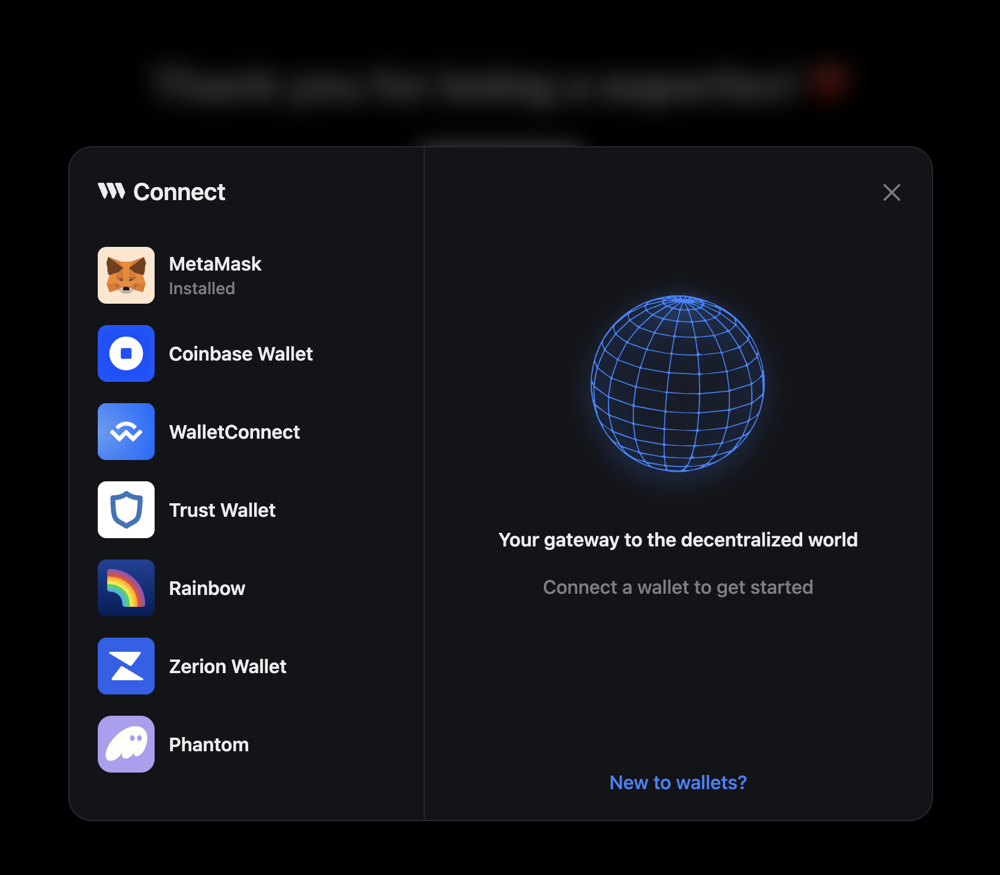
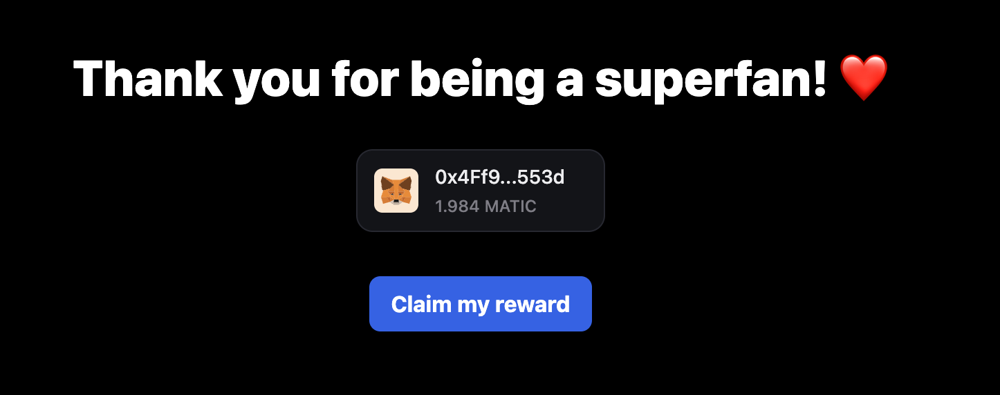
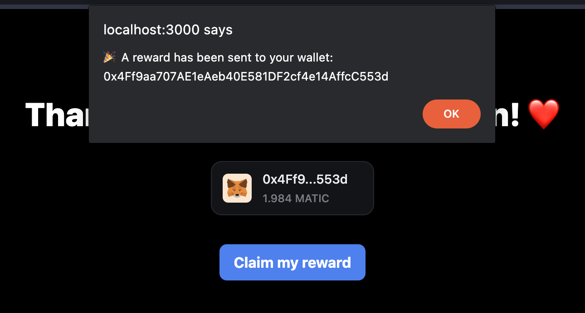

import QuickstartCard from "@components/QuickstartCard";
import Tabs from "@theme/Tabs";
import TabItem from "@theme/TabItem";
import CodeBlock from "@theme/CodeBlock";

See how Engine enables a brand to airdrop NFTs at scale to their superfans. The developer only pays gas!

> This guide references Polygon Mumbai testnet and NextJS but is applicable for any EVM chain and full-stack framework.

## Source Code

View the full source code on GitHub:

<div className="col col--12" style={{ padding: 8 }}>
  <QuickstartCard
    name="Source Code"
    link="https://github.com/thirdweb-example/engine-minting-api"
    image="/assets/github-icon.webp"
  />
</div>

## Prerequisites

- An Engine instance deployed to `<engine_url>`.
- A Client ID and Secret Key from the [API Keys page](https://thirdweb.com/dashboard/settings/api-keys).

## 1. Create a backend wallet

Create a backend wallet with Engine.

```bash
curl -X POST \
  -H "Authorization: Bearer <thirdweb_secret_key>" \
  "<engine_url>/backend-wallet/create"
```

_Replace `<engine_url>` and `<thirdweb_secret_key>`._

This endpoint returns a wallet address `<backend_wallet_address>`.

## 2. Deploy an NFT contract

> MATIC on Mumbai is required for this step. Send 0.1 MATIC or [claim MATIC for free from a faucet](https://mumbaifaucet.com/) to your backend wallet address.

Deploy a [thirdweb Edition contract](https://thirdweb.com/thirdweb.eth/TokenERC1155), an ERC-1155 contract that allows minting a token to multiple users.

```bash
curl -X POST \
  -H "Content-Type: application/json" \
  -H "Authorization: Bearer <thirdweb_secret_key>" \
  -H "x-backend-wallet-address: <backend_wallet_address>" \
  -d '{
    "contractMetadata": {
      "name": "Acme Inc. Loyalty Card",
      "symbol": "ACME",
      "primary_sale_recipient": "<backend_wallet_address>"
    }
  }' \
  "<engine_url>/deploy/mumbai/prebuilts/edition"
```

_Replace `<engine_url>`, `<backend_wallet_address>`, and `<thirdweb_secret_key>`._

The NFT contract will be deployed after a brief moment.

## 2. Create a NextJS app

Clone a NextJS app template.

<Tabs>
  <TabItem value="npm" label="npm" default>
    <CodeBlock language="bash">{`npx create-next-app@latest`}</CodeBlock>
  </TabItem>
  <TabItem value="yarn" label="yarn">
    <CodeBlock language="bash">{`yarn create next-app`}</CodeBlock>
  </TabItem>
  <TabItem value="pnpm" label="pnpm">
    <CodeBlock language="bash">{`pnpm create next-app`}</CodeBlock>
  </TabItem>
  <TabItem value="bun" label="bun">
    <CodeBlock language="bash">{`bunx create-next-app`}</CodeBlock>
  </TabItem>
</Tabs>

Install the thirdweb React (frontend) and Typescript (backend) SDKs.

<Tabs>
  <TabItem value="npm" label="npm" default>
    <CodeBlock language="bash">{`npm i @thirdweb-dev/react @thirdweb-dev/sdk ethers@^5`}</CodeBlock>
  </TabItem>
  <TabItem value="yarn" label="yarn">
    <CodeBlock language="bash">{`yarn add @thirdweb-dev/react @thirdweb-dev/sdk ethers@^5`}</CodeBlock>
  </TabItem>
  <TabItem value="pnpm" label="pnpm">
    <CodeBlock language="bash">{`pnpm i @thirdweb-dev/react @thirdweb-dev/sdk ethers@^5`}</CodeBlock>
  </TabItem>
  <TabItem value="bun" label="bun">
    <CodeBlock language="bash">{`bun i @thirdweb-dev/react @thirdweb-dev/sdk ethers@^5`}</CodeBlock>
  </TabItem>
</Tabs>

## 3. Frontend: Add Connect Wallet and Claim buttons

Key details:

- [`<ThirdwebProvider>`](https://portal.thirdweb.com/react/react.thirdwebprovider) wraps thirdweb components and React hooks.
- [`<ConnectWallet>`](https://portal.thirdweb.com/react/react.connectwallet) prompts the user to connect a wallet.
- When connected, the **Claim** button is presented.
- The **Claim** buton calls `POST /api/claim`.

```tsx
import {
  ConnectWallet,
  ThirdwebProvider,
  useAddress,
} from "@thirdweb-dev/react";

export default function Home() {
  return (
    <ThirdwebProvider activeChain="mumbai" clientId={<thirdweb_client_id>}>
      <ClaimPage />
    </ThirdwebProvider>
  );
}

function ClaimPage() {
  const userWalletAddress = useAddress();

  const onClick = async () => {
    const resp = await fetch("/api/claim", {
      method: "POST",
      body: JSON.stringify({ userWalletAddress }),
    });
    if (resp.ok) {
      alert(`🎉 A reward has been sent to your wallet: ${userWalletAddress}`);
    }
  };

  return (
    <main>
      <h2>Thank you for being a superfan! ❤️</h2>
      <ConnectWallet />
      {userWalletAddress && <button onClick={onClick}>Claim my reward</button>}
    </main>
  );
}
```

_Replace `<thirdweb_client_id>`_.

## 4. Backend: Call Engine to mint an NFT

Key details:

- `POST /api/claim` calls Engine to mint an NFT to the user's wallet.

```tsx
import { NextResponse } from "next/server";

const {
  BACKEND_WALLET_ADDRESS,
  NFT_CONTRACT_ADDRESS,
  ENGINE_URL,
  THIRDWEB_SECRET_KEY,
} = process.env;

export async function POST(request: Request) {
  const { userWalletAddress } = await request.json();

  await fetch(
    `${ENGINE_URL}/contract/mumbai/${NFT_CONTRACT_ADDRESS}/erc1155/mint-to`,
    {
      method: "POST",
      headers: {
        "Content-Type": "application/json",
        Authorization: `Bearer ${THIRDWEB_SECRET_KEY}`,
        "x-backend-wallet-address": BACKEND_WALLET_ADDRESS,
      },
      body: JSON.stringify({
        receiver: userWalletAddress,
        metadataWithSupply: {
          metadata: {
            name: "Acme Inc. Superfan",
            description: "Created with thirdweb Engine",
            image:
              "ipfs://QmciR3WLJsf2BgzTSjbG5zCxsrEQ8PqsHK7JWGWsDSNo46/nft.png",
          },
          supply: "1",
        },
      }),
    },
  );

  return NextResponse.json({ message: "Success!" });
}
```

## 5. Start the server

Update `.env.local` with relevant details from previous steps.

```bash
ENGINE_URL=https://...
THIRDWEB_CLIENT_ID=0123...
THIRDWEB_SECRET_KEY=AaBb...
BACKEND_WALLET_ADDRESS=0x...
NFT_CONTRACT_ADDRESS=0x...
```

Start the server.

<Tabs>
  <TabItem value="npm" label="npm" default>
    <CodeBlock language="bash">{`npm run dev`}</CodeBlock>
  </TabItem>
  <TabItem value="yarn" label="yarn">
    <CodeBlock language="bash">{`yarn dev`}</CodeBlock>
  </TabItem>
  <TabItem value="pnpm" label="pnpm">
    <CodeBlock language="bash">{`pnpm dev`}</CodeBlock>
  </TabItem>
  <TabItem value="bun" label="bun">
    <CodeBlock language="bash">{`bun dev`}</CodeBlock>
  </TabItem>
</Tabs>

The server is hosted on `http://localhost:3000`.

## Try it out!

Here’s what the user flow looks like.

The app prompts the user to connect their wallet.



A user presses claim.


They'll receive the NFT in their wallet shortly!

