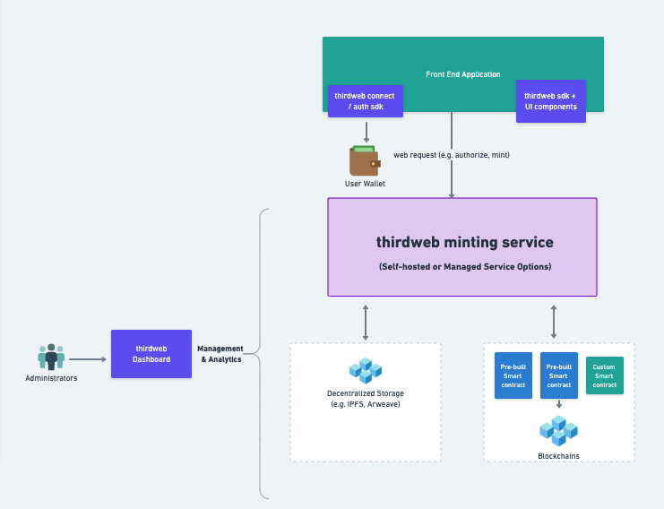

# Minting

thirdweb’s Launchpad minting solution is a set of tools that allow creators and developers to launch a wide assortment of NFT content and distribution strategies in a configurable, secure and scalable way.

Launchpad allows users to setup their NFT content and distribution strategy using a web3 API where users own and control their smart contracts. In addition, thirdweb is a web3 architecture that doesn’t require a custodian that sits between the user and their digital assets.

## What You Can Build

The thirdweb Launchpad can be used to to build different NFT strategies including:

- 1-of-1 collections
- Membership NFTs
- POAP’s and [Soulbound tokens](/glossary/soulbound)
- Open Editions
- Lootboxes for communities and games
- Airdrops
- Free mints
- Creating bundles of NFTs that can be sold together

## Features

The key features of Launchpad are:

- Flexibility in choosing different NFT types including 1-of-1 collections, editions, loot boxes, on-demand/dynamic and specialized NFT’s available in thirdweb’s on-chain smart contract registry ([Explore](https://thirdweb.com/explore))
- “Build once” and deploy to over 700 blockchains supported by thirdweb
- A non-custodial ownership model that allows users to own their own NFT smart contracts
- Automatic uploading of media assets and NFT metadata to decentralized storage
- A broad set of options for distributing NFTs including claimable [drops](/glossary/drop), airdrops and on-demand [signature minting](/glossary/signature-based-minting)
- Control over access to mints by start/end time, private allow lists, overrides for certain users, public mints, open editions, limiting supply and delayed reveals
- Options for delivering [free/gasless](/glossary/gasless-transactions) mints to users
- Analytics via a Dashboard and API for balances, [gas](/glossary/gas) spent, transactions and owners

## Architecture

## Deployment Options

The thirdweb minting solution offers multiple configurations for integration into applications:

- Embeddable SDK in multiple languages including [javascript](/typescript), [typescript](/typescript), [React](/react), [Go](/go), [Python](/python) and [Unity](/unity)
- Self-hosted web3 API server that exposes a REST API
- Managed service hosted by thirdweb

## Dashboard

The thirdweb [Dashboard](https://thirdweb.com/dashboard) is a live example of Launchpad in action. Users can select and deploy smart contracts via [Explore](https://thirdweb.com/explore) and use the Dashboard UI to configure their NFT mints.

Dashboard uses the same thirdweb SDK’s referenced in this document and is available as an open source github repo ([link](https://github.com/thirdweb-dev/dashboard))
