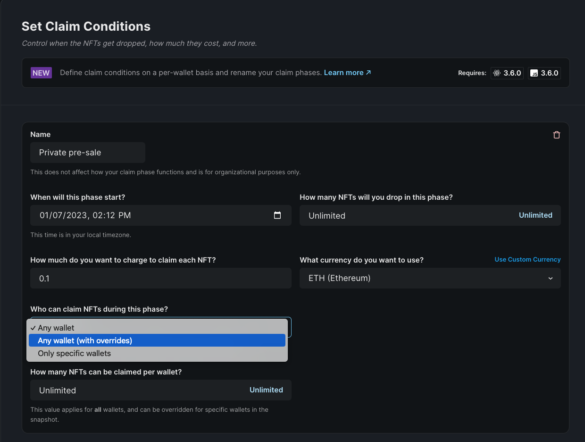

# Setting Up NFT Access with Claim Phases

The rules for determining time windows, price, currency and allow list access is controlled via Claim Conditions. In addition, users can opt for open editions or applying supply limits during any time window.



Applications can use the [SDK](/sdk) to control these parameters.

```js
// setup all the claim phases
const presaleStartTime = new Date();
const publicSaleStartTime = new Date(Date.now() + 60 * 60 * 24 * 1000);
const claimConditions = [
  {
    startTime: presaleStartTime, // start the presale now
    maxQuantity: 2, // limit how many mints for this presale
    price: 0.01, // presale price
    snapshot: ['0x...', '0x...'], // limit minting to only certain addresses
  },
  {
    startTime: publicSaleStartTime, // 24h after presale, start public sale
    price: 0.08, // public sale price
  }
]);

// set the claim conditions
await contract.erc721.claimConditions.set(claimConditions);
```
