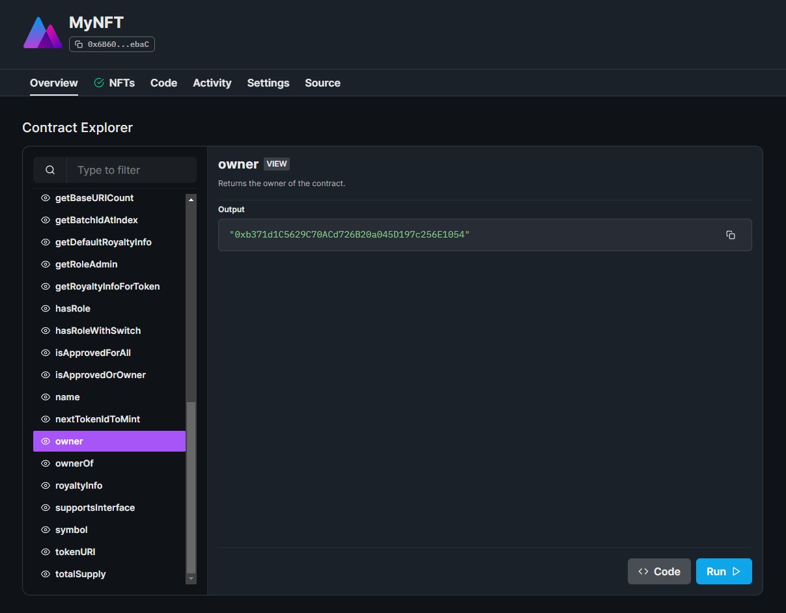
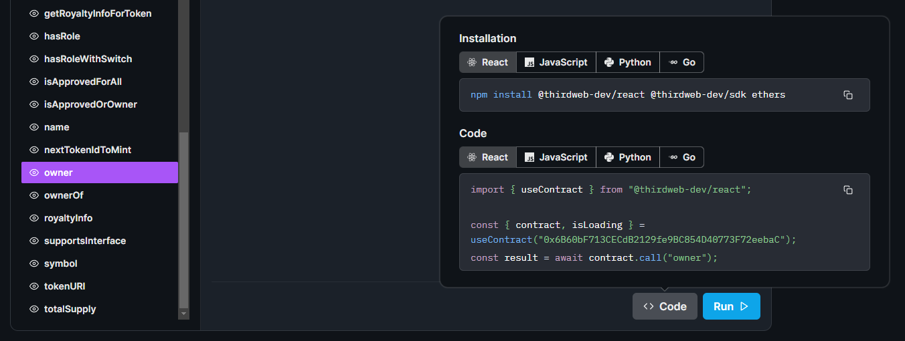
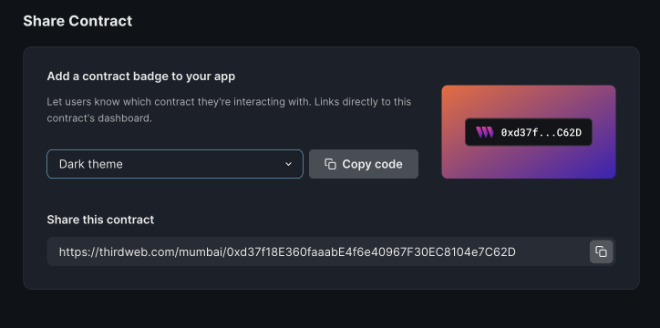

# View & Interact with Contracts

The **Contract Explorer** is available to all contracts deployed with thirdweb in the **Overview** tab,
and allows any user to view and call all of the functions on your smart contract from their connected wallet.

This page is accessible to anyone, meaning users can interact directly with your contract using the dashboard if they choose to do so!

Each function also comes with a **Code** snippet that shows you how to use the [SDK](/sdk) to interact with each function
of your contract in a variety of languages.

## Verifying Contracts

You can view the compiled source code of your contract, and verify it on sites like Etherscan from within the **Source** tab:

## Contract Badge

You can use the contract badge to inform users about which contract they are interacting with. Clicking on a contract badge will take users to the contract's dashboard, where they can view and interact with the contract's code. This helps make your app more transparent and open.

To add a contract badge to your app, go to the contract's overview page and scroll to the "Share your contract" section. Once you choose the theme that you want, you can copy the code and add it to your website.
