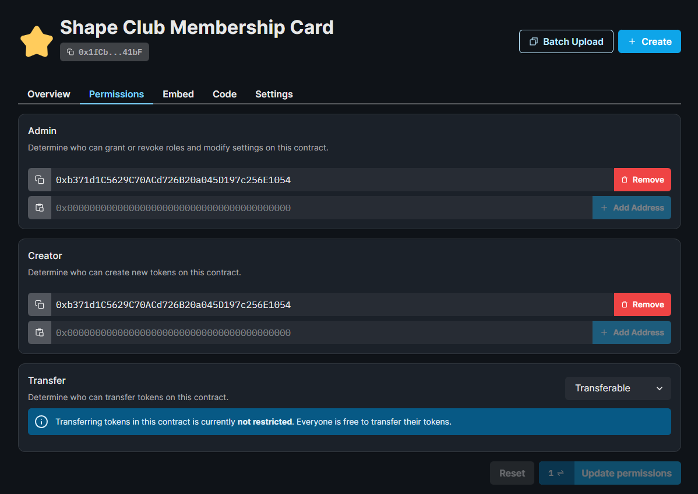

# Permission Controls

Permissions outline which wallet addresses can perform which actions on your smart contract.

You can invite team members using their wallet addresses to have different levels of permissions on your smart contract under the **Permissions** tab.

To define which wallets have these permissions, you must add them to the required role.

Each contract has a different set of configurable roles, you can find the full list in the [ALL_ROLES](/typescript/sdk.all_roles#all_roles-variable) variable.

| Role Name | Description                                                                  | Relevant Contracts                                                             |
| --------- | ---------------------------------------------------------------------------- | ------------------------------------------------------------------------------ |
| admin     | Grant or revoke roles and modify settings on this contract.                  | All contracts                                                                  |
| minter    | Create new tokens on this contract.                                          | NFTs, Tokens                                                                   |
| transfer  | Transfer tokens on this contract.                                            | NFTs, Tokens                                                                   |
| unwrap    | Can unwrap tokens on this contract.                                          | [Multiwrap](/pre-built-contracts/multiwrap), [Pack](/pre-built-contracts/pack) |
| lister    | Can create new listings on this marketplace contract.                        | [Marketplace](/pre-built-contracts/marketplace)                                |
| pauser    | Can pause (and unpause) all external calls made to this contract's contract. | [Custom](/contractkit)                                                         |
| asset     | Which assets can be listed on this marketplace contract.                     | [Marketplace](/pre-built-contracts/marketplace)                                |

From the dashboard, you can add or remove wallets for each role in the **Permissions** tab:

