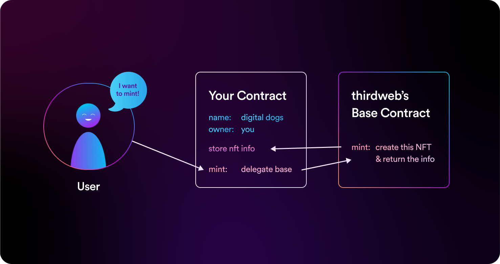

# How Pre-Built Contracts Work

Each contract extends the extensions that are available in our [Solidity SDK](/solidity/extensions),
and all come with a standard set of features that enable fine-grained control over the contract's behavior, such as:

- [Contract metadata](/dashboard/NFTs)
- [Permission controls](/dashboard/permissions)
- [Royalties and platform fees](/dashboard/settings)

When you deploy a prebuilt contract, you are actually deploying a [**proxy contract**](/glossary/proxy-contracts);
which reduces the gas cost for you by **~90%**!

This works by having our smart contracts run the underlying logic, meaning you only deploy the code that is unique to _your_ contract.

The proxy contract stores the state, for example; its name, and what NFTs have been minted so far.
For any logic (such as how to mint an NFT), it delegates to the implementation smart contract to handle, since this logic is the same for every NFT collection.

**You still maintain 100% ownership of the contract.**

