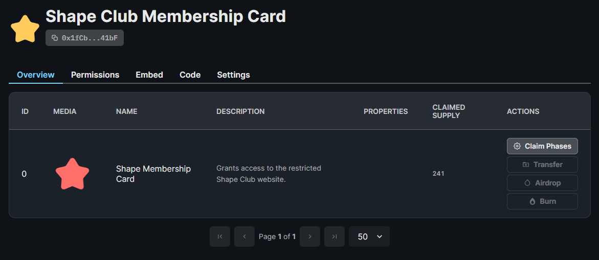

import DeployThisContractButton from "@components/DeployThisContractButton";
import QuickstartCard from "@components/QuickstartCard";

# Edition Drop

  <DeployThisContractButton
    link={"https://thirdweb.com/thirdweb.eth/DropERC1155?via=portal"}
    contractType="edition-drop"
  />

The **Edition Drop** contract is best used when you want to release many NFTs based on the same asset and uses the [ERC1155 Standard](https://eips.ethereum.org/EIPS/eip-1155), also known as "Semi-Fungible Tokens".

The Edition Drop contract allows you to define the conditions for when and how your users can mint an NFT, including allowlists, release dates, and claim limits.

## Use Cases & Examples

You could use the Edition Drop contract to:

- Create NFT Memberships such as our [Early Access Cards](https://opensea.io/collection/thirdweb-community) that you want your users to claim
- Release an item in your game for a limited-time
- Create 100 NFTs based on one art piece, and allow users to claim one per wallet

  

    <QuickstartCard
      name="Video: Build an NFT Membership Club Using Edition Drop"
      link="https://www.youtube.com/watch?v=dc28IKz9x8I"
      image="/assets/icons/education.png"
    />
  

  

    <QuickstartCard
      name="Guide: Create an Early Access NFT Using our SDK"
      link="https://blog.thirdweb.com/guides/early-access-nft-with-typescript"
      image="/assets/icons/education.png"
    />
  

## Smart Contract Design

For a detailed exploration of how our drop smart contracts work, why they were built,
and their limitations, visit our [Drop Design Doc](/contracts/design/Drop)!

  

    <QuickstartCard
      name="Drop Smart Contract Design Document"
      link="/contracts/design/Drop"
      image="/assets/icons/edition-drop.png"
    />
  

## Creating & Configuring the Edition Drop

Learn how to create and configure your smart contract using the [dashboard](https://thirdweb.com/dashboard).

### Creating an Edition Drop Contract

Deploy the edition drop contract to any of our
[supported networks](https://blog.thirdweb.com/guides/which-network-should-you-use) using the button below.

  <DeployThisContractButton
    link={"https://thirdweb.com/thirdweb.eth/DropERC1155?via=portal"}
    contractType="edition-drop"
  />

### Lazy Minting NFTs

Lazy minting is the process of uploading your metadata for your NFT(s) without minting them _yet_.

This is useful when you want _other_ wallets to mint NFTs from your drop into their own wallets.

To lazy-mint NFT(s), click **Create** to lazy-mint a single NFT, or **Batch Upload** to lazy-mint multiple NFTs at once.

To get started, you can use one of our example files for [CSV](https://thirdweb.com/example.csv) or [JSON](https://nightly.thirdweb.com/example.json) metadata.

  

    <QuickstartCard
      name="Guide: Batch Upload NFT Metadata"
      link="https://blog.thirdweb.com/guides/how-to-batch-upload/"
      image="/assets/icons/education.png"
    />
  

### Setting Claim Phases

On the Edition Drop contract, you set claim phases for each NFT, by clicking the **Claim Phases** button

A claim phase is a set of conditions that define when and how your users can claim an NFT from your drop.

**The Edition Drop contract supports multiple sequential claim phases**.

Within a claim phase, you can define:

- When the claim phase will start
- How many NFTs do you want to drop
- How much do you want to charge per NFT
- What currency do you want to use
- Which wallet addresses are allowed to mint (allowlist)
- How many NFTs can be claimed per transaction
- How many seconds do wallets have to wait between claims

To add a claim phase to a token, click **Add Initial Claim Phase**:

### Airdrop NFTs

Click **Airdrop** on the token you want to use, and upload a `.csv` file containing a list of addresses you want to airdrop NFTs to.

In the `.csv` file, you must specify an `address` column and a `quantity` column, representing the address you want to send the NFTs and how many you wish to send.
You can download our example [CSV File](https://thirdweb.com/airdrop.csv) to get started.

### Contract Metadata

To configure the image, name, and description of the contract, click the **Settings** tab:

### Royalty & Platform Fees

From the **Settings** tab, you also configure the [royalty fee](/dashboard/contract-settings),
[primary sales recipient](/dashboard/contract-settings#primary-sales-recipient)
and [platform fee](/dashboard/contract-settings).

