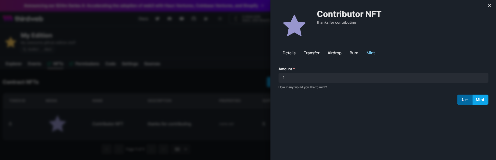
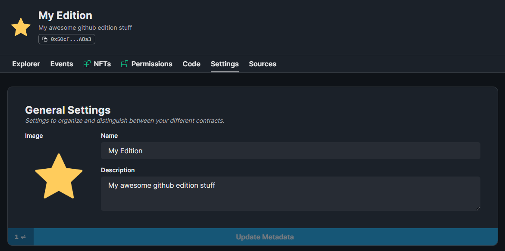

import DeployThisContractButton from "@components/DeployThisContractButton";
import QuickstartCard from "@components/QuickstartCard";

# Edition

  <DeployThisContractButton
    link={"https://thirdweb.com/thirdweb.eth/TokenERC1155?via=portal"}
    contractType="edition"
  />

The **Edition** contract is best used when you want to release many NFTs based on the same asset, but you **don't** want to "drop" or "release" them for your community to claim.

Unlike the [Edition Drop](/pre-built-contracts/edition-drop) contract, the Edition contract does not **lazy mint** your NFTs. Instead, NFTs are minted immediately when they are added to the collection.

This means you can still transfer the NFTs or sell them on a [Marketplace](/pre-built-contracts/marketplace) and perform any other actions you would expect to do with an NFT.

For advanced use-cases, the Edition also has [signature-based minting](/glossary/signature-based-minting) capabilities.

## Use Cases & Examples

You could use the Edition contract to:

- Create an NFT Collection where each NFT has 100 copies
- Airdrop an NFT to a list of addresses that all use the same asset and metadata
- Create 10 "copies" of your artwork and sell them on a [Marketplace](/pre-built-contracts/marketplace)

  

    <QuickstartCard
      name="Video: Airdrop NFTs Using the Dashboard"
      link="https://www.youtube.com/watch?v=UN3DVVHm7Qw"
      image="/assets/icons/education.png"
    />
  

  

    <QuickstartCard
      name="Guide: Sell ERC1155 in Multiple Currencies Simultaneously"
      link="https://blog.thirdweb.com/guides/sell-nft-multiple-currencies/"
      image="/assets/icons/education.png"
    />
  

## Creating & Configuring the Edition

Learn how to create and configure your smart contract using the [dashboard](https://thirdweb.com/dashboard).

### Creating an Edition Contract

Deploy the edition drop contract to any of our
[supported networks](https://blog.thirdweb.com/guides/which-network-should-you-use) using the button below.

  <DeployThisContractButton
    link={"https://thirdweb.com/thirdweb.eth/TokenERC1155?via=portal"}
    contractType="edition"
  />

### Minting NFTs

Click **Mint** to create a single NFT.

You can add additional supply to an existing NFT by clicking on that NFT and clicking **Mint**:

### Airdrop NFTs

Click on the token you want to use, navigate to the **Airdrop** tab,
and upload a `.csv` file containing a list of addresses you want to airdrop NFTs to.

In the `.csv` file, you must specify an `address` column and a `quantity` column, representing the address you want to send the NFTs and how many you wish to send.
You can download our example [CSV File](https://thirdweb.com/airdrop.csv) to get started.

### Contract Metadata

To configure the image, name, and description of the contract, click the **Settings** tab:

### Royalty & Platform Fees

From the **Settings** tab, you also configure the [royalty fee](/dashboard/contract-settings),
[primary sales recipient](/dashboard/contract-settings#primary-sales-recipient)
and [platform fee](/dashboard/contract-settings).

