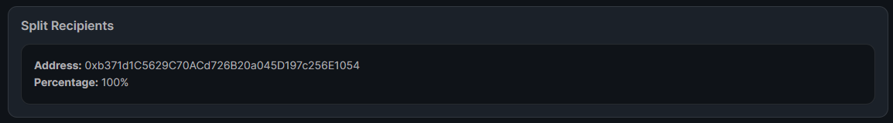
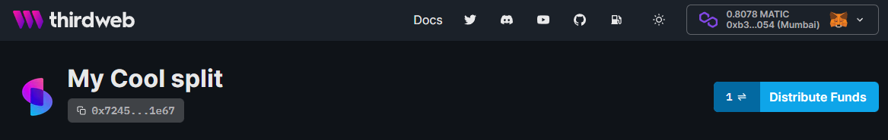

import DeployThisContractButton from "@components/DeployThisContractButton";
import QuickstartCard from "@components/QuickstartCard";
import YoutubeEmbed from "@components/YoutubeEmbed";

# Split

  <DeployThisContractButton
    link="https://thirdweb.com/thirdweb.eth/Split?via=portal"
    contractType="split"
  />

  

    

The Split contract lets you specify multiple wallet addresses that are recipients of any revenue or royalty split.
    

You define what percentage of any funds that get sent to the split contract address is sent to each recipient.
For example, you could define `0x1` and `0x2` as recipients, and configure them to receive 50% of the funds sent to the split contract.

  

  

    <YoutubeEmbed link="https://www.youtube.com/embed/QDWlGOocKm8" />
  

The split contract will store the funds, and when any user calls the `distribute` function, the funds will be distributed to the recipients according to the percentages you define.

## Use Cases & Examples

You could use the Split contract to:

- Use as a "team wallet", where funds are distributed between the members of your team with set percentages
- Share revenue from your primary minting in an NFT drop
- Share revenue from royalty sales with members of your team, such as an artist
- Any programmatic split of revenue

  

    <QuickstartCard
      name="Video: Build a Royalty Split with the Split Contract"
      link="https://www.youtube.com/watch?v=QDWlGOocKm8"
      image="/assets/icons/education.png"
    />
  

  

    <QuickstartCard
      name="Guide: Deploy an NFT Drop with Revenue Share"
      link="https://blog.thirdweb.com/guides/nft-drop-with-revenue-share"
      image="/assets/icons/education.png"
    />
  

## Creating & Configuring the Split

Learn how to create and configure your smart contract using the [dashboard](https://thirdweb.com/dashboard).

### Creating a Split Contract

Deploy the split contract to any of our
[supported networks](https://blog.thirdweb.com/guides/which-network-should-you-use) using the button below.

  <DeployThisContractButton
    link="https://thirdweb.com/thirdweb.eth/Split?via=portal"
    contractType="split"
  />

### View Recipients

You can view the recipients of your Split contract in the **Overview** button on the dashboard.

### View Balance

In the **Overview** tab of your split in the dashboard, you can see **your** (the wallet you're currently connected with) split of the funds in this contract.

### Distribute Funds

**Any wallet** can distribute funds to the split recipients.

To do so, click the **Distribute Funds** button.

:::info Native Token Storage

If your contract is storing both native tokens such as `ETH`, and ERC20 tokens such as `wrapped ETH`,
it will prompt you to accept two separate transactions to distribute the funds.

:::
