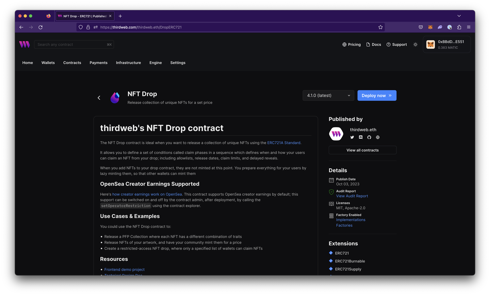
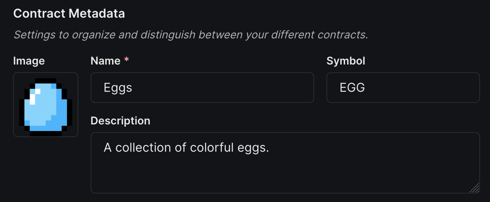
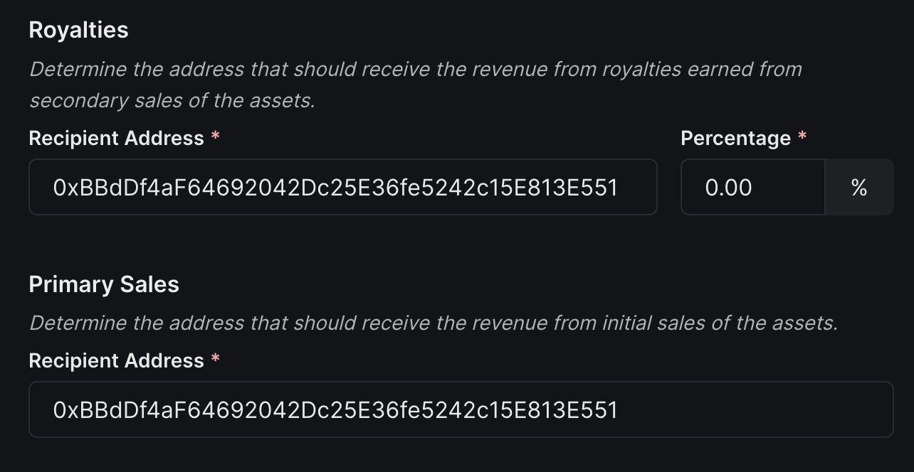
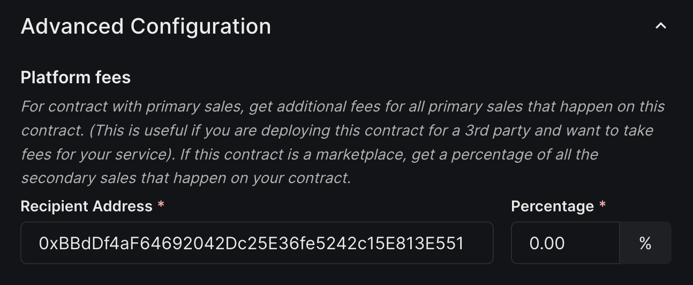
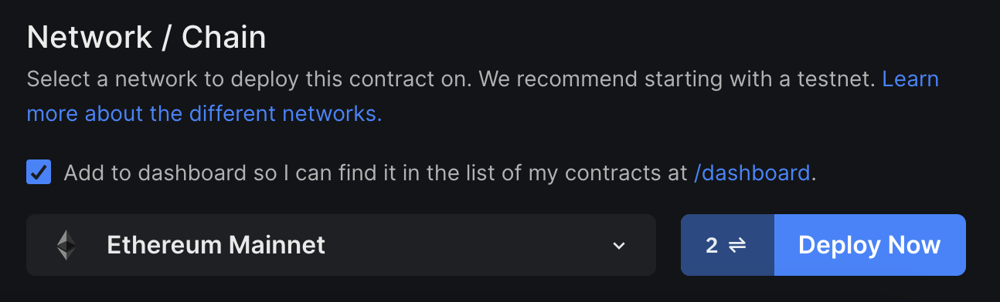
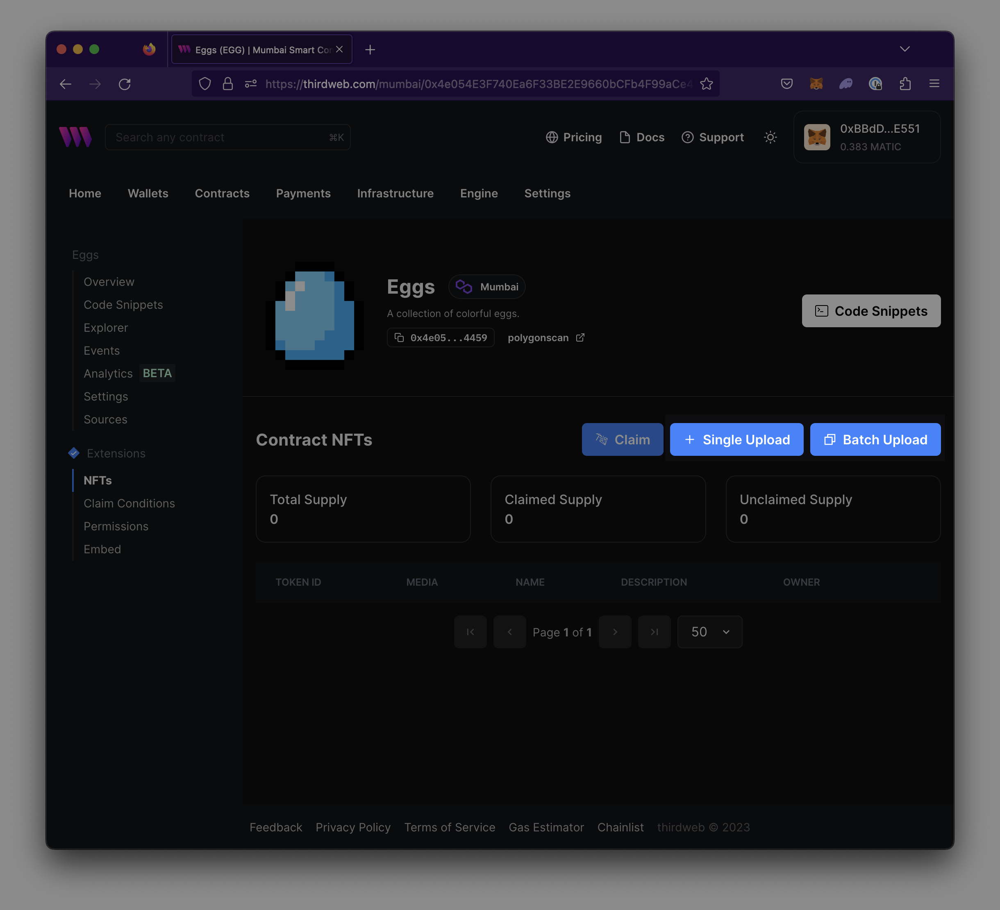
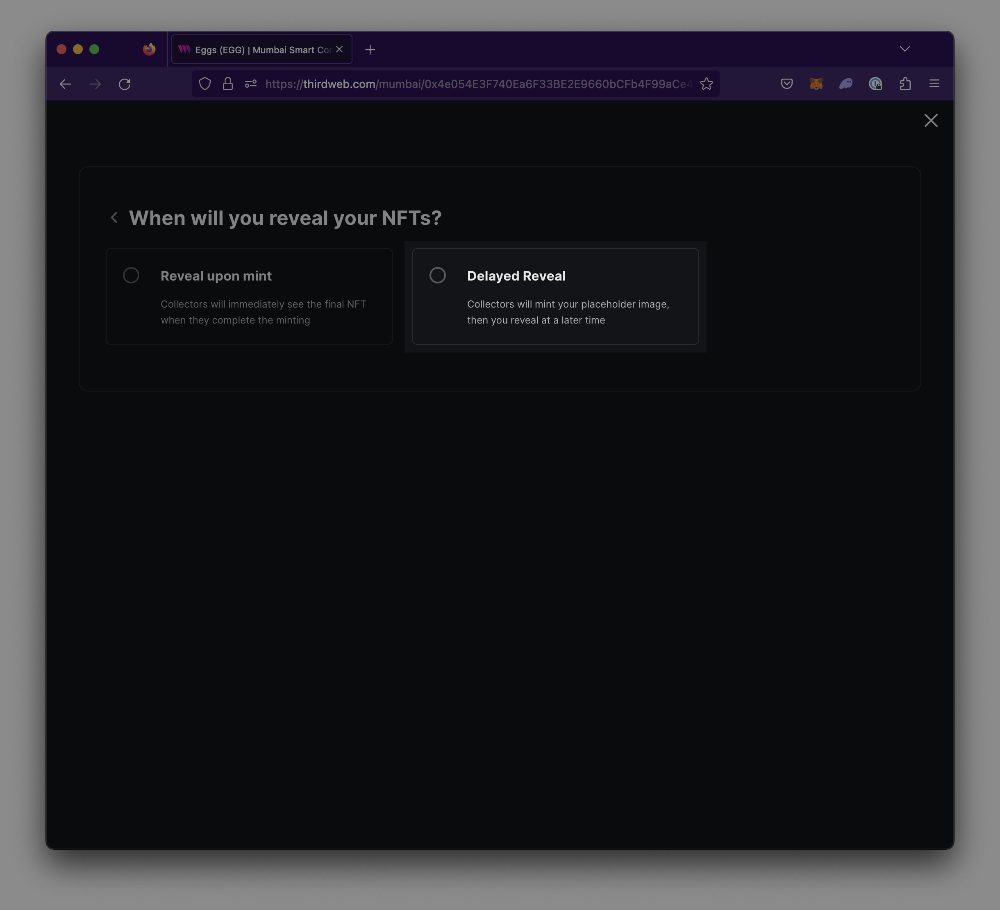

import Tabs from "@theme/Tabs";
import TabItem from "@theme/TabItem";
import CodeBlock from "@theme/CodeBlock";
import DeployThisContractButton from "@components/DeployThisContractButton";

<div className="deployContractBtnContainer" style={{ marginTop: -70 }}>
  <DeployThisContractButton
    link={
      "https://thirdweb.com/thirdweb.eth/DropERC721?via=portalhttps://thirdweb.com/thirdweb.eth/DropERC721?via=/explore"
    }
    contractType="nft-drop"
  />
</div>

## Overview

NFT Drop enables users to release a collection of unique NFTs using the ERC721A standard. NFT Drop uses a “drop” mechanism intended for large collections to distribute NFTs. The NFT Drop can be deployed via the [dashboard](/pre-built-contracts/nft-drop#deploy-nft-drop-dashboard), [CLI](/pre-built-contracts/nft-drop#deploy-nft-drop-cli), or [SDKs](/pre-built-contracts/nft-drop#deploy-nft-drop-sdk).

:::info
**NFT Drop vs NFT Collection**

NFT Drop differs from [NFT Collection](https://portal.thirdweb.com/pre-built-contracts/nft-collection) in that it allows users to lazy-mint the NFT directly to their wallet. This eliminates the need to mint the NFT to the creator's wallet and then transfer the asset to another user’s wallet.

:::

### Use Cases

- Create restricted-access NFTs which can only be claimed by a specified allowlist of wallets
- Create large collections of unique NFT profile pics with each NFT corresponding to unique metadata or traits
- Create NFTs of artwork intended for distribution

### Extensions

- ERC721
- ERC721Burnable
- ERC721Supply
- ERC721LazyMintable
- ERC721Revealable
- ERC721ClaimPhasesV2
- Royalty
- PlatformFee
- PrimarySale
- Permissions
- PermissionsEnumerable
- ContractMetadata
- Ownable
- Gasless

## Deploy NFT Drop (Dashboard)

### Deploy and configure contract

1. Navigate to Contracts > Explore > [NFT Drop](https://thirdweb.com/thirdweb.eth/DropERC721)
2. Select `Deploy now`

   

3. A modal will appear to set Contract Metadata or settings to organize and distinguish between contracts. Set the following metadata:

   1. **Name** - name of the contract
   2. **Symbol (optional)** - shortened name or symbol to denote a specific group of tokens. Similar to a stock ticker.
   3. **Description (optional)** - description of contract to
   4. **Image (optional)** - image or icon of contract

   

4. Set fund distribution recipients for Primary Sales and Secondary Sales by passing in the corresponding wallet addresses you want to receive the funds.

   1. **Primary Sales** - The initial recipient will receive any funds from sales made upon initially minting the NFT.
   2. **Royalties / Secondary Sales** - The recipient that will receive funds from any secondary sales or re-sales of the NFT.

      

   3. **(Optional) Platform fees** - Recipient that will receive additional fees for all primary sales that happen on this contract. (This is useful if you are deploying this contract for a 3rd party and want to take fees for your service).

      

5. Choose a Network / Chain to Deploy to. [View list of available Networks.](https://thirdweb.com/chainlist)

   

6. Select `Deploy` and sign the transaction prompted in the connected wallet to finish deploying the contract.

### Upload NFTs

**Single Upload**

- Single upload is a preferred option for users uploading few NFTs at a time. Learn [how to single upload](https://portal.thirdweb.com/dashboard/NFTs#single-upload) through dashboard.

**Batch Upload**

- Batch upload is a method that allows you to upload large amounts of NFTs in one click. Learn [how to batch upload](https://portal.thirdweb.com/dashboard/NFTs#batch-upload) through dashboard.



### Enable Delayed Reveal

Optionally, users may choose to hide their NFT image and metadata from users before minting. [Learn more about delayed reveal.](https://portal.thirdweb.com/dashboard/NFTs#reveal-nfts)



## Deploy NFT Drop (CLI)

1. In the CLI run the following Deploy command:

   ```jsx
   npx thirdweb deploy -n --name nft-drop
   ```

2. Follow the prompts to fill out your contract by following the Deploy NFT Drop (Dashboard) section.

## Deploy NFT Drop (SDK)

**TypeScript**

```jsx
const txResult = await sdk.deployer.deployBuiltInContract("nft-drop", {
  name: "<your_contract_name>",
  primary_sale_recipient: "<wallet_address>",
});
```

**Python**

```jsx
from thirdweb.types.settings.metadata import NFTDropContractMetadata

metadata = NFTDropContractMetadata(
    name="<your_contract_name>",
    primary_sale_recipient="<wallet_address>",
    seller_fee_basis_points=500, # 5% royalty fee
    fee_recipient="<wallet_address>",
    platform_fee_basis_points=10, # 0.1% platform fee
    platform_fee_recipient="<wallet_address>",
)

sdk.deployer.deploy_nft_drop(metadata)
```

**Go**

```jsx
address, err := sdk.Deployer.DeployNFTDrop(
     context.Background(),
        &thirdweb.DeployNFTDropMetadata{
            Name: "<your_contract_name>",
        }
    })
```

**React Native**

```jsx
const sdk = useSDK(sdk.deployer.deployBuiltInContract("nft-drop", {
  name: "<your_contract_name>",
  primary_sale_recipient: "<wallet_address>",
});)
```

### Interact with your contract

For easy-to-use code snippets for your contract, view the [Code Snippets](https://portal.thirdweb.com/dashboard/build) view on your contract’s dashboard or visit the [SDK documentation](/sdk).
