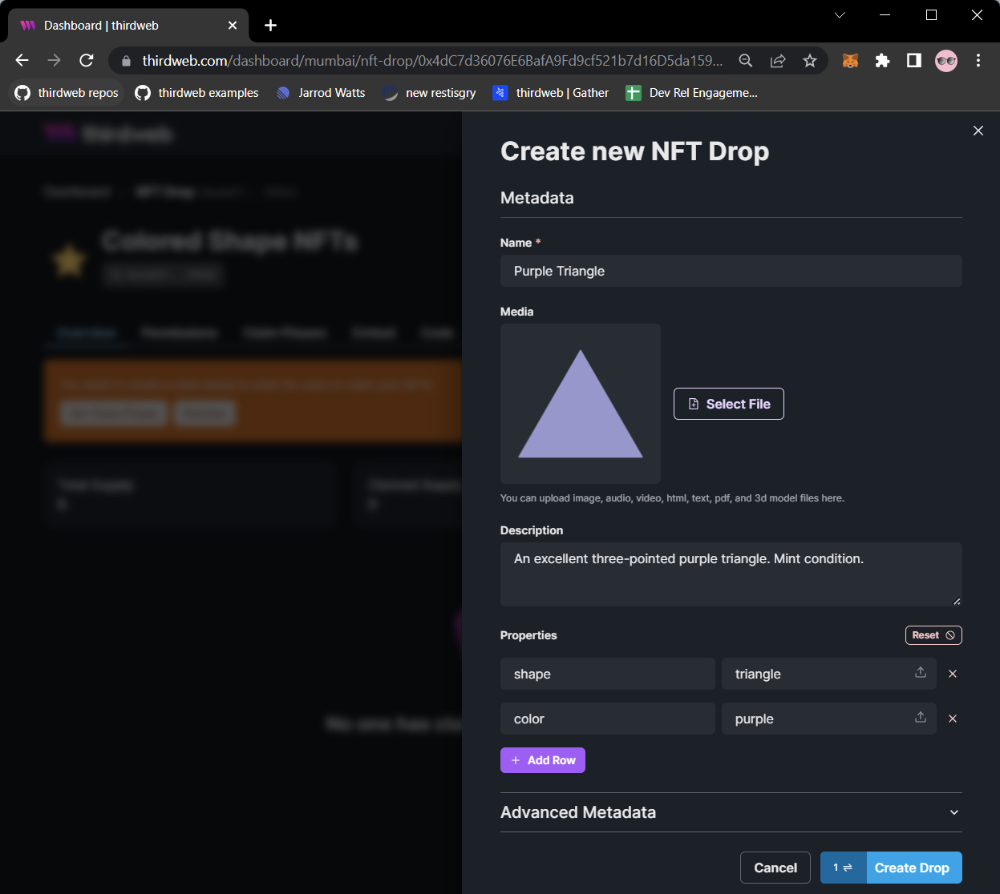
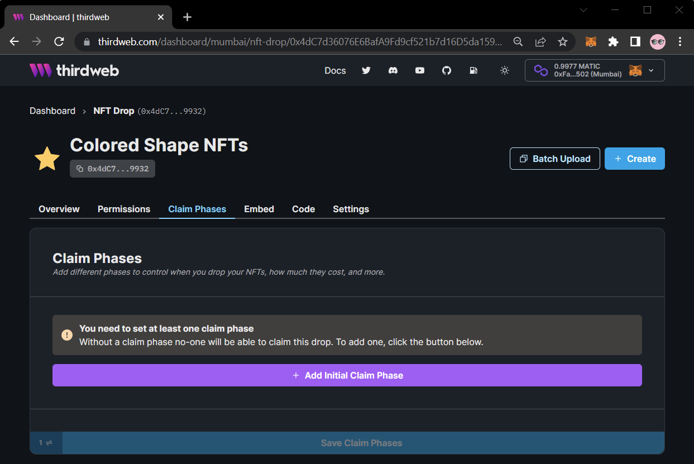
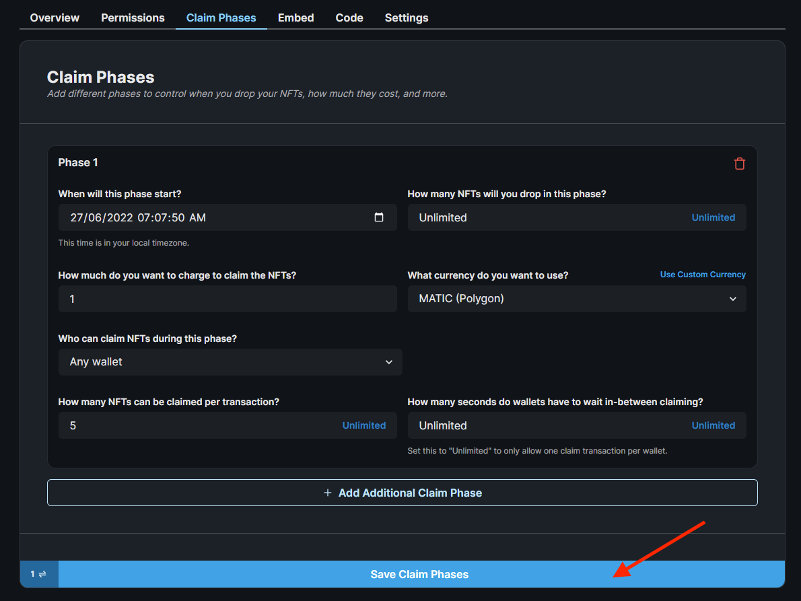

import QuickstartCard from "../../../src/components/QuickstartCard";

# Creating & Releasing Tokens

Drop contracts such as the [NFT Drop](/pre-built-contracts/nft-drop) allow you to lazy mint tokens and release them to be claimed by other wallets.
They include configurable **claim phases** that define the conditions under which a token can be claimed, such as an allowlist, price, and release date.

This page will show you how to lazy mint tokens and set up claim phases for others to mint your NFTs.

## Lazy Minting An NFT

To create an NFT, upload a media asset, enter the metadata of your NFT and click on the **Create Drop** button.

All of the metadata you configure will automatically be [pinned to IPFS](/guides/securing-pinning-your-nft-with-ipfs).

Once it is minted, it will instantly show up on sites like [OpenSea](https://opensea.io/) without any extra steps!

## Setting Up Claim Phases

To add a claim phase, click the **Claim Phases** tab, and then click the **Add Initial Claim Phase** button.

Each claim phase can include a sale price, release date, allow-lists, and more.

Below is an example of a claim phase, where:

- Each NFT is sold for 1 MATIC
- Any wallet can claim an NFT
- Each wallet can claim one time, and mint up to 5 NFTs in that claim.

Click **Save Claim Phases** to save your changes.

## Next Steps

Our NFTs are ready to be claimed from the contract!

Let's see how we can build an application on top of this smart contract.

  

    <QuickstartCard
      name="Building web3 Apps"
      link="/getting-started/building-app"
      image="/assets/icons/sdks.png"
    />
  

