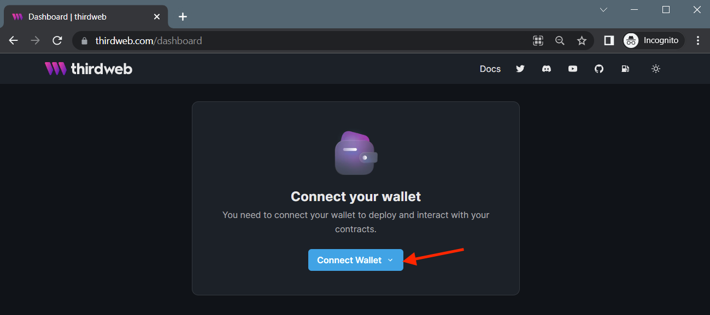
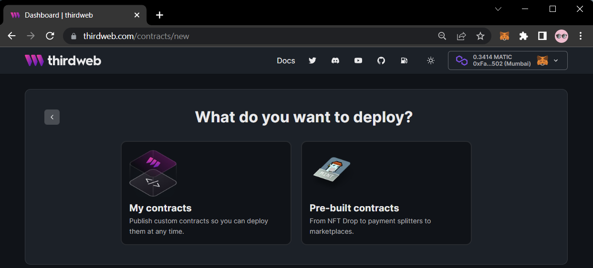
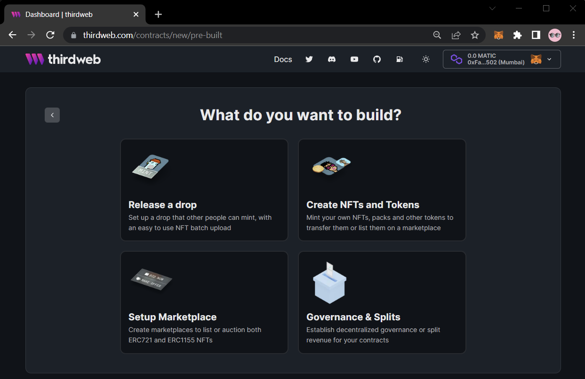
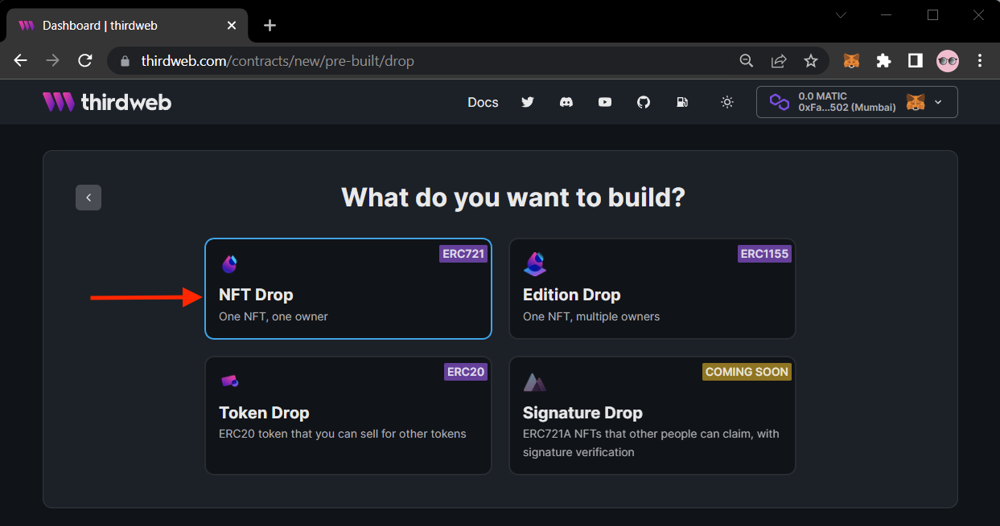

import DeployingContractsCodeTabs from "../../../src/components/DeployingContractsCodeTabs";
import InstallingThirdwebCodeTabs from "../../../src/components/InstallingThirdwebCodeTabs.tsx";
import InitializingThirdwebCodeTabs from "../../../src/components/InitializingThirdwebCodeTabs.tsx";

# Deploying a Smart Contract

There are two ways to deploy contracts using thirdweb.

1. Deploying one of our [pre-built contracts](/pre-built-contracts), using the [dashboard](https://thirdweb.com/dashboard) or the [SDK](/typescript/sdk.contractdeployer.deploynftdrop).
2. Writing your own smart contract with the help of our [contract extensions](/thirdweb-deploy/contract-extensions) and deploying it with [thirdweb deploy](/thirdweb-deploy).

To get started, we'll show you how to deploy a pre-built contract; the [NFT Drop](/pre-built-contracts/nft-drop)!

## Connect Your Wallet

The first step is to visit the [thirdweb dashboard](https://thirdweb.com/dashboard) and connect your wallet.

:::tip Creating a Wallet

Learn how to create a wallet here: [Create a MetaMask Wallet Guide](/guides/create-a-metamask-wallet).

:::

## Choosing your Contract

Next, we'll pick which contract we want to deploy.

To deploy an [NFT Drop](/pre-built-contracts/nft-drop), select **Pre-built contracts**.

From here, we can select which kind of pre-built contract we want to deploy.

To learn more about the different kinds of contracts you can deploy with thirdweb, check out the [pre-built contracts](/pre-built-contracts) page.
There, you'll find detailed explanations and example use-cases for each of them.

An [NFT Drop](/pre-built-contracts/nft-drop) is a "drop" contract, which means other wallets mint NFTs from your collection.

Click **Release a drop** and then **NFT Drop**.

## Configuring Contract Metadata

You can configure the [metadata](/advanced-features/contract-settings#contract-metadata)
of your smart before you deploy it.

Metadata includes information such as:

- Image, name, symbol and description.
- The wallet address that will receive the funds from the contract's mints/sales.
- The royalty percentage fee on secondary sales and the wallet that will receive them.
- The blockchain & network that the contract will be deployed to.

:::info Blockchains & Networks

Not sure which blockchain and network you want to deploy to?

Learn more about testnets, and the blockchains that thirdweb supports here: [Blockchains & Networks Guide](/guides/which-network-should-you-use).
:::

To deploy a contract, you need to have enough funds in your wallet to cover the gas cost of the deployment.

If you're deploying to a testnet, you can get test funds for free, using our [Faucet Guide](guides/get-matic-on-polygon-mumbai-testnet-faucet).

To deploy your contract, click the **Deploy Now** button!

:::tip Deployment Tip

We recommend deploying to a testnet first, to make sure your contract is working as expected.

:::

## Managing Your Contract

The dashboard is a great way to visualize and configure your contract.

It allows you to view the contract's current state, configure settings & permissions, and perform helpful actions like mint and transfer NFTs.

### Creating an NFT

To create an NFT, click on the **Create** button.

All of the metadata you configure will automatically be [pinned to IPFS](/guides/securing-pinning-your-nft-with-ipfs) and stored on the blockchain.

This means it will instantly show up on sites like [OpenSea](https://opensea.io/) and [Rarible](https://rarible.com/) without any extra steps.

Click the **Create Drop** button to lazy-mint your NFT (this allows it to be minted by other wallets).

### Setting up Claim Phases

The NFT Drop contract uses [claim phases](/pre-built-contracts/nft-drop#claim-phase)
that define the conditions that must be met before a wallet can claim an NFT.

To add a claim phase, click the **Claim Phases** tab, and then click the **Add Initial Claim Phase** button.

Each claim phase can include a sale price, release date, allow-lists, and more.

Below is an example of a claim phase, where:

- Each NFT is sold for 1 MATIC
- Any wallet can claim an NFT
- Each wallet can claim one time, and mint up to 5 NFTs

Click **Save Claim Phases** to save your changes.

### Adding Team Members

If you're working in a team, you can invite your team members to your contract with different levels of permissions.

Learn more about the different roles and what they mean here: [Permission Controls](/advanced-features/permission-controls).

