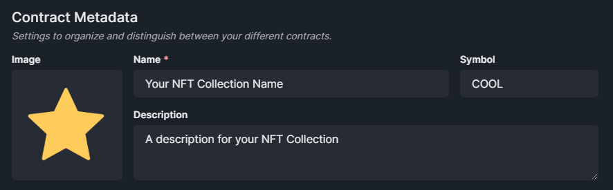
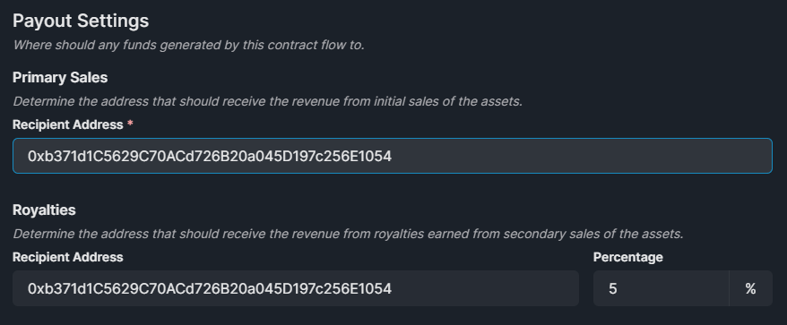
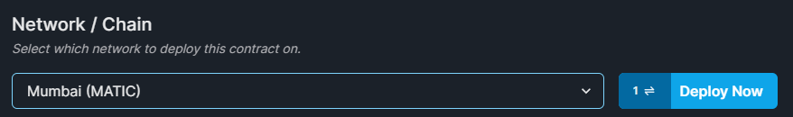
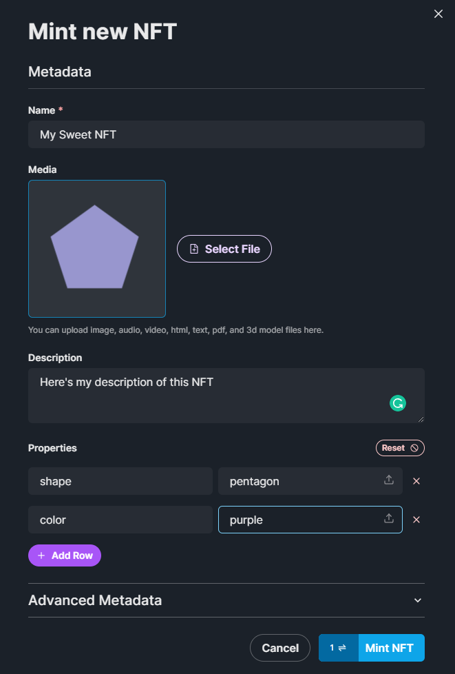

# Deploying Contracts

## Deploying via the thirdweb Dashboard

You can deploy smart contracts onto the blockchain using the thirdweb dashboard for free, onto one of our supported test networks. In order to do this, you’ll need to first get yourself some test funds from a faucet.

:::tip

For your first project we recommend you use the Mumbai Test Network, and you can access free test MATIC from [the official faucet](https://faucet.polygon.technology/).

:::

Now you’ve loaded up on test funds, let’s deploy your first contract.

Head over to the [**dashboard**](https://thirdweb.com/dashboard) and connect your wallet.

Click **Deploy New Contract** and you’ll be taken to our contract deployment page.

Here is where you’ll find all of our available Built-in Contracts, and any of the contracts you’ve uploaded using thirdweb Deploy.

Under **Built-In Contracts**, click the **Deploy Now** button on the **NFT Collection** contract.

From here, you’ll be prompted to configure your NFT Collection’s metadata:

You can also configure specific settings within your smart contract such as

- Primary Sales Recipient Address
- Royalties Address
- Royalties Percentage

When you’re happy with the configuration, you can deploy your smart contract with one click!

You’ll need to approve one transaction and pay a gas fee to deploy your NFT Collection smart contract onto the blockchain.

You just deployed an NFT Collection smart contract onto the Mumbai Polygon Test Network! 🎉

Now you can easily view and mint new NFTs into your collection using the the dashboard too! Let's mint an NFT into your collection now.

Click on the **Mint** button and enter the details such as the name, image, description, and properties of your new NFT.

Approve the transaction, and you have successfully minted your first NFT into your collection!

Now let’s learn how to use this smart contract inside our application.
