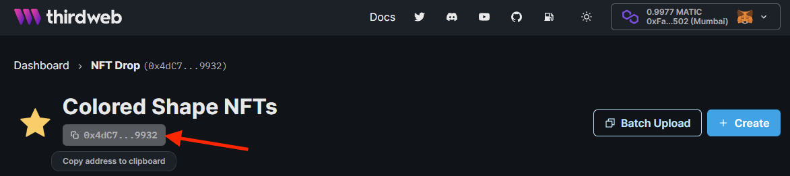

import ThirdwebCodeSnippet from "../../../src/components/ThirdwebCodeSnippet";

# Interacting with Smart Contracts

Now that you've [installed and configured](/getting-started/creating-a-web3-app/) the SDK, you're ready to start interacting with your smart contracts (and more)!

## Getting Your Smart Contract

The first step is to get your contract.

You can do this by using its contract address, which you can find in the dashboard.

Copy this contract address, and use it to get an instance of your smart contract in code.

For example, we can get our NFT Drop contract using the code below:

<ThirdwebCodeSnippet
  contract={"NFTDrop"}
  name={"initializing the SDK"}
  isGetContractCode
  showHr={false}
/>

## Using Your Smart Contract

Now you're ready to use the functions of your smart contract.

### Read Data

You can read data from the contract like so:

<ThirdwebCodeSnippet contract={"NFTDrop"} name={"getAll"} showHr={false} />

### Write Data (Create Transaction)

You can write data to the contract if there is a connected wallet, or instantiated the SDK with a signer/private key.

<ThirdwebCodeSnippet contract={"NFTDrop"} name={"claimTo"} />
