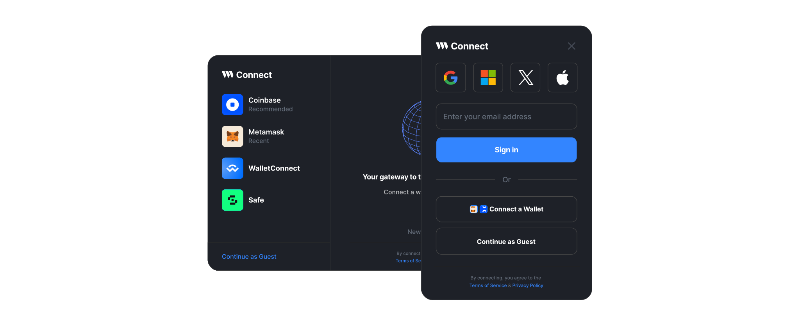
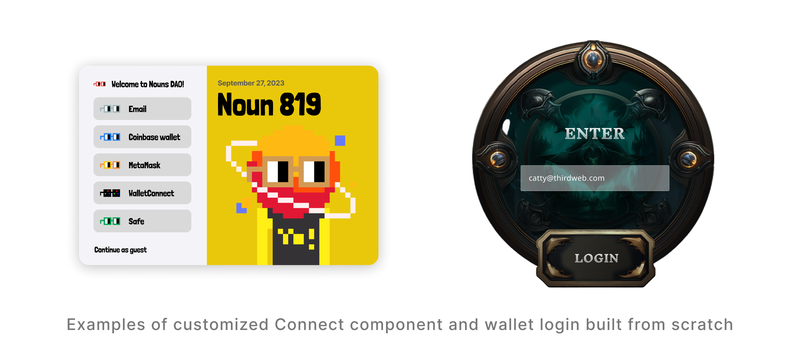

import QuickstartCard from "@components/QuickstartCard";

# Overview

Connect is a comprehensive toolkit for connecting end-user wallets to applications and games. With Connect, you have the option to use the Connect Wallet component or utilize the Wallet SDK to create a customized experience that suits your app requirements.

### Features

- **Wallet Support:** Connect to 170+ different wallet providers with support for any EVM network
- **Improved onboarding experience:** Support for email / social login, and smart wallets with gas-less options to seamlessly onboard non-native or new crypto users.
- **Customization options:** Change default or recommend wallet providers, themes, modal size, logos, text, and more to match your branding.
- **Enable wallet actions for native experiences:** Connect / disconnect wallet, view balance, display ENS name, view transaction history, send / receive tokens, switch networks, and more directly from the UI.
- **Authenticate Users:** Easily enable Auth (SIWE) to authenticate your end users.
- **SDK Integration:** Easily integrate with thirdweb's Contract SDKs to enable users to interact with your application.
- **Multi-platform Support:** Extend wallet connection capabilities across various platforms, including web applications, mobile applications, and games, ensuring a seamless and consistent user experience.
- **Analytics:** Gain valuable insights into user behavior and wallet usage with built-in analytics tools. Track metrics such as the number of active users, most used wallet providers, and retention.

### Use Cases

- Add a connect wallet modal for users connect to your application with options for multiple wallet providers
- Help onboard non-native crypto users via email, social, or guest wallets
- Integrate with SDKs to enable contract interactions via games or applications

### Try it out!

Try out and customize the Connect modal to match your brand using the thirdweb dashboard.

  <QuickstartCard
    name="Try Out the Connect Wallet Component"
    link="https://thirdweb.com/dashboard/wallets/connect"
    image="/assets/product/connect-wallet.png"
  />

 

## Full References

  

    <QuickstartCard
      name="TypeScript"
      link="/connect/usage-with-typescript-sdk"
      image="/assets/languages/typescript.png"
    />
  

  

    <QuickstartCard
      name="React"
      link="/connect/usage-with-react-sdk"
      image="/assets/languages/react.png"
    />
  

  

    <QuickstartCard
      name="React Native"
      link="/connect/usage-with-react-native-sdk"
      image="/assets/languages/react-native.png"
    />
  

  

    <QuickstartCard
      name="Unity"
      link="/connect/usage-with-unity-sdk"
      image="/assets/languages/unity.webp"
    />
  

