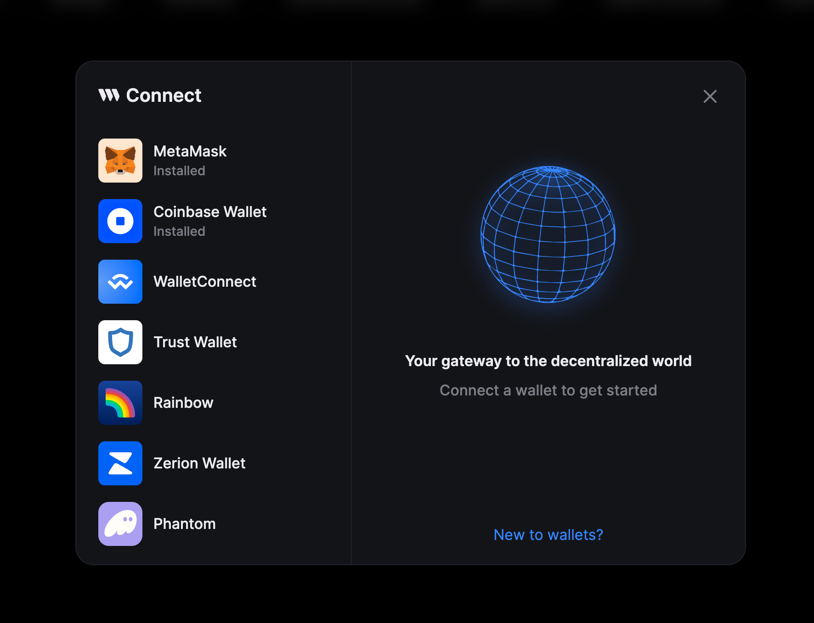

import QuickstartCard from "@components/QuickstartCard";

# Connect Wallet Component

The Connect Wallet Component is an out-of-the-box UI solution for connecting users' wallets to web3 applications and games.
With its customizable UI and extensive wallet options,
this component allows for flexibility in supporting various wallet types including non-custodial,
custodial, [smart wallets](/smart-wallet), and embedded wallets.

  <QuickstartCard
    name="Try Out The Connect Wallet Component"
    link="https://thirdweb.com/dashboard/wallets/connect"
    image="/assets/product/connect-wallet.png"
  />

 

## Features

- Connect to 170+ different wallets including local wallets, email wallets (for better onboarding) and ERC-4337 Smart Wallets.
- Easy to adapt to your brand and theme.
- Compatible with any EVM network.
- Customize the displayed and recommended wallet providers, the theme, modal, logo and more. See the [connect wallet component documentation](/connect/connect-wallet#configuration-options) for full configuration options.
- Support for [React](/connect/usage-with-react-sdk), [React Native](/connect/usage-with-react-native-sdk), and [Unity](/connect/usage-with-unity-sdk)
- Gasless support when using with [Smart Wallets](/react/react.smartwallet).
- Send and Receive Tokens
- Integrates with thirdweb SDKs
- View balance, ENS name and transaction history
- Ability to add SIWE authorization
- Create a [completely custom UI](/connect/connect-wallet/custom-ui) using the SDK hooks and functions
- Ability to add custom custom wallets using the [Wallet SDK](/connect/build-a-wallet)

## Custom Connect Wallet UI

Gives you low level control to create a completely custom UI with
your own buttons and modals,using the available Hooks, Connectors Configurators and functions.

[View the Custom Connect Wallet UI documentation.](/connect/connect-wallet/custom-ui)

You can also build your own wallet connector using the Wallet SDK and add this wallet to the Connect Wallet component by following [this guide](/connect/build-a-wallet).

## References

By using the thirdweb SDKs, you can easily connect and execute wallet actions.

  

    <QuickstartCard
      name="React SDK"
      link="/react/react.connectwallet"
      image="/assets/languages/react.png"
    />
  

  

    <QuickstartCard
      name="React Native SDK"
      link="/react-native/react-native.connectwallet"
      image="/assets/languages/react-native.png"
    />
  

  

    <QuickstartCard
      name="Unity SDK"
      link="/unity/connectwallet"
      image="/assets/languages/unity.webp"
    />
  

