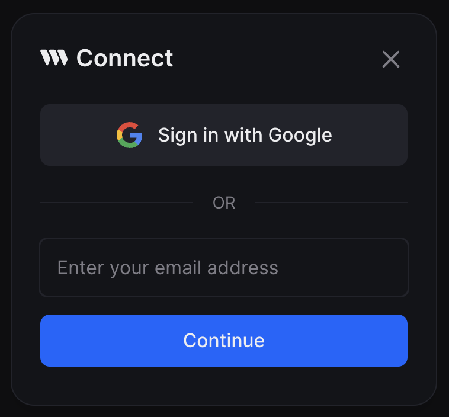
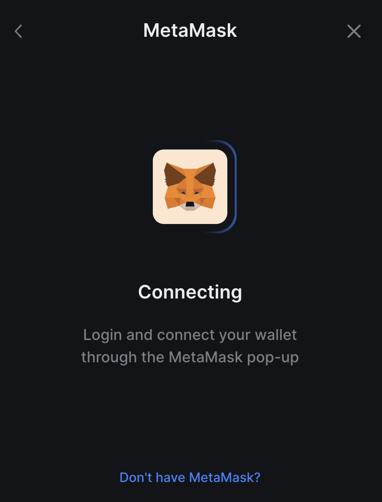

Customize the UI of one of the supported wallets when using the `ConnectWallet` component or add a UI for a custom wallet configurator.

## Render a Custom UI for Selecting your Wallet

Instead of the default icon + name in the wallet selector screen, you can render a custom UI for your wallet.

Take [`embedded wallet`](/embedded-wallet) for example, It renders an input field where the user can enter their email address:



This can be done by specifying a React component in the `selectUI` property of your wallet config.

Similarly, you can render a custom UI for connecting your wallet by specifying a React component in the `connectUI` property of your wallet config.

Take `metamaskWallet` for example, It renders a screen when users connect their wallet:



### selectUI & connectUI

To create a custom UI for selecting and connecting your wallet in the wallet selection/connection screens in the connect wallet modal, create a `selectUI` and `connectUI` function **in your wallet configurator**.

```tsx
    import { SelectUIProps, ConnectionUIProps, WalletConfig } from '@thirdweb-dev/react';

// example: render an input field where the user can enter their email address
function MyWalletSelectionUI(props: SelectUIProps<MyWallet>) {
  const [email, setEmail] = useState('');
  const usesMoreWallets = props.supportedWallets.length > 1;

  return (
    <div>
      <input value={email} onChange={e => setEmail(e.target.value)} />
      <button
        onClick={() => {
          props.onSelect(email);
        }}
      >
        submit
      </button>
      {usesMoreWallets && <p> --- OR --- </p>}
    </div>
  );
}

function MyWalletConnectionUI(props: SelectUIProps<MyWallet>) {
  // Get the email address entered by the user in MyWalletSelectionUI
  const email = props.selectionData as string;

  return <div> ... </div>;
}

function myWallet (options?: MyWalletConfig): WalletConfig<MyWallet> {
  // ...
  selectUI(props) {
    return <MyWalletSelectionUI {...props} />;
  },
  connectUI(props) {
    return <MyWalletConnectionUI {...props} />
  }
}
```
