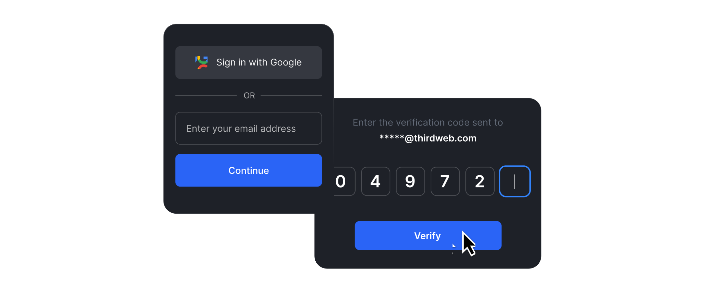

import QuickstartCard from "@components/QuickstartCard";

# Embedded Wallet

Embedded wallets are wallets that get spun up for users when they first come into your app. They are designed to help app developers building web3 apps for mainstream audiences build seamless login experiences.

Users can login using their email address, social logins (twitter, apple, discord, etc), or any Open ID Compatible authentication service. Once they authenticate they are provisioned a wallet, which they can then use to perform on-chain actions like minting NFTs and sending transactions.

Embedded wallets work with all EVM networks

  <QuickstartCard
    name="Try it out in a live playground"
    link="https://thirdweb.com/dashboard/wallets/connect"
    image="/assets/product/connect-wallet.png"
  />

## Features

- **Modular, Composable & Customizable:** Email login, social login, and bring-your-own auth.
- **Enable Gasless Transactions:** When you combine embedded wallets with smart wallets, users do not require crypto to interact with the blockchain.
- **Security:** No single point of failure. Private keys cannot be reconstructed by thirdweb or any developer without user authentication. The only owner of the wallet is the end user.
- **Connect To Other Web3 Apps**: Your application's embedded wallet users can use the [My Wallets](https://ews.thirdweb.com/wallet) page to sign in to their wallet, and connect to web3 apps via WalletConnect.
- **View & Transfer NFTs**: Buyers can visit the [My Wallets](https://ews.thirdweb.com/wallet) page to view and transfer NFTs in their Embedded Wallets. We cover all gas fees related to transferring NFTs out of embedded wallets and offer a way for users to export their private keys.

## Use cases

- Creating user wallets without requiring web3/crypto knowledge or downloading an external app.
- Combining embedded wallets with smart wallets allowing users to send transactions e.g. trade and sell NFTs or ERC-20 tokens, gaslessly.
- Allowing users to access their wallets on different devices without additional passwords.
- Enabling users to connect to WalletConnect-compatible web3 apps. _OpenSea, CollabLand, etc._

## Pricing

Embedded wallet is free up to 10,000 Monthly Active Wallet and $0.02 per incremental Monthly Active Wallet beyond that. Find more information on the different billing tiers by visiting [thirdweb's pricing page](https://thirdweb.com/pricing).
