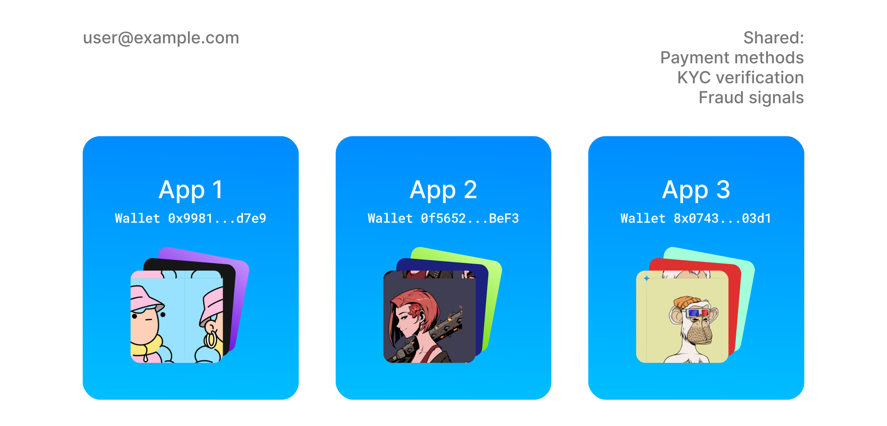

## One Embedded Wallet Per App

Embedded wallets are scoped to your app. If a user uses the same email to sign in to a different app, that app will manage a different wallet entirely. However, users can get a global view of all their application-scoped Embedded Wallets by logging into the [My Wallets](https://ews.thirdweb.com/wallet) page.

**Benefits:**

- Each app has access to wallets created on their app only and cannot manage wallets from other apps.
- Users only see tokens sent/purchased from your app.
- Some behind-the-scenes information can be shared to improve the user experience, such as saved payment methods and KYC verification provided to thirdweb. Apps can never view this information.

## Scaling and Security

### Sharded Private Keys

**A private key is constructed on the user's device after they sign in.**

We use **threshold secret sharing cryptography** to shard each private key to multiple, independent shards: (1) on the user's device, (2) stored in Amazon's KMS and encrypted by a key on a secure hardware security module (HSM) that can only be retrieved by the customer's auth, and (3) encrypted with a key, known by thirdweb, and stored on thirdweb's KMS server. The wallet only works when **two of these three** shards are present.

Key advantages over standard wallets:

- The wallet is not compromised if an attacker gets an individual shard.
- There is no seed phrase. Seed phrases can leaked or forgotten leading to compromised wallets. Not having one increases the security of the wallet
- Users can recover their wallets from any of their devices.

Shards are always encrypted stored and transferred between the customer's device and thirdweb's server. The developer (you) and thirdweb are **non-custodial** and can never reconstruct private keys when the user is not authenticated. thirdweb only has access to the third shard and cannot access the other two shards without the user logging into your application.

With threshold secret sharing, your customers’ assets are safe even if thirdweb or you are compromised. This is because the attacker will only be able to access one of the three shards, and that is not enough to reconstruct the private key.

### Audits

The Embedded Wallet private key security architecture has been audited by HackerOne, and there is an ongoing bounty program to ensure vulnerabilities are being covered.

### Embedded Wallet Scalability

You can create up to 100 wallets/second by default and can support higher limits (up to 3,000 wallets/second) upon request.

## Free email wallets

By default, thirdweb embedded wallets securely manages away all passwords or codes from the user.
We also offer an option for users to set a password as the encryption key for the device recovery share.
For the user, this means that when they authenticate for the first time, they will be prompted to enter a password.

Enable this by selecting "User-managed" when setting up your embedded wallet-enabled API key.
Any wallets created with this option will be completely free.
