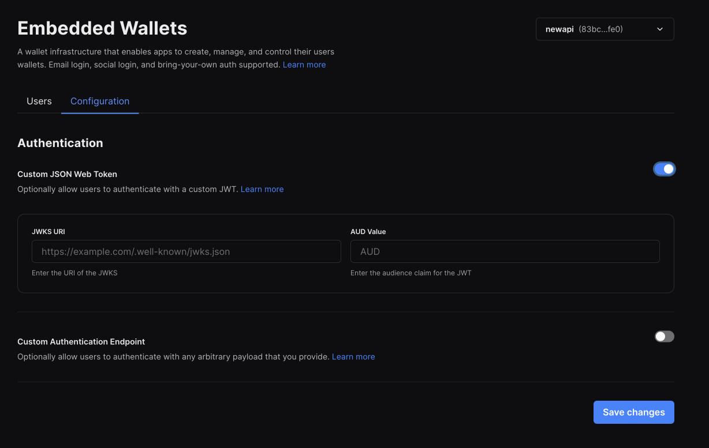
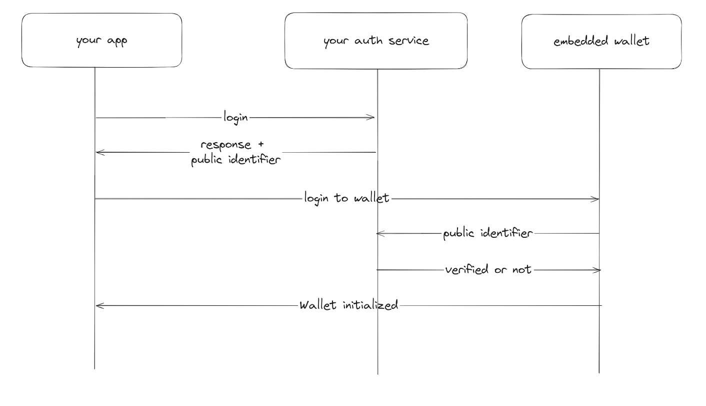
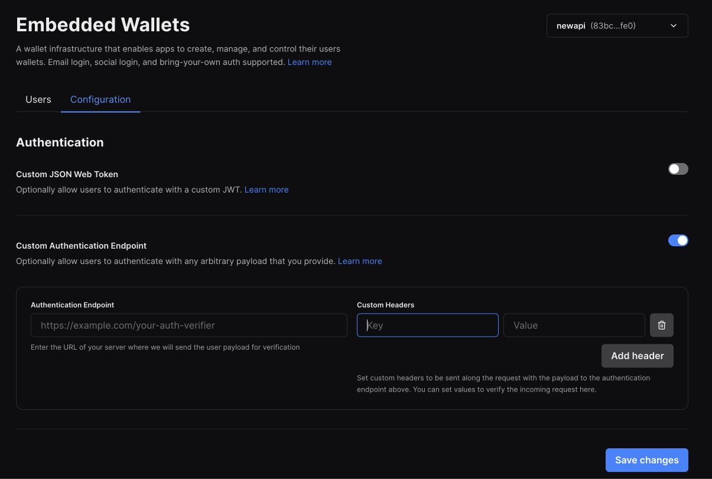

import TabItem from "@theme/TabItem";
import Tabs from "@theme/Tabs";
import QuickstartCard from "@components/QuickstartCard";

Embedded wallets already support most popular login methods out of the box, but we also give app developers the flexibility to use 
embedded wallets with any authentication method. If you have a valid authenticated user, you should be able to easily spin up an 
embedded wallet for them irrespective of how they got authenticated.

### Usecases

This means that app developers can now

- Spin up embedded wallets for users using their existing authentication service. For example, if you have a game where players log in using their username and password, you can now easily create wallets when they sign up.
- Integrate with any social login provider. For example, if you have a game where you want to let users login with their Steam or Epic games credentials, you can now use embedded wallets to enable these experiences.
- Use embedded wallets in non-frontend environments. For example, you could authenticate users with SSH and use embedded wallets with CLI tools.
- Build completely custom authentication experiences. For example, you could ask users to verify their credentials with 2FA or passkey before you consider them authenticated and provision wallets for them.

## Configuring custom auth

We offer two options to setup your custom auth, one that is based on the [OIDC (Open ID Connect)](https://openid.net/developers/how-connect-works/) standard, and a generic option that lets you bring your own auth server. You can also use both options together if needed.

### Setting up OIDC compatible auth

An OIDC auth system has a public-private keypair, where the private key is used to sign auth tokens
- The public key is uploaded to a public URL in JWKS format. The standard location is `https://{domain}.com/.well-known/jwks.json`
- When a user logs in, a JWT token called the idToken is generated and signed by the private key. The OIDC spec provides an interface for fields that are used in this token.
- This JWT is then passed to the embedded wallet to generate a wallet for the user.
- We will verify the JWT against the public key to verify that the JWT was signed correctly. Upon successful verification, we will proceed to generate a wallet based on the `sub` (user identifier) value of the idToken.


To setup an OIDC compatible auth, enable the first option in the configuration tab of the embedded wallet dashboard


You will be asked to enter the following values
- The URL of the JWKS file (public key): This is used to verify the token was signed by you.
- The `aud` value of the idToken: This is used to verify that thirdweb is the intended user of the token


### Setting up generic auth

Generic auth is a lower level option that can be used when you have your own auth server that you use to authenticate users
- When a user logs in, you are able to generate a public identifier that allows you to identify the user.
- You can pass this identifier to the embedded wallet to generate a wallet for the user.
- When verifying the user, we will hit an endopint that you provide to verify the user's identity.
- We will then generate a wallet for the user if the provided payload is valid.



To use generic auth, enable the second option in the configuration tab of the embedded wallet dashboard



You will be asked to enter an endpoint that we can hit to verify the user's identity. This endpoint should accept a POST request with a JSON body containing the following fields:
- `payload`: This will correspont to the public identifier that was generated for your user.

The endpoint should return a JSON body containing the following fields:
  - `userId`: A uid for the user. Note that you can only create one wallet per `userId` at this point
  - `email` (optional): If provided, the user will be able to access the same account outside of the platform for things like private key export // using with wallet connect etc.
  - `exp` (optional): An expiration date for the user's wallet session. By default a session is 7 days long.


You can also pass a list of headers. These headers will be sent with every request to your verification endpoint. You can use these to authenticate the request.


## Authenticating a user


### OIDC auth

<Tabs>
<TabItem value="react" label="React & React Native">

In React and React Native, the `useEmbeddedWallet()` hook handles authentication and connection states.

```typescript
import { useEmbeddedWallet } from "@thirdweb-dev/react"; // or /react-native

const embeddedWallet = useEmbeddedWallet();

const handlePostLogin = async (jwt: string) => {
  await embeddedWallet.connect({
    strategy: "jwt",
    jwt,
  });
};
```

</TabItem>

<TabItem value="typescript" label="Other Typescript Frameworks">

In other frameworks, use your own instance of the wallet to authenticate and connect.

```typescript
import { EmbeddedWallet } from "@thirdweb-dev/wallets";
import { Goerli } from "@thirdweb-dev/chains";

const embeddedWallet = new EmbeddedWallet({
  chain: Goerli, //  chain to connect to
  clientId: "YOUR_CLIENT_ID", // Your thirdweb client ID
});

const authResult = await embeddedWallet.authenticate({
  strategy: "jwt",
  jwt,
});

const walletAddress = await embeddedWallet.connect({ authResult });
```

</TabItem>
</Tabs>


### Generic auth


<Tabs>
<TabItem value="react" label="React & React Native">

In React and React Native, the `useEmbeddedWallet()` hook handles authentication and connection states.

```typescript
import { useEmbeddedWallet } from "@thirdweb-dev/react"; // or /react-native

const embeddedWallet = useEmbeddedWallet();

const handlePostLogin = async (jwt: string) => {
  await embeddedWallet.connect({
    strategy: "auth_endpoint",
    payload,
  });
};
```

</TabItem>

<TabItem value="typescript" label="Other Typescript Frameworks">

In other frameworks, use your own instance of the wallet to authenticate and connect.

```typescript
import { EmbeddedWallet } from "@thirdweb-dev/wallets";
import { Goerli } from "@thirdweb-dev/chains";

const embeddedWallet = new EmbeddedWallet({
  chain: Goerli, //  chain to connect to
  clientId: "YOUR_CLIENT_ID", // Your thirdweb client ID
});

const authResult = await embeddedWallet.authenticate({
  strategy: "auth_endpoint",
  payload,
});

const walletAddress = await embeddedWallet.connect({ authResult });
```

</TabItem>
</Tabs>

