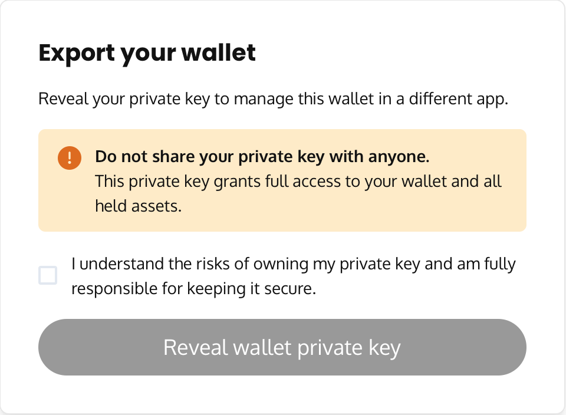

Allow your users to export the private key for their embedded wallet embedding this page in an iframe:

```html
<iframe
  src="https://embedded-wallet.thirdweb.com/sdk/2022-08-12/embedded-wallet/export?clientId=CLIENT_ID"
/>
```

The user will be presented with a form to sign in to reveal their private key:



## Use cases

- As your users gain familiarity with the blockchain, they may want to manage their wallet in another app.
- Your users may lose access to their email (e.g. corporate account) and want to fully own their wallet.

:::note
The export private key embed is only embeddable on sites whitelisted by your client ID in the allowed domains section. Visit the [Settings tab](https://thirdweb.com/dashboard/settings) on the Dashboard to configure your Client ID.
:::
