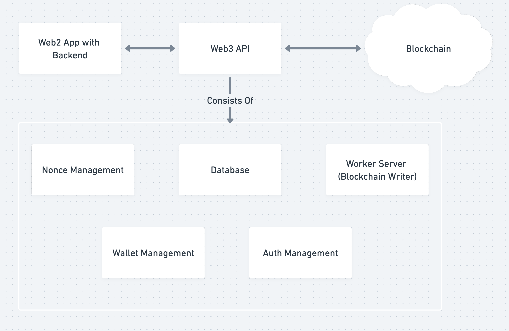

:::info
Engine is currently in Open Beta and requires self-hosting. If you need a managed version, please [contact us](https://thirdweb.com/contact-us).
:::

# Overview

Engine provides a server-side interface for contracts & wallets, without the complexities of wallet and transaction management.

It offers APIs for contracts, wallets, gas-less configurations & auth that allows developers to go to market and launch production grade applications with cross-EVM chain support with faster speeds, security, and reliability.

---

Building a decentralized application with a seamless user experience at scale requires setting up a backend infrastructure to create & manage wallets, deploy & interact with contracts, and handle user authentication. Engine removes this friction by eliminating blockchain constraints related to nonce, funds, gas, and key management.

## Features

- **Backend wallets:** Create backend wallets, store their keys securely via a cloud secrets manager like KMS, sign & send any transactions, and move funds at scale with nonce-management.
- **Smart wallets with shared custody:** Create managed, smart wallets with shared custody between the backend wallets & a user’s EOA wallet.
- **Contracts:** Deploy, read, and write to any contract across any blockchain.
- **Auth:** Create permissions to enable users with wallets to directly interact with certain endpoints on Engine.
- **Sponsored transactions:** Sponsor gas fees for any transactions through Engine.

## Beta Feedback

If you experience any bugs or have any feedback, please [report it to our support team](https://discord.gg/thirdweb) via Discord.
