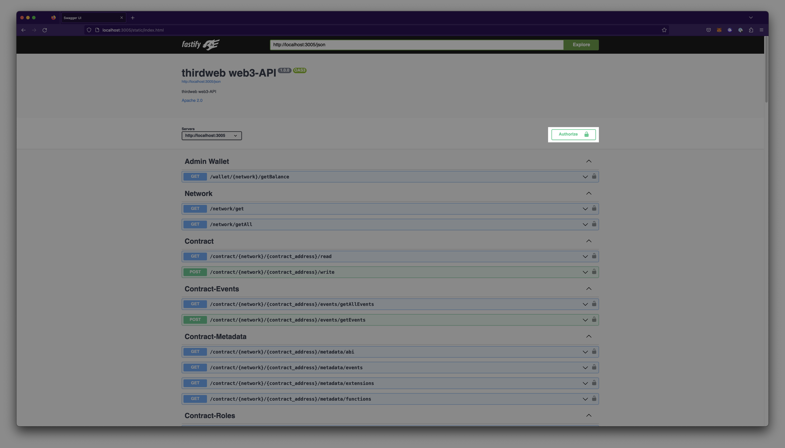
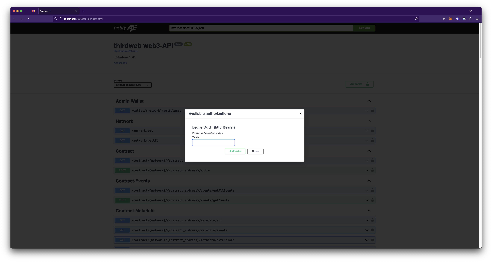

import Tabs from "@theme/Tabs";
import TabItem from "@theme/TabItem";

:::info
Engine is currently in Open Beta and requires self-hosting. If you need a managed version, please [contact us](https://thirdweb.com/contact-us).
:::

# Configuration

## Prerequisites

Before you begin, ensure you have the following:

- [ ] Docker
- [ ] PostgreSQL

## Part 1: Wallet Configuration

To use Engine, you will need to initiate it with a backend wallet using one of the following options:

### Secret Key

1. Setup a `.env` file at the root of your project’s repository
2. Set the following variables in your `.env` file:

   ```
   POSTGRES_CONNECTION_URL=<YOUR_CONNECTION_URL>
   THIRDWEB_SDK_SECRET_KEY=<YOUR_SECRET_KEY>
   ```

### AWS KMS

Engine supports AWS KMS for signing & sending transactions over any EVM chain.

1. Setup a managed key through AWS KMS.
   1. Create an IAM user with programmatic access. Follow the instructions in the AWS documentation on **[creating an IAM user in your AWS account](https://docs.aws.amazon.com/IAM/latest/UserGuide/id_users_create.html#id_users_create_console)**.
   2. Enable Create, Get, and Read permissions for your KMS. Learn more about **[authentication and access control for AWS KMS](https://docs.aws.amazon.com/kms/latest/developerguide/control-access.html)** in the AWS documentation.
   3. Create a KMS key by following the instructions in the AWS documentation on how to [create keys](https://docs.aws.amazon.com/kms/latest/developerguide/create-keys.html).
2. Setup a `.env` file at the root of your repository and set the following variables in this file.

   ```json
   # Required for AWS Auth
   AWS_ACCESS_KEY_ID=<aws_access_key_id>
   AWS_SECRET_ACCESS_KEY=<aws_secret_access_key>
   AWS_REGION=<aws_region>
   ```

### Google KMS

Engine supports Google KMS for signing & sending transactions over any EVM chain.

1. Setup a managed key through Google KMS.
   1. Create an encrypted key with Cloud KMS. Learn how to [Create encryption keys with Cloud KMS](https://cloud.google.com/kms/docs/create-encryption-keys#before-you-begin) from the Google Cloud documentation.
   2. Create a Service Account. Learn how to [Create service accounts](https://cloud.google.com/iam/docs/service-accounts-create) in the Google Cloud documentation.
   3. Create a key with this service account.
   4. Download the JSON file. The JSON file details will be used to authenticate with Google KMS.
   5. Add the following permissions to your service account: `Cloud KMS Admin` and `Cloud KMS CryptoKey Signer/Verifier`
2. Setup a `.env` file at the root of your repository
3. Set the following variables in your `.env` file:

   ```json
   # Required for Google Auth
   GOOGLE_APPLICATION_CREDENTIAL_EMAIL=<client_email_from_download_service_account_json>
   GOOGLE_APPLICATION_CREDENTIAL_PRIVATE_KEY=<private_key_from_download_service_account_json>

   # Required for Google KMS
   GOOGLE_APPLICATION_PROJECT_ID=<google_project_id>
   GOOGLE_KMS_KEY_RING_ID=<key_ring_id>
   GOOGLE_KMS_LOCATION_ID=<location_of_key_ring>
   ```

## Part 2: Server Configuration

While in beta, Engine only offers self-hosted options. To use Engine, you will need to host your own server using a containerization platform such as Docker or Kubernetes.

### Configure Server Using Docker

To host your own server with Docker:

1. [Install Docker](https://docs.docker.com/get-docker/)

2. To obtain the Postgres Docker Image, navigate to the root of your project and run the following command in your command line:

   ```python
   docker run --env-file ./.env -p 5432:5432 --name my-local-postgres -d postgres
   ```

3. Afterwards, to get the Engine Docker Image, navigate to the root of your project and run the following command in your command line:

   ```
   docker run -e .env -p 3005:3005 thirdweb/engine:v0.0.1
   ```

   :::info
   For different versions, please see our [Docker Hub](https://hub.docker.com/r/thirdweb/web3-api) page.
   :::

4. To authenticate, open `localhost:3005` in your browser.
5. Select the `Authorize` option on the dashboard.

   

6. Pass in your corresponding secret key created from the thirdweb dashboard and select Authorize.

   

7. You are now ready to begin developing using APIs. To see a demonstration of endpoints, please visit the `Get Started` tutorial.

### Authorization Header

All Requests need to have `Authorization` header with the value of `Bearer <YOUR_THIRDWEB_SDK_SECRET_KEY>` from the `.env` file.

Write requests to the server will also require a `x-wallet-address: <YOUR_WALLET_ADDRESS>` header to specify which admin wallet to send a transaction with.

Example:

```
x-wallet-address: 0x3ecdbf3b911d0e9052b64850693888b008e18373
```

For specific examples of implementation, follow along with our Get Started tutorial.
