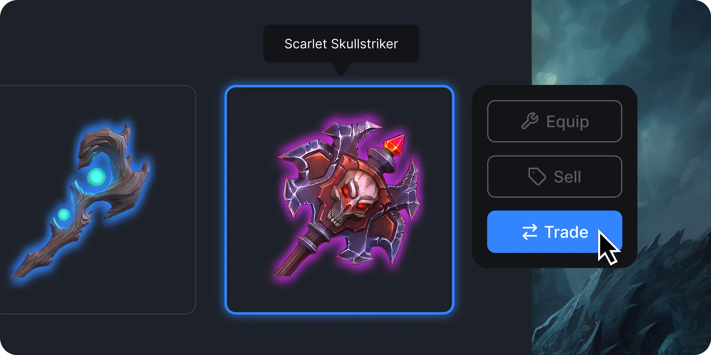

import QuickstartCard from "@components/QuickstartCard";

# Overview

thirdweb has tools that let you easily build web3 games for any platform - Browser, Native Desktop, Mobile, Console, and VR. 

## Features

- **Seamless onboarding**: Allow users to login with their wallets, email, social logins, usernames, passkeys, or build completely invisible login experiences.
- **Cross-platform support**. Build games on Unity, WebGL, or Unreal Engine.
- **Account abstraction support**. Easily integrate ERC-4337 compatible smart accounts into your games, enabling seamless user experiences and interoperability
- **Support for any EVM network.** thirdweb’s tools with any EVM-compatible network, allowing you to build games on the latest L2 chains
- **Customizable**. Our products let you control all aspects of the user experience. For example, you can our tools to bring your own authentication system and spin up in-game embedded wallets for users.
- **All-inclusive**. Our solutions come with prefabs, RPCs, Account abstraction infra (bundler and paymaster), fiat ramps, and storage out of the box. You get everything you need to build great games

## Check Out Our Demos

- [Speed Racer](https://github.com/thirdweb-example/unreal_demo)
- [Cat Attack](https://catattack.thirdweb.com/)
- [Web3 Warriors](https://web3warriors.thirdweb.com/)

### Full reference

  

    <QuickstartCard
      name="Unity"
      link="/unity"
      image="/assets/languages/unity.webp"
    />
  

    

    <QuickstartCard
      name="Unreal Engine"
      link="/gaming/unreal-engine"
      image="/assets/languages/unreal.jpg"
    />
  

