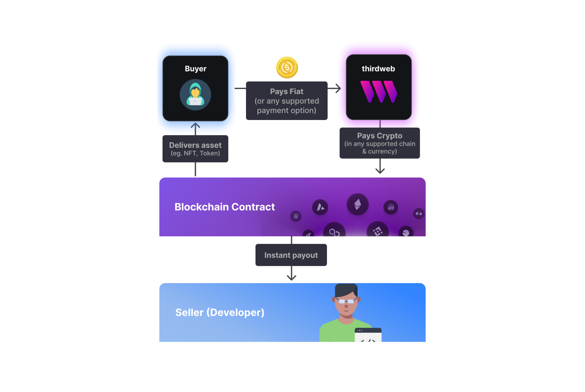

Checkouts delivers the easiest NFT payments experience for you and your buyers. Sell NFTs on any one of our supported EVM chains and allow your users to pay with
any supported payment option. You and your buyers can expect instant payouts and instant NFT processing - all done through your smart contract.

### Payment options for buyers

| Payment Type | Supported Options                           |
| :----------- | :------------------------------------------ |
| Fiat         | Credit & Debit Cards, Apple Pay, Google Pay |
| Crypto       | ETH                                         |

Card and other fiat payments are accepted from all 50 US states and US-sanctioned countries.

### Supported chains and currencies

| Blockchain (Mainnet) | Supported Currencies            |
| :------------------- | :------------------------------ |
| Arbitrum Nova        | ETH                             |
| Arbitrum One         | ETH, USDC.e\*                   |
| Avalanche            | AVAX, USDC.e\*                  |
| Ethereum             | ETH, USDC\*                     |
| Optimism             | ETH, USDC\*                     |
| Polygon              | MATIC, USDC\*, USDC.e\*, WETH\* |
| Zora                 | ETH                             |

###

| Blockchain (Testnet) | Supported Currencies |
| :------------------- | :------------------- |
| Arbitrum Sepolia     | ETH                  |
| Avalanche Fuji       | AVAX                 |
| Base Goerli          | ETH                  |
| Goerli               | ETH, USDC            |
| Mumbai               | MATIC, USDC          |
| Optimism Goerli      | ETH                  |
| Sepolia              | ETH                  |
| Zora Testnet         | ETH                  |

\* - ERC-20 tokens are available for pro or enterprise customers only.

### Fraud prevention & chargeback protection

thirdweb deters bots and fraudulent activity by using multiple data points about the buyer's device, network, behavior, payment, and more. Only high-risk buyers will need to verify their identity with an ID and selfie.

We protect you from these concerns by offering **full chargeback protection.**

### Reliable NFT Delivery

thirdweb manages a fleet of funded crypto wallets to handle blockchain transactions at scale. Queues are automated to monitor for stuck transactions, failed on-chain calls, and low funds.

### Conversion-optimized UX

Our checkout flow accounts for many cases to provide buyers a seamless experience with minimal steps:

- Does the buyer need a crypto wallet or do they already have one?
- Do they exhibit bot-like or suspicious behavior?
- Do they have enough tokens to mint directly from their wallet?
- Is your user trying to purchase more than one NFT?
- Is your user allowlisted to purchase?
- Are there enough NFTs remaining to purchase?

### Webhooks & custom metadata

Configure webhooks to notify your backend when payments and transfers are completed. Webhooks allow you to unlock NFT-gated utilities, send customized emails, and more.

Provide custom metadata to tag purchases with added information.

### Analytics

View purchases to your checkouts including breakdowns by payment method and wallet. Export your data with additional details including buyer location, transaction hash, conversion rate, and custom metadata.

Get visibility into failed transactions to speed up debugging and resolve support questions.
