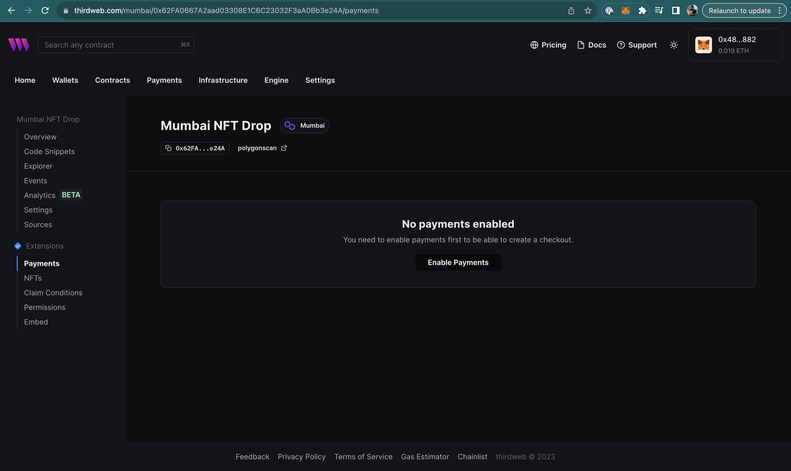

Enabling your contract for Payments is required to unlock Checkouts functionality. This can be done on the thirdweb dashboard or with the Payments API.

## Prerequisites

Before you start, ensure your contract is set up properly for Checkouts.

- Using a thirdweb contract? [Ensure your contract is configured properly](thirdweb-contracts).
- Using your own NFT contract? [Ensure your custom contract is compatible](custom-contracts).
- Selling a token listed on a secondary marketplace? [Visit the marketplaces guide](marketplaces).

## Enable a contract for Payments

### Dashboard

1. Navigate into your contract from the [Contracts > Deploy dashboard page](https://thirdweb.com/dashboard/contracts/deploy).
2. Navigate to the "Payments" page from the sidebar.
3. Click the "Enable Payments" button
   

### API

[See the API Reference for enabling contracts for Payments](https://redocly.github.io/redoc/?url=https://payments.thirdweb.com/api/doc#tag/Contracts/paths/~1api~12022-08-12~1register-contract/post)
