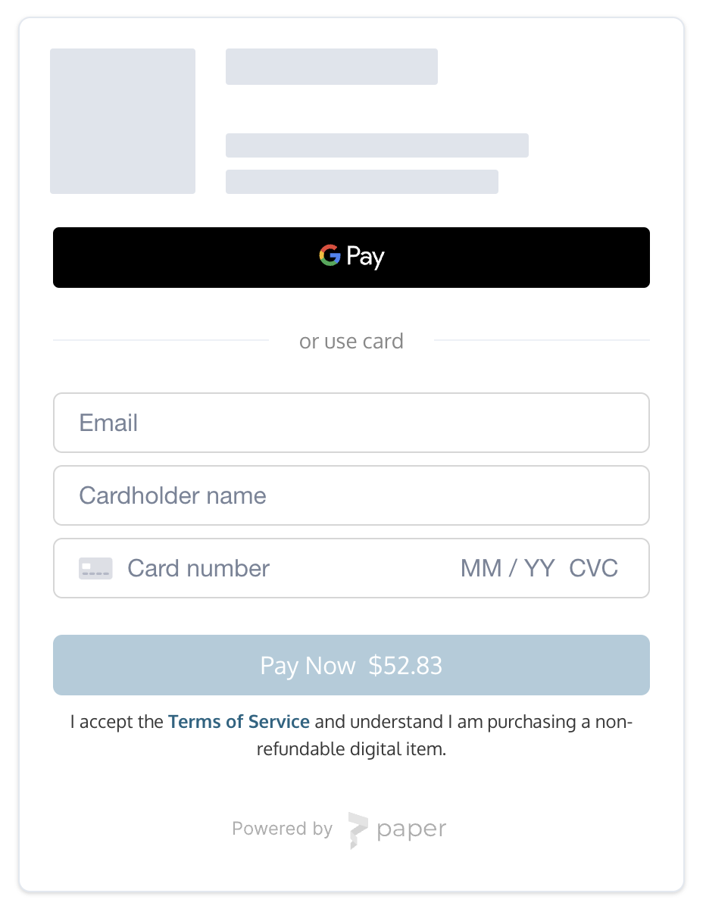
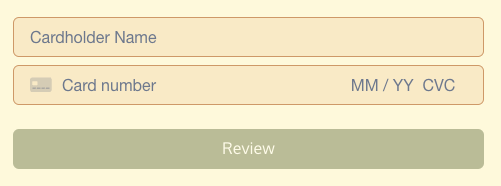

The **CheckoutWithCard** element embeds a form on your app that accepts credit/debit card, Apple Pay, and Google Pay.

This component also handles:

- Apple Pay and Google Pay
- Bot and anti-fraud detection
- 3D Secure (if necessary)
- Buyer KYC (if necessary)

## Demo

> 👍 <a href="https://payments.thirdweb.com/sdk/2022-08-12/examples/checkout-with-card" target="_blank">Try a demo!</a>



## React Integration

1. Install the React SDK ([Install guide](/react/getting-started)):
   ```Text npm
   npm install @thirdweb-dev/react
   ```
   ```Text yarn
   yarn add @thirdweb-dev/react
   ```
2. On your frontend, render the `CheckoutWithCard` component with your configs.

### Example code

```typescript
import { CheckoutWithCard } from "@thirdweb-dev/react";

<CheckoutWithCard
  clientId="YOUR_CLIENT_ID"
  configs={{
    // Registered contract ID
    contractId: "YOUR_CONTRACT_ID",
    // Buyer wallet address
    walletAddress: "0x...",
    // Mint method (for custom contracts only)
    mintMethod: {
      name: "claimTo",
      args: {
        _to: "$WALLET",
        _quantity: "$QUANTITY",
        _tokenId: 0,
      },
      payment: {
        value: "0.1 * $QUANTITY",
        currency: "ETH",
      },
    },
    // contractArgs (for prebuilt contracts)
    contractArgs: {
      tokenId: 0,
    },
  }}
  onPaymentSuccess={(result) => {
    console.log("Payment successful:", result);
  }}
/>
```

### `CheckoutWithCard` props

| Name                    | Type                                                                                                                            | Description                                                                                                                                                                                                                    |
| ----------------------- | ------------------------------------------------------------------------------------------------------------------------------- | ------------------------------------------------------------------------------------------------------------------------------------------------------------------------------------------------------------------------------ |
| clientId **\***         | string                                                                                                                          | thirdweb client ID (Obtained from an API key which you can generate on the [Dashboard](https://thirdweb.com/dashboard))                                                                                                        |
| configs **\***          | object                                                                                                                          | A list of configs to create your card checkout element. Fields correspond to those in the [Create Checkout Elements Client Secret](https://docs.withpaper.com/reference/create-checkout-elements-client-secret) API.           |
|                         |                                                                                                                                 | **Additional Contract Resources:**                                                                                                                                                                                             |
|                         |                                                                                                                                 | - _Custom Contracts:_ Refer to [Custom Contracts Guide](/checkouts/custom-contracts) for integration details.                                                                                                                  |
|                         |                                                                                                                                 | - _Pre-built Contracts:_ For using pre-built contracts, see [Pre-built Contracts Information](/checkouts/pre-built-contracts).                                                                                                 |
| onPaymentSuccess **\*** | ({ transactionId: string; }) => void                                                                                            | This method is called after the payment has been submitted for processing. This payment may still be rejected by the cardholder's bank.                                                                                        |
| onError                 | (PaymentsSDKError) => void                                                                                                      | This method is called when an error is encountered.                                                                                                                                                                            |
| onPriceUpdate           | ({ quantity: number; unitPrice: PriceDetail; networkFees: PriceDetail; serviceFees: PriceDetail; total: PriceDetail; }) => void | This method is called when the price is updated or loaded for the first time. This summary is helpful to show a granular price breakdown. Where PriceDetail is { display: string; valueInSubunits: number; currency: string; } |
| locale                  | enum Valid values: `en`, `fr`, `es`, `it`, `de`, `ja`, `ko`, `zh`                                                               | The language to show text in. Defaults to `en`.                                                                                                                                                                                |
| options                 | object                                                                                                                          | Customize component styling. See [Customization](#customization).                                                                                                                                                              |

## Javascript Integration

1. Install the Javascript SDK:
   ```Text npm
   npm install @thirdweb-dev/payments
   ```
   ```Text yarn
   yarn add @thirdweb-dev/payments
   ```
2. Call `createCheckoutWithCardElement` with `configs` to insert the iframe on your page into a new or existing element.
   1. If you don't provide `elementOrId`, this call returns an iframe element for you to insert into your page.

### Example code

```typescript
import { createCheckoutWithCardElement } from "@thirdweb-dev/payments";

// Assume a container exists:
//
//		<div id="paper-checkout-container" width="380px" />
//
createCheckoutWithCardElement({
  clientId: "YOUR_CLIENT_ID",
  configs: {
    contractId: "YOUR_CONTRACT_ID",
    walletAddress: "0x...",
    // Mint method (for custom contracts only)
    mintMethod: {
      name: "claimTo",
      args: {
        _to: "$WALLET",
        _quantity: "$QUANTITY",
        _tokenId: 0,
      },
      payment: {
        value: "0.1 * $QUANTITY",
        currency: "ETH",
      },
    },
    // contractArgs (for prebuilt contracts)
    contractArgs: {
      tokenId: 0,
    },
  },
  elementOrId: "paper-checkout-container",
  appName: "My Web3 App",
  options: {
    colorPrimary: "#cf3781",
  },
  onError(error) {
    console.error("Payment error:", error);
  },
  onPaymentSuccess({ id }) {
    console.log("Payment successful.");
  },
});

// Alternatively, insert the iframe programmatically:
//
//		const iframe = createCheckoutWithCardElement(...)
//		document.getElementById('paper-checkout-container').appendChild(iframe);
```

### `createCheckoutWithCardElement` Parameters

| Name             | Type                                                                | Description                                                                                                                                                                                                          |
| ---------------- | ------------------------------------------------------------------- | -------------------------------------------------------------------------------------------------------------------------------------------------------------------------------------------------------------------- |
| clientId **\***  | string                                                              | thirdweb client ID (Obtained from an API key which you can generate on the [Dashboard](https://thirdweb.com/dashboard))                                                                                              |
| configs **\***   | object                                                              | A list of configs to create your card checkout element. Fields correspond to those in the [Create Checkout Elements Client Secret](https://docs.withpaper.com/reference/create-checkout-elements-client-secret) API. |
|                  |                                                                     | **Additional Contract Resources:**                                                                                                                                                                                   |
|                  |                                                                     | - _Custom Contracts:_ Refer to [Custom Contracts Guide](/checkouts/custom-contracts) for integration details.                                                                                                        |
|                  |                                                                     | - _Pre-built Contracts:_ For using pre-built contracts, see [Pre-built Contracts Information](/checkouts/pre-built-contracts).                                                                                       |
| elementOrId      | string \| HTMLElement                                               | If provided, the iframe will be appended to this element. You can pass in the DOM element or the `id` associated with the element. A minimum width of 380px is recommended.                                          |
| appName          | string                                                              | If provided, the wallet card will display your `appName`.                                                                                                                                                            |
| locale           | enum (Valid values: `en`, `fr`, `es`, `it`, `de`, `ja`, `ko`, `zh`) | The language to show text in. Defaults to `en`.                                                                                                                                                                      |
| options          | object                                                              | Customize component styling. See [Customization](#customization).                                                                                                                                                    |
| onLoad           | () => void                                                          | This method is called when the iframe loads.                                                                                                                                                                         |
| onError          | (error: PaymentsSDKError) => void                                   | This method is called when an error occurs during the payment process.                                                                                                                                               |
| onPaymentSuccess | (props: { transactionId: string }) => void                          | This method is called when the buyer has successfully paid.                                                                                                                                                          |
| onReview         | (props: { cardholderName: string, id: string }) => void             | This method is called after the user enters their card details.                                                                                                                                                      |

## Customization

The optional `options` argument allows you to customize the component's styling. All customization fields are optional.

#### `options` object

| Name                 | Type                                                                                | Description                                     |
| -------------------- | ----------------------------------------------------------------------------------- | ----------------------------------------------- |
| colorPrimary         | string (In hex, e.g. #cf3781)                                                       | The primary brand color for buttons and links.  |
| colorBackground      | string (In hex, e.g. #cf3781)                                                       | The background color of the page.               |
| colorText            | string (In hex, e.g. #cf3781)                                                       | The color for text on the page and UI elements. |
| borderRadius         | number (In px, e.g. 0 for sharp corners, 12 for rounded corners, 24 for pill shape) | The roundness of buttons and input elements.    |
| inputBorderColor     | string (In hex, e.g. #cf3781)                                                       | The border color of the input field.            |
| inputBackgroundColor | string (In hex, e.g. #cf3781)                                                       | The background color of the input field.        |

#### Examples

Here's an example component with the following `options` arguments:

```javascript
{
	colorBackground: '#fefae0',
	colorPrimary: '#606c38',
	colorText: '#283618',
	borderRadius: 6,
	inputBackgroundColor: '#faedcd',
	inputBorderColor: '#d4a373',
}
```



## Important Notes

### How do I prevent the 3D Secure or KYC modal from popping up behind my other frontend components?

The SDK uses a z-index of `10000` for these modals. If they are appearing behind other components, please lower your other components' z-index values.
