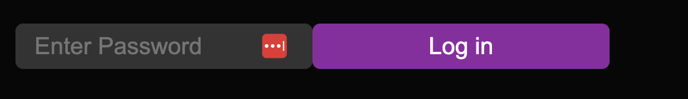

# Using Smart Wallet in React

By using the [wallet SDK](/wallet/smart-wallet) alongside the [React SDK](/react), you can use smart wallets in your front-end applications easily.

In react, there are two ways to get started with smart wallets:

- Using the [`ConnectWallet`](#using-connectwallet) component - an out of the box UI to connect your users with any wallet including smart wallet.
- Using the [`useConnect` hook](#using-useconnect) to create a custom UI.

## Pre-requisites

- [Node.js](https://nodejs.org/en/) installed.
- [Yarn](https://yarnpkg.com/) or [npm](https://www.npmjs.com/) installed.

## 1. Deploy an Account Factory

First, you need to deploy an account factory. This is a contract that will be used to issue smart wallets.

There are two ways to deploy an account factory:

- Deploy a pre-built account factory from the [explore page](https://thirdweb.com/explore).
- Deploy a custom account factory using the [Solidity SDK](/solidity).

### 1.(a) Deploy a Pre-Built Contract

You can deploy a pre-built account factory from the [explore page](https://thirdweb.com/explore).
Head to the [Account Factory](https://thirdweb.com/thirdweb.eth/AccountFactory) contract page, Select your desired network and click on Deploy Now:


Alternatively, you can deploy [ManagedAccountFactory](https://thirdweb.com/thirdweb.eth/ManagedAccountFactory) or [DynamicAccountFactory](https://thirdweb.com/thirdweb.eth/DynamicAccountFactory) to create upgradable wallets.

Learn more about the different account factories [here](/solidity/base-contracts/smart-accounts).

### 1.(b) Deploy a Custom Contract

You can also create a custom account factory by using the Solidity SDK and inheriting from one of the [base factory contracts](/solidity/base-contracts/smart-accounts).
This is useful if you want to create a custom account factory with custom logic.

For example:

```solidity
import "@thirdweb-dev/contracts/smart-wallet/non-upgradable/AccountFactory.sol";

contract MyAccountFactory is AccountFactory {
      constructor(
        IEntryPoint _entrypoint
    )
        AccountFactory(
            _entrypoint
        )
    {}

    function createAccount(
        address _owner,
        address _account,
        bytes calldata _data
    ) external override returns (address) {
        // custom logic here
    }
}
```

You can then deploy this contract using the CLI:

```bash
npx thirdweb deploy
```

This command will require you to [login](/cli/login) with your thirdweb account.

Once the `AccountFactory` contract is deployed, you will be redirected to the deployed contract dashboard page.
Copy the address for this contract.

## 2. Create an API key

To use the smart wallet bundler and paymaster you need to create an API key and a billing account.

To create an API Key:

- Head to the settings page in the dashboard and click the **API Keys** tab.
- Click on **Create API Key**:


- Give your API key a name and click **Next**.
- Make sure that the **Smart Wallets** services are enabled and any addresses that your deployed smart accounts interact with are added to the **Allowed Contract Addresses** section:


- Click **Next** and then ignore the **Set Access Restrictions** section. If you are using the smart wallet as part of a client side application,
  you will need to add the domains/ bundle IDs of your application here but since we will be writing a script, we do not need this. Click "Create" to create your key.
- Copy your **Secret Key** and store it in a safe place such as a password manager. You will not be able to see this key again.
- Click **I Have Stored the Secret Key Securely** and your key will now be visible from the API Keys table.
- **Note**: to edit your private key at any point, click on the key from the table and then click on the **Edit** button.

In order to use smart wallets on mainnet you will also need to [create an account and add a paymet method](https://thirdweb.com/dashboard/settings/billing).

## 3. Create an App

To use smart wallets in a react app, we are going to setup our project using the CLI [create](/cli/create) command.
Open your terminal and run:

```bash
npx thirdweb create app
```

When promted, select/input the following options:

- A name for the project
- `EVM` as the blockchain
- `Vite` as the environment
- `TypeScript` as the language

This will create a repository. Open this in your code editor.

You will firsty need to pass the `clientId` we created earlier to the `ThirdwebProvider`.
The template already comes with the client ID so you can create a new `.env` file and
add the `clientId`:

```bash
VITE_TEMPLATE_CLIENT_ID="YOUR_CLIENT_ID"
```

Open main.tsx and change the `activeChain` variable to the chain that you deployed your contract to.
In this case, it is Mumbai:

```tsx
// This is the chainId your dApp will work on.
const activeChain = "mumbai";
```

Now, let's set up our configuration for the smart wallet. In `main.tsx` add the following:

```tsx
export const smartWalletConfig = smartWallet({
  factoryAddress: "your-factory-address",
  gasless: true,
  personalWallets: [localWallet()],
});
```

You can change the configuration based on your requirements,
but for this demo, we will enable gasless transactions and use a local wallet as the personal wallet.
You can learn more about the configuration [here](https://portal.thirdweb.com/react/react.smartwallet).

Finally, pass the configuration to the provider:

```tsx
<ThirdwebProvider
  clientId={import.meta.env.VITE_TEMPLATE_CLIENT_ID}
  activeChain={activeChain}
  supportedWallets={[smartWalletConfig]}
>
  <App />
</ThirdwebProvider>
```

## Using ConnectWallet

To use the pre-build UI component to connect your users to your app using smart wallet, import the `ConnectWallet` component from the React package and add it to your app:

```tsx
import { ConnectWallet } from "@thirdweb/react";

function App() {
  return (
    <div className="App">
      <ConnectWallet />
    </div>
  );
}
```

Since we already added Smart Wallet as a supported wallet, it will automatically be used in the `ConnectWallet` component to connect users to your app.
Clicking on the connect button will show a popup:


You can now create a new wallet with a password or import a previously created wallet. This will create a smart wallet for you and connect it to the application


## Using useConnect

Now let's create our own UI using the `useConnect` hook.
Create a new file `connect.tsx` inside a `components` folder for us to add the code for our custom component
and add the following:

```tsx
export const ConnectComponent = () => {
  return <></>;
};
```

Firstly, we will use the `useAddress` hook to get the address of the connected wallet and check if the user is connected:

```tsx
export const ConnectComponent = () => {
  const address = useAddress();
  return address ? (
    <h3>
      Connected as:
      <br /> <a
        href={`https://thirdweb.com/${activeChain.chainId}/${address}/account`}
        target="_blank"
      >
        {address}
      </a>
    </h3>
  ) : (
    <></>
  );
};
```

Here, we are checking if there is an address and then rendering the address with a link; otherwise, it returns a fragment.
Now, let's create the logic of connecting the wallet using a custom UI.

```tsx
const [password, setPassword] = useState("");
```

If the address isn't present we can now show an input and button log in. Inside the fragment, add the following:

```tsx
<>
  <input
    className="input"
    type="password"
    placeholder="Enter Password"
    onChange={(e) => setPassword(e.target.value)}
  />
  <button className="button" onClick={loadLocalWalletAndConnect}>
    Log in
  </button>
</>
```

As you can see, we are missing the `loadLocalWalletAndConnect` function, so let's create that:

```tsx
const loadLocalWalletAndConnect = async () => {
  if (!password) {
    alert("Please enter a password");
    return;
  }
  try {
    const personalWallet = new LocalWallet({
      chain: Mumbai,
    });
    await personalWallet.loadOrCreate({
      strategy: "encryptedJson",
      password: password,
    });
    await connect(smartWalletConfig, {
      personalWallet: personalWallet,
    });
  } catch (e) {
    alert((e as any).message);
  }
};
```

This creates an instance of a `LocalWallet` class and uses the `loadOrCreate` function to get the wallet, and finally connects the wallet using the `useConnect` hook.

```tsx
const connect = useConnect();
```

The final code should look like this:

```tsx
import { Goerli } from "@thirdweb-dev/chains";
import { useAddress, useConnect } from "@thirdweb-dev/react";
import { LocalWallet } from "@thirdweb-dev/wallets";
import { activeChain, smartWalletConfig } from "../main";
import { useState } from "react";

export const ConnectCompoenent = () => {
  const connect = useConnect();
  const address = useAddress();
  const [password, setPassword] = useState("");
  const [error, setError] = useState("");

  const loadLocalWalletAndConnect = async () => {
    if (!password) {
      setError("Please enter a password");
      return;
    }
    setError("");
    try {
      const personalWallet = new LocalWallet({
        chain: Goerli,
      });
      await personalWallet.loadOrCreate({
        strategy: "encryptedJson",
        password: password,
      });
      await connect(smartWalletConfig, {
        personalWallet: personalWallet,
      });
    } catch (e) {
      setError((e as any).message);
    }
  };

  return address ? (
    <h3>
      Connected as:
      <br /> <a
        href={`https://thirdweb.com/${activeChain.chainId}/${address}/account`}
        target="_blank"
      >
        {address}
      </a>
    </h3>
  ) : (
    <>
      <input
        className="input"
        type="password"
        placeholder="Enter Password"
        onChange={(e) => setPassword(e.target.value)}
      />
      <br />
      <br />
      <button className="button" onClick={loadLocalWalletAndConnect}>
        Log in
      </button>
      <p style={{ color: "red" }}>{error}</p>
    </>
  );
};
```

You can now go ahead and add this component to your `App.tsx` file!

On your homesecreen you will see an input like this:



Go ahead and fill in your password, and you will see that it shows the address of your smart wallet that has been created!


And that's it!

## Conclusion

In this guide, we learned how to connect users to a React app using two methods:

- With a pre-built UI component
- With a custom UI component

Take a look at the [GitHub Repository](https://github.com/thirdweb-example/smart-wallet-react) for the full source code!
