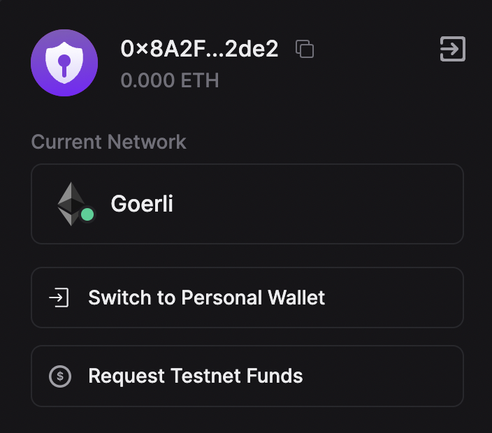

import QuickstartCard from "@components/QuickstartCard";

# Using Smart Wallet in React

By using the [wallet SDK](/wallet/smart-wallet) alongside the [React SDK](/react), you can use smart wallets in your front-end applications easily.

In react, there are three ways to get started with smart wallets:

- Using the [`ConnectWallet`](#using-connectwallet) component - an out-of-the-box UI to connect your users with any wallet including smart wallet. This uses the Wallet SDK under the hood.
- Using the [`useConnect` hook](#using-useconnect) to connect users and create a custom UI.
- Using the [`Wallet SDK`](#using-thirdwebsdkprovider) directly for low level control over the smart wallet.

## Pre-requisites

- [Node.js](https://nodejs.org/en/) installed.
- [Yarn](https://yarnpkg.com/) or [npm](https://www.npmjs.com/) installed.

## 1. Deploy an Account Factory

Deployable via the [explore page](https://thirdweb.com/explore/smart-wallet) or build your own [ERC 4337](https://eips.ethereum.org/EIPS/eip-4337) compatible factory contract using the [Solidity SDK](/solidity/base-contracts/smart-accounts).

Choose the right smart wallet setup for your app. thirdweb offers the following three different kinds of smart wallets:

<div className="row" style={{ marginBottom: 12, padding: 8, paddingTop: 0 }}>
  <div className="col col--4" style={{ padding: 8 }}>
    <QuickstartCard
      name="Account Factory"
      link="https://thirdweb.com/thirdweb.eth/AccountFactory"
      image="/assets/wallets/smart-wallet.svg"
    />
  </div>
  <div className="col col--4" style={{ padding: 8 }}>
    <QuickstartCard
      name="Managed Account Factory"
      link="https://thirdweb.com/thirdweb.eth/ManagedAccountFactory"
      image="/assets/wallets/smart-wallet.svg"
    />
  </div>
  <div className="col col--4" style={{ padding: 8 }}>
    <QuickstartCard
      name="Dynamic Account Factory"
      link="https://thirdweb.com/thirdweb.eth/DynamicAccountFactory"
      image="/assets/wallets/smart-wallet.svg"
    />
  </div>
</div>

## 2. Create an API key

To use the smart wallet bundler and paymaster, you must create an API key and a billing account.

To create an API Key:

- Head to the settings page in the dashboard and click the **API Keys** tab.
- Click on **Create API Key**:


- Give your API key a name and click **Next**.
- Make sure that the **Smart Wallets** services are enabled, and any addresses that your deployed smart accounts interact with are added to the **Allowed Contract Addresses** section:


- Click **Next** and then add your local host and production/preview domains to the **Set Access Restrictions** section. Click "Create" to create your key.
- Copy your **Secret Key** and store it in a safe place like a password manager. You will not be able to see this key again.
- Click **I Have Stored the Secret Key Securely** and your key will now be visible from the API Keys table.
- **Note**: to edit your private key at any point, click on the key from the table and then click on the **Edit** button.
- Copy your **clientId**. Since we are building a front-end application, we will need to use this key to build our application.

To use smart wallet infrastructure on mainnet you will also need to [create an account and add a payment method](https://thirdweb.com/dashboard/settings/billing).

## 3. Create an App

To use smart wallets in a React app you can either:

- Use the [create](/cli/create) command to create a new project with the dependencies already installed.
- Add the dependencies to an existing project.

### Create a New Project

Open your terminal and run:

```bash
npx thirdweb create app
```

When prompted, select/input the following options:

- A name for the project
- `EVM` as the blockchain
- Select your desired environment e.g. `Next.js`
- `TypeScript` or `JavaScript` as the language.

This will create a repository.

### Add Dependencies to an Existing Project

To add the dependencies to an existing project, run the following command from your terminal:

```bash
npx thirdweb install
```

This will detect the environment you are working in and install the relevant dependencies.

## 1. Using Connect Wallet

To use the [Connect Wallet](/react/react.connectwallet) component to connect your users to your app using smart wallet,
we need to pass a [`smartWallet`](/react/react.smartwallet) as a [`supportedWallet`](/react/react.thirdwebprovider#supportedwallets-optional) to the [`ThirdwebProvider`](/react/react.thirdwebprovider).

To set up our configuration for the smart wallet add the following:

```tsx
export const smartWalletConfig = smartWallet(localWallet(), {
  factoryAddress: "your-factory-address",
  gasless: true,
});
```

You can change the configuration based on your requirements,
but for this demo, we will enable **gasless transactions** and use a [local wallet](/wallet/local-wallet) as the personal wallet.
You can learn more about the configuration [here](https://portal.thirdweb.com/react/react.smartwallet).

Pass the configuration to the provider:

```tsx
<ThirdwebProvider
  clientId="<your-client-id>"
  activeChain={activeChain}
  supportedWallets={[smartWalletConfig]}
>
  <App />
</ThirdwebProvider>
```

Now, import the `ConnectWallet` component from the React package and add it to your app:

```tsx
import { ConnectWallet } from "@thirdweb/react";

function App() {
  return (
    <div className="App">
      <ConnectWallet />
    </div>
  );
}
```

Since we already added Smart Wallet as a supported wallet, it will automatically be used in the `ConnectWallet` component to connect users to your app.
Clicking on the connect button will show the following popup which allows you to create or import a local wallet.
This is the personal wallet you are using to initialize the smart wallet. For local wallet, you can create a new wallet with a password or import a previously created wallet.


After connecting your personal wallet, a smart wallet is created for you and connected to the application:



## 2. Using useConnect

The [useConnect](/react/react.useconnect) hook allows you to programmatically connect your application to the wallet. You will need to build your own UI for connecting the wallet.

```tsx
import {
  useConnect,
  smartWallet,
  localWallet,
  useCreateWalletInstance,
} from "@thirdweb-dev/react";
import { Goerli } from "@thirdweb-dev/chains";

const personalWalletConfig = localWallet();

export const smartWalletConfig = smartWallet(personalWalletConfig, {
  factoryAddress: "0xE38fAC32BbA9F1Fe700a5D7f5630236171fa87e4",
  gasless: true,
});

export function LocalSmartUseConnect() {
  const connect = useConnect();
  const createWalletInstance = useCreateWalletInstance();

  return (
    <button
      onClick={async () => {
        // 1. create wallet instance of personal wallet
        const personalWallet = createWalletInstance(personalWalletConfig);

        // in this example we are generating a new wallet,
        // but you can also import existing wallet using import() method
        // or use the saved wallet from local storage using load() method
        await personalWallet.generate(); // this is only required for localWallet(), not any other wallets

        // 2. connect personal wallet
        await personalWallet.connect({
          chainId: Goerli.chainId,
        });

        // 3. connect to smart wallet
        const wallet = await connect(smartWalletConfig, {
          personalWallet: personalWallet,
          chainId: Goerli.chainId,
        });

        console.log("connected to ", wallet);
      }}
    >
      Connect
    </button>
  );
}
```

## 3. Using ThirdwebSDKProvider

[`ThirdwebSDKProvider`](/react/react.thirdwebsdkprovider) is a lower-level provider that accepts an arbitrary wallet, as a signer, and only handles contract interactions. This means you can use the [Wallet SDK](/wallet) to programmatically connect to any wallet, and pass the connected wallet signer to this provider to execute transactions from the connected wallet.

To use this method, you will need to install the `@thirdweb-dev/wallets` package.

```tsx
import { ThirdwebSDKProvider } from "@thirdweb-dev/react";
import {
  LocalWallet,
  SmartWallet,
  type SmartWalletConfig,
  type WalletOptions,
} from "@thirdweb-dev/wallets";
import { Goerli } from "@thirdweb-dev/chains";
import type { Signer } from "ethers";
import { useState, useEffect, useRef } from "react";

function MyComponent() {
  const [signer, setSigner] = useState<Signer | undefined>(undefined);

  const config: WalletOptions<SmartWalletConfig> = {
    chain: Goerli, // the chain where your smart wallet will be or is deployed
    factoryAddress: "<your-factory-address>", // your own deployed account factory address
    clientId: "<your-client-id>", // obtained from the thirdweb dashboard
    gasless: true,
  };

  const generated = useRef(false);
  useEffect(() => {
    if (generated.current) {
      return;
    }
    generated.current = true;

    const generateWallet = async () => {
      const personalWallet = new LocalWallet({
        chain: Goerli,
      });
      await personalWallet.loadOrCreate({
        strategy: "encryptedJson",
        password: "<user-password>",
      });
      const smartWallet = new SmartWallet(config);
      await smartWallet.connect({
        personalWallet: personalWallet,
      });
      setSigner(await smartWallet.getSigner());
      console.log("signer", signer);
    };
    generateWallet();
  }, []);

  // The provider will handle maintaining the connected wallet
  // calling contracts from within the provider with the regular hooks
  // will execute on behalf of the provided wallet signer
  return (
    <ThirdwebSDKProvider
      activeChain={Goerli}
      signer={signer}
      clientId="your-client-id"
    >
      <App />
    </ThirdwebSDKProvider>
  );
}
```

## Conclusion

In this guide, we learned how to connect users to a React app using two methods:

- With the Connect Wallet component.
- With a custom UI component via the `useConnect` hook.
- Low-level control with `ThirdwebSDKProvider` and the Wallet SDK.

Take a look at the [GitHub Repository](https://github.com/thirdweb-example/smart-wallet-react) for the full source code!
