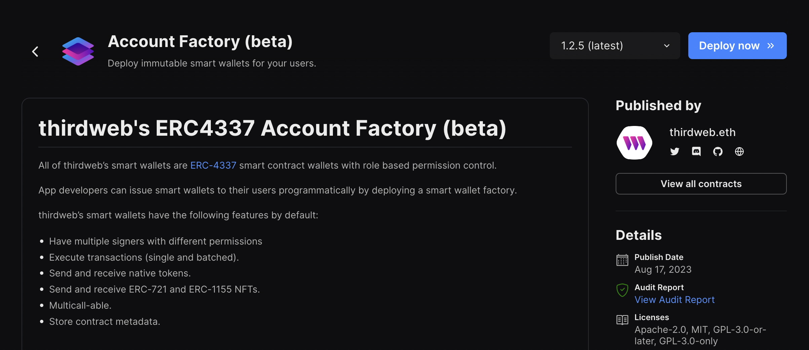

# Using Smart Wallet with the Typescript SDK

By using the [wallet SDK](/wallet/smart-wallet) alongside the [TypeScript SDK](/typescript), you can use smart wallets in your applications easily.

## Example Use Cases

The wallet SDK with the TypeScript SDK is primarily used when creating a backend for your application or when creating a node script.
In this guide, we will be using the wallet SDK to create a Node script but the logic for creating a backend is the same.

If you are working in a React environment, you are recommended to follow [this guide](/smart-wallet/guides/react).

## Prerequisites

- [Node.js](https://nodejs.org/en/) installed.
- [Yarn](https://yarnpkg.com/) or [npm](https://www.npmjs.com/) installed.

## 1. Deploy an Account Factory

First, you need to deploy an account factory. This is a contract that will be used to issue smart wallets.

There are two ways to deploy an account factory:

### 1.(a) Deploy a Pre-Built Contract

You can deploy a pre-built account factory from the [explore page](https://thirdweb.com/explore).
Head to the [Account Factory](https://thirdweb.com/thirdweb.eth/AccountFactory) contract page, Select your desired network and click on Deploy Now:



Alternatively, you can deploy [ManagedAccountFactory](https://thirdweb.com/thirdweb.eth/ManagedAccountFactory) or [DynamicAccountFactory](https://thirdweb.com/thirdweb.eth/DynamicAccountFactory) to create upgradable wallets.

**Learn more about the different account factories [here]**(/solidity/base-contracts/smart-accounts).

### 1.(b) Deploy a Custom Contract

You can also create a custom account factory by using the Solidity SDK and inheriting from one of the [base factory contracts](/solidity/base-contracts/smart-accounts).
This is useful if you want to create a custom account factory with custom logic.

For example:

```solidity
import "@thirdweb-dev/contracts/smart-wallet/non-upgradable/AccountFactory.sol";

contract MyAccountFactory is AccountFactory {
      constructor(
        IEntryPoint _entrypoint
    )
        AccountFactory(
            _entrypoint
        )
    {}

    function createAccount(
        address _owner,
        address _account,
        bytes calldata _data
    ) external override returns (address) {
        // custom logic here
    }
}
```

You can then deploy this contract using the CLI:

```bash
npx thirdweb deploy
```

This command will require you to [login](/cli/login) with your thirdweb account.

Once the `AccountFactory` contract is deployed, you will be redirected to the deployed contract dashboard page.
Copy the address for this contract.

## 2. Create an API key

To use the smart wallet bundler and paymaster you need to create an API key and a billing account.

To create an API Key:

- Head to the settings page in the dashboard and click the **API Keys** tab.
- Click on **Create API Key**:


- Give your API key a name and click **Next**.
- Make sure that the **Smart Wallets** services are enabled and any addresses that your deployed smart accounts interact with are added to the **Allowed Contract Addresses** section:


- Click **Next** and then ignore the **Set Access Restrictions** section. If you are using the smart wallet as part of a client side application,
  you will need to add the domains/ bundle IDs of your application here but since we will be writing a script, we do not need this. Click "Create" to create your key.
- Copy your **Secret Key** and store it in a safe place such as a password manager. You will not be able to see this key again.
- Click **I Have Stored the Secret Key Securely** and your key will now be visible from the API Keys table.
- **Note**: to edit your private key at any point, click on the key from the table and then click on the **Edit** button.

In order to use smart wallets on mainnet you will also need to [create an account and add a paymet method](https://thirdweb.com/dashboard/settings/billing).

## 3. Create a Node Script

### 3.(a) Using the Create Command

To use smart wallets in a node script, we are going to setup our project using the CLI [create](/cli/create) command.
Open your terminal and run:

```bash
npx thirdweb create app
```

When promted, select/input the following options:

- A name for the project
- `EVM` as the blockchain
- `Node.js` as the environment
- `TypeScript` as the language

This will create a repository. Open this in your code editor.

Open the `index.ts` file and add the following:

```typescript
import { config } from "dotenv";
import { ThirdwebSDK } from "@thirdweb-dev/sdk";
import { readFileSync } from "fs";

config();

const chain = Goerli;
const factoryAddress = "0x3c115305ecC8119D9517BB67a5B3D4073Bc9CffF";
const secretKey = process.env.THIRDWEB_SECRET_KEY as string;

const main = async () => {
  if (!secretKey) {
    throw new Error(
      "No API Key found, get one from https://thirdweb.com/dashboard",
    );
  }
  console.log("Running on", chain.slug, "with factory", factoryAddress);
};

main();
```

Here, we have added `Goerli` as the chain, pasted the factory address and the retrieved the `secretKey` from the `.env` file - make sure you paste the `secretKey` we created earlier here.

### 3.(b) Creating the Personal Wallet Key

This smart wallet is unlocked by a 'key' - a personal account.
This key can be anything from a [MetaMask wallet](/wallet/metamask) or even a [Local Wallet](/wallet/local-wallet) and is used as a way to 'sign in' to the wallet.

To create a personal wallet key, we are going to use the [Local Wallet](/wallet/local-wallet), which we need to import from the `@thirdweb-dev/wallets` package, and store it in an ecrypted JSON file.

```typescript
// Load or create personal wallet
// here we generate LocalWallet that will be stored in wallet.json
const personalWallet = new LocalWalletNode();
await personalWallet.loadOrCreate({
  strategy: "encryptedJson",
  password: "password",
});
const personalWalletAddress = await personalWallet.getAddress();
console.log("Personal wallet address:", personalWalletAddress);
```

### 3.(c) Creating the Smart Wallet

Now, let's create a smart wallet using the [SmartWallet](/wallet/smart-wallet) class from the `@thirdweb-dev/wallets` package.
To do this, we need to pass a `SmartWalletConfig` object to the constructor. This object contains the following properties:

- `chain`: the chain that the smart wallet will be deployed on.
- `factoryAddress`: the address of the account factory contract.
- `secretKey`: the secret key that we created earlier.
- `gasless`: whether the smart wallet should be gasless or not.

Once we have created the config and instantiating the `SmartWallet` class, we can connect the personal wallet to the smart wallet using the `connect` method.

```typescript
// Configure the smart wallet
const config: SmartWalletConfig = {
  chain,
  factoryAddress,
  secretKey,
  gasless: true,
};

// Connect the smart wallet
const smartWallet = new SmartWallet(config);
await smartWallet.connect({
  personalWallet,
});
```

To view all of the methods on the `SmartWallet` class, [view the Wallet SDK documentation](/wallet/smart-wallet).

### 3.(d) Instantiate the thirdweb SDK

Now that we have created a smart wallet object and connected it, we can instantiate the [thirdweb SDK](/typescript) with the smart wallet using the `fromWallet` method.

```typescript
// now use the SDK normally to perform transactions with the smart wallet
const sdk = await ThirdwebSDK.fromWallet(smartWallet, chain, {
  secretKey: secretKey,
});

console.log("Smart Account addr:", await sdk.wallet.getAddress());
console.log("balance:", (await sdk.wallet.balance()).displayValue);
```

We have also passed our `secretKey` to the SDK so that we can use the smart wallet bundler and paymaster.

We have also added some helpful logs to view the smart wallet address and balance using the associated `balance` and `getAddress` methods.

### 3.(d) Using the Smart Wallet

In order to follow this specific example, you will need the following setup:

- [Deploy a token drop contract](https://thirdweb.com/thirdweb.eth/DropERC20) deployed on Goerli.
- [Claim conditions](/dashboard/claim-conditions) set so that tokens can be claimed

Now let's use this smart wallet to claim an ERC20 token from a token drop contract!

First, we will get the contract instance of an ERC20 token drop contract using the `getContract` method.
Then, we will get the balance of the ERC20 token using the `balance` method and log it to the console.
Finally, we will claim 1 ERC20 token using the `claim` method and log the transaction hash to the console.

```typescript
// Claim a ERC20 token
const contract = await sdk.getContract(
  "0xc54414e0E2DBE7E9565B75EFdC495c7eD12D3823", // TokenDrop on goerli
);
const tokenBalance = await contract.erc20.balance();
console.log("ERC20 token balance:", tokenBalance.displayValue);
const tx = await contract.erc20.claim(1);
console.log("Claimed 1 ERC20 token, tx hash:", tx.receipt.transactionHash);
```

## 4. Run the Script

To run the script, run the following command:

```bash
yarn dev
```

Here, you will see the following output:


As you can see, upon claiming the token, the smart wallet is deployed. This is because smart account contracts are deployed when the first transaction is initiated.

We have successfully deployed a smart wallet using our factory contract and claimed an ERC20 token!
