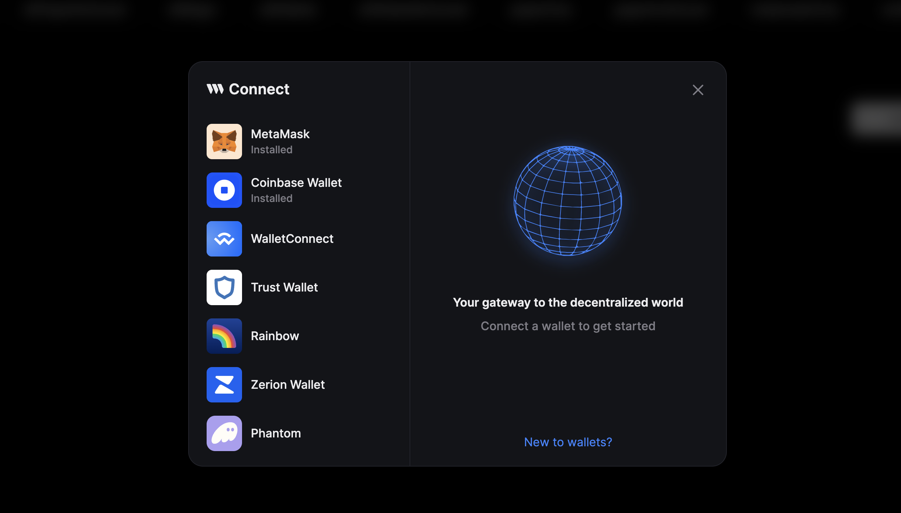
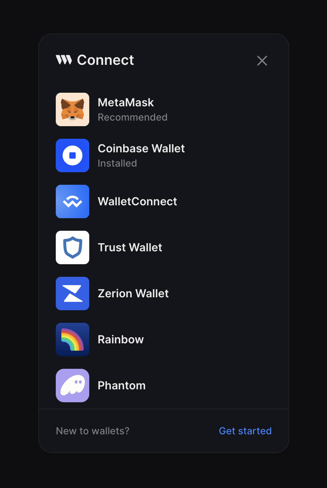

ConnectWallet modal has two sizes - "wide" and "compact"

The default is `"wide"` for desktop and `"compact"` for mobile devices

ConnectWallet Modal is always `"compact"` on mobile and the `modalSize` prop is ignored.

```tsx
import { ConnectWallet } from "@thirdweb-dev/react";

function App() {
  return (
    <ConnectWallet
      // highlight-next-line
      modalSize="wide"
    />
  );
}
```

## Wide



## Compact


