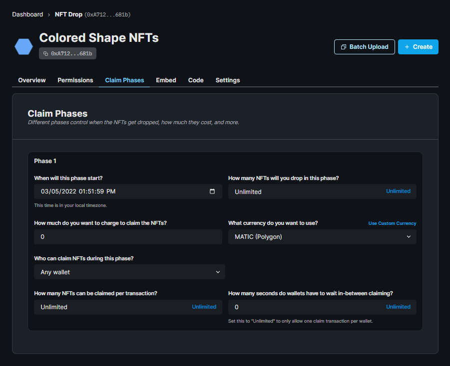

import ViewContractCodeButton from "../../../../../../src/components/ViewContractCodeButton";
import QuickstartCard from "../../../../../../src/components/QuickstartCard";
import ImportSnippet from "../../../../../../src/components/ImportSnippet";

# Drop Single Phase

The `DropSinglePhase` smart contract extension is meant to be used with any token (ERC20), or NFT (ERC721 or ERC1155) smart contract.

The ‘drop’ mechanism in the `DropSinglePhase` extension is a distribution mechanism for tokens. It lets you set ‘claim conditions’ i.e. restrictions such as a price to charge, an allowlist etc. when a wallet attempts to mint tokens on your smart contract.

<ViewContractCodeButton
  link="https://github.com/thirdweb-dev/contracts/blob/main/contracts/extension/DropSinglePhase.sol"
  name="DropSinglePhase"
/>

## Import

<ImportSnippet type="extension" category="extension" name="DropSinglePhase" />

## Available functionality

| Functionality            | Description                                                                                                                                   |
| ------------------------ | --------------------------------------------------------------------------------------------------------------------------------------------- |
| `setClaimConditions`     | Lets an authorized wallet set restrictions around the minting of tokens, such as a price to charge, or an allowlist of eligible minters, etc. |
| `claim`                  | Lets a wallet eligible to claim tokens.                                                                                                       |
| `_canSetClaimConditions` | Defines the criteria a wallet must meet to be able to set claim conditions.                                                                   |

## Implementing the Contract extension.

Import the contract extension and make your contract inherit it.

```solidity
// SPDX-License-Identifier: Apache-2.0
pragma solidity ^0.8.0;

import "@thirdweb-dev/contracts/base/ERC721LazyMint.sol";
import "@thirdweb-dev/contracts/lib/CurrencyTransferLib.sol";

import "@thirdweb-dev/contracts/extension/DropSinglePhase.sol";

/**
 *  The `DropSinglePhase` extension is meant to be used with any token or NFT contract as a base.
 *
 *  As an EXAMPLE, we'll use the extension with the `ERC721LazyMint` contract to distribute lazy minted tokens
 *  via the `claim` function made available by `DropSinglePhase`.
 */
contract MyNFT is ERC721LazyMint, DropSinglePhase {
    constructor(
        string memory _name,
        string memory _symbol,
        address _royaltyRecipient,
        uint128 _royaltyBps,
        address _primarySaleRecipient
    ) ERC721LazyMint(_name, _symbol, _royaltyRecipient, _royaltyBps) {}

    /**
     *  This function runs before every call to the `claim` function. This gives room
     *  to add any checks / restrictions around wallets claiming tokens.
     *
     *  As an EXAMPLE, we check that there are enough lazy minted tokens for the calling
     *  wallet to claim.
     */
    function _beforeClaim(
        address,
        uint256 _quantity,
        address,
        uint256,
        AllowlistProof calldata,
        bytes memory
    ) internal view override {
        require(msg.sender == tx.origin, "BOT");
        if (_currentIndex + _quantity > nextTokenIdToLazyMint) {
            revert("Not enough minted tokens");
        }
    }

    /**
     *  This function collect the price, if any, of claiming tokens, from the calling wallet.
     */
    function collectPriceOnClaim(
        uint256 _quantityToClaim,
        address _currency,
        uint256 _pricePerToken
    ) internal override(DropSinglePhase) {
        if (_pricePerToken == 0) {
            return;
        }

        uint256 totalPrice = _quantityToClaim * _pricePerToken;

        if (_currency == CurrencyTransferLib.NATIVE_TOKEN) {
            if (msg.value != totalPrice) {
                revert("Must send total price");
            }
        }

        CurrencyTransferLib.transferCurrency(
            _currency,
            msg.sender,
            owner(),
            totalPrice
        );
    }

    /**
     *  This function mints to the wallet attempting to claim them.
     */
    function transferTokensOnClaim(address _to, uint256 _quantityBeingClaimed)
        internal
        override
        returns (uint256 startTokenId)
    {
        startTokenId = _currentIndex;
        _safeMint(_to, _quantityBeingClaimed);
    }

    /**
     *  This function returns who is authorized to set claim conditions.
     *
     *  As an EXAMPLE, we'll only allow the contract's current owner to set claim conditions.
     *
     *  You MUST complete the body of this function to use the `DropSinglePhase` extension.
     */
    function _canSetClaimConditions() internal view override returns (bool) {
        return msg.sender == owner();
    }
}
```

## Unlocked Features

Once deployed, you can now:

- [Configure a claim phase](/signature-drop#setting-claim-phases)
- [Have other wallets claim/mint NFTs from your drop](/pre-built-contracts/signature-drop#minting--claiming-nfts)

### Configure a claim phase

On the dashboard, you'll be able to set the criteria under which a wallet can claim tokens from the `Claim Phases` tab:

<div className="row" style={{ marginBottom: 24, flexWrap: 'wrap' }}>
<div className="col col--12" style={{marginTop:16}} >
  <QuickstartCard
    name="Batch Uploading NFT Metadata Guide"
    link="/templates/nft-drop/lazy-minting-nfts"
    image="/assets/icons/drop.png"
  />
</div>

</div>



Within the SDK, you can pass an array of NFT metadata objects to batch lazy mint them

<div className="row" style={{ marginBottom: 24, flexWrap: 'wrap' }}>
<div className="col col--12" style={{marginTop:16}} >
  <QuickstartCard
    name="Claim Phases in the SDK"
    link="/pre-built-contracts/signature-drop#lazy-minting-your-nfts"
    image="/assets/icons/sdks.png"
  />
</div>

</div>

### Claiming NFTs

Within the SDK, you can have a wallet claim tokens from your drop or claim tokens to an address.

<div className="row" style={{ marginBottom: 24, flexWrap: "wrap" }}>
  <div className="col col--12" style={{ marginTop: 16 }}>
    <QuickstartCard
      name="Claim NFTs in the SDK"
      link="/pre-built-contracts/signature-drop#minting--claiming-nfts"
      image="/assets/icons/sdks.png"
    />
  </div>
</div>
