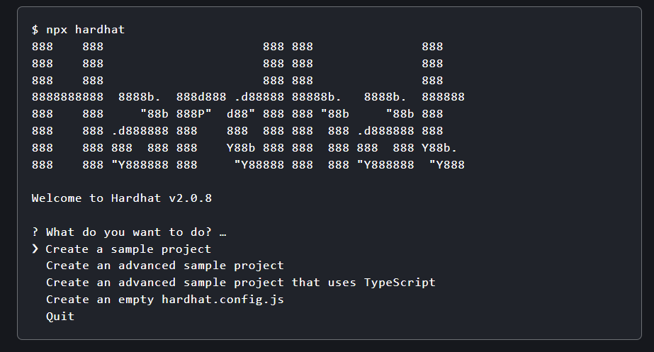
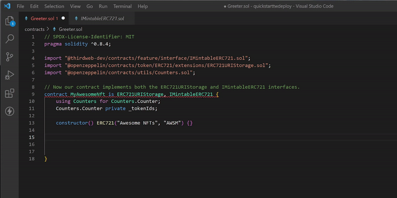
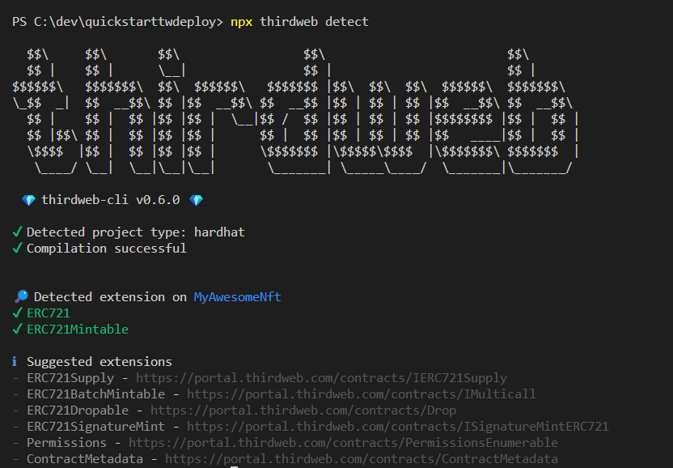
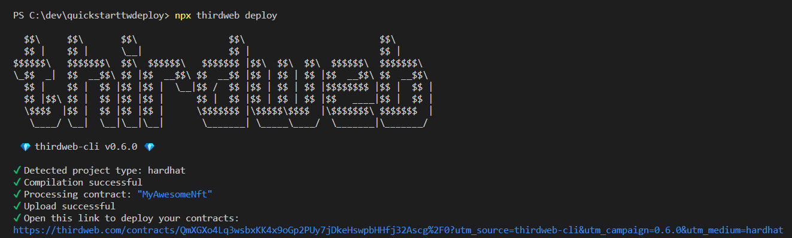
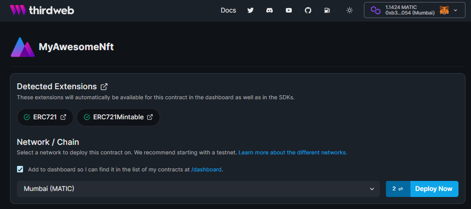
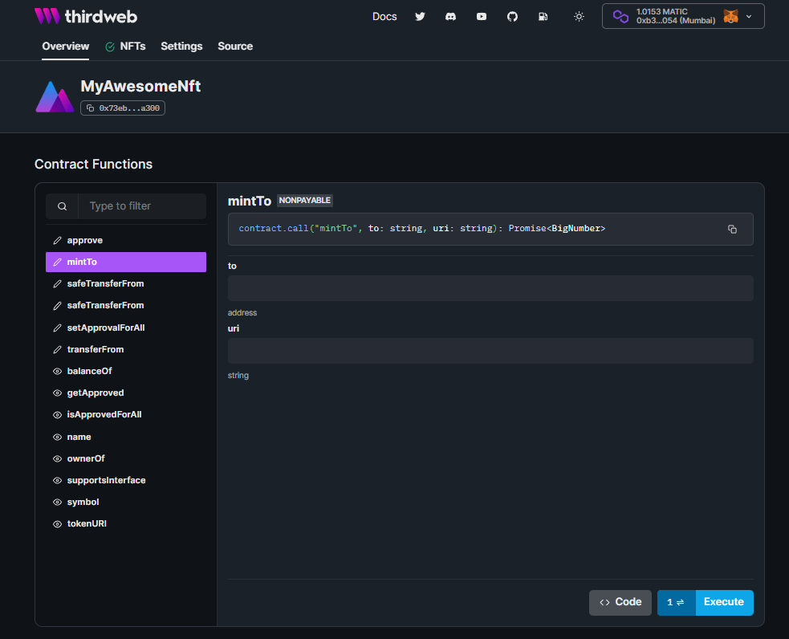
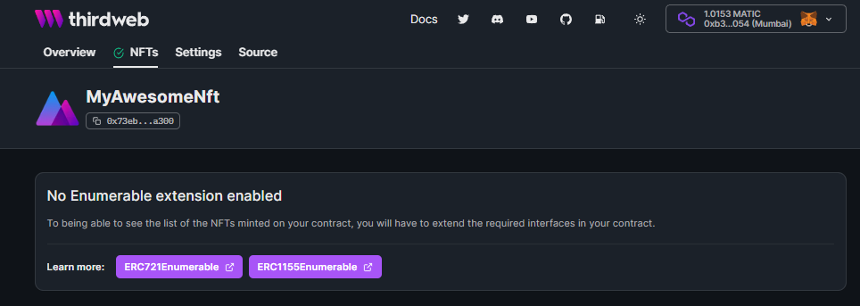
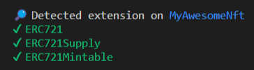

import QuickstartCard from "../../../../../src/components/QuickstartCard";

# Quick Start

Learn how to build a smart contract using contract extensions and deploy it using thirdweb deploy.

## Creating a Solidity Project

Run the `npx hardhat` command to create a basic project with a smart contract using [Hardhat](https://hardhat.org/).

```bash
npx hardhat
```

Select "Create a sample project" from the menu to get started.



:::info Project Dependencies

Hardhat will ask you to install a list of packages at this point, you can do this by running:

```bash
npm install --save-dev "hardhat@^2.6.8" "@nomiclabs/hardhat-waffle@^2.0.0" "ethereum-waffle@^3.0.0" "chai@^4.2.0" "@nomiclabs/hardhat-ethers@^2.0.0" "ethers@^5.0.0"
```

:::

Now we have a simple project with a `Greeter` smart contract, let's introduce our Solidity SDK!

## Installing the SDK

To use the SDK, install the [@thirdweb-dev/contracts package](/contracts).

```bash
npm install @thirdweb-dev/contracts
```

## Implementing a contract extension

Open the project in your text editor, and remove the existing contents of the `Greeter.sol` file.

We'll be creating our own custom ERC-721 NFT contract in this file.

Let's first import the [IMintableERC721](/thirdweb-deploy/contract-extensions/erc721#erc721mintable) contract extension.

```solidity
// SPDX-License-Identifier: MIT
pragma solidity ^0.8.4;

import "@thirdweb-dev/contracts/feature/interface/IMintableERC721.sol";
```

Next, we need our contract to implement this interface, by saying our contract `is` the `IMintableERC721` interface.

```solidity
// Here, we tell Solidity that our Awesome NFT contract implements the IMintableERC721 interface.
contract MyAwesomeNft is IMintableERC721 {

}
```

:::tip Viewing the source code

If you're using VS Code, you can `Ctrl / ⌘ + click` on `IMintableERC721` to see the functions that must be implemented to satisfy the interface!
In the gif below, you can see we need to implement the `mintTo` function.


:::

We now need to implement the `mintTo` function from the `IMintableERC721` interface.
You have total freedom over how you choose to implement this function in your contract, but let's explore an example of how you might implement it.

## Writing contract functions

For our contract, we'll implement [OpenZeppelin](https://docs.openzeppelin.com/contracts/4.x/erc721)'s `ERC721URIStorage` interface
that allows us to have NFTs with metadata, and also utilize the [Counter](https://docs.openzeppelin.com/contracts/3.x/api/utils#Counters) utility to keep track of our token IDs.

To install these, run the following command:

```bash
npm install @openzeppelin/contracts
```

Next, we'll tell Solidity that our contract is both an `ERC721URIStorage` _and_ an `IMintableERC721` contract.

```solidity
import "@thirdweb-dev/contracts/feature/interface/IMintableERC721.sol";
import "@openzeppelin/contracts/token/ERC721/extensions/ERC721URIStorage.sol";
import "@openzeppelin/contracts/utils/Counters.sol";

// Now our contract implements both the ERC721URIStorage and IMintableERC721 interfaces.
contract MyAwesomeNft is ERC721URIStorage, IMintableERC721 {

}
```

To initialize a `Counter` that starts from `0` to represent our token IDs, we can use the following code:

```solidity
contract MyAwesomeNft is ERC721URIStorage, IMintableERC721, IERC721Supply {
    // Create a new counter to represent the token ID that we can safely increment.
    using Counters for Counters.Counter;
    Counters.Counter private _tokenIds;

    // This sets the name and symbol of our NFT contract when it is created.
    constructor() ERC721("Awesome NFTs", "AWSM") {}
}
```

Now let's use the functionality provided to us from the `ERC721URIStorage` interface to write our `mintTo` function.

:::tip Function Signature

In VS Code, you can view the function signature from the `IMintableERC721` file by `Ctrl / ⌘ + click`ing on `IMintableERC721`,
pasting the `mintTo` function into our contract, and signifying we are going to `override` it.



:::

Now all that's left to do is write the `mint` logic inside this function:

```solidity
function mintTo(address to, string calldata uri) external override returns (uint256) {
    // Get the next token ID from the counter.
    uint256 newTokenId = _tokenIds.current();

    // Mint the token and set the metadata
    _mint(to, newTokenId);
    _setTokenURI(newTokenId, uri);

    // Increment the counter for next time.
    _tokenIds.increment();

    // Emit an event that the token was minted (enables listening to live events in the SDK).
    emit TokensMinted(to, newTokenId, uri);

    return newTokenId;
}
```

You just created your very own ERC-721 NFT Collection contract!

Let's see what we can do with it!

## Detecting contract extensions

The thirdweb CLI provides a command to detect the implemented contract extensions.

```bash
npx thirdweb detect
```

This command:

- Compiles your contract
- Detects the extensions you have successfully implemented
- Shows you other extensions you might want to implement _(spoilers)_!



As you can see, we have successfully implemented the `ERC721` and `ERC721Mintable` contract extensions in our contract.

Now let's go ahead and deploy it!

## Deploying contracts

Run the following command to deploy your contract:

```bash
npx thirdweb deploy
```

This command:

- Detects any contract(s) in your project
- Compiles them
- Uploads the contract ABIs and bytecode to IPFS
- Generates a deploy link for you to deploy the contract onto the blockchain - no private keys required!



Open the link in your browser, and you'll be taken to the thirdweb dashboard where you can deploy your contract.



Select the network you want to deploy to, and click `Deploy`.

Once deployed, you'll have your very own contract dashboard where you can view and **execute** all of the available functions on your contract.



From here, you can easily view, `mint`, and `transfer`, tokens from your contract!

If you select the `NFTs` tab from the menu, you will notice we can't yet view all of the NFTs minted in our contract,
because we didn't implement an `Enumerable` contract extension, such as [IERC721Supply](/thirdweb-deploy/contract-extensions/erc721#erc721enumerable)



Let's quickly go back to our contract and implement an `Enumerable` contract extension.

## Unlocking thirdweb features

Let's go through the same process again, to demonstrate the general flow of adding contract extensions to your contract.

**Import the contract extension**

```solidity
import "@thirdweb-dev/contracts/eip/interface/IERC721Supply.sol";
```

**Implement the interface**

```solidity
// Now we also implement the IERC721Supply interface.
contract MyAwesomeNft is ERC721URIStorage, IMintableERC721, IERC721Supply {
```

**Implement the required functions from the interface**

```solidity
function totalSupply() external view override returns (uint256) {
    return _tokenIds.current();
}
```

**Detect Contract Extensions**

```bash
npx thirdweb detect
```

Now we also have successfully implemented the `ERC721Supply` contract extension.



**Deploy the Contract**

```bash
npx thirdweb deploy
```

Now let's take another look at our dashboard's `NFTs` tab.

We have now enabled the following capabilities in both the SDK and the dashboard:

- View of all the NFTs in our contract
- The ability to **mint** new NFTs from the dashboard


Let's go ahead and mint an NFT by clicking the **Mint** button on the dashboard.

<div align='center'>


</div>

When we mint an NFT using the dashboard or the SDK on this contract, we get to utilize all of the special features that thirdweb enables, including:

- Automatic uploading and [pinning](/guides/securing-pinning-your-nft-with-ipfs#what-is-pinning) of metadata to IPFS
- Detection of contract events (such as `TokensMinted`)
- Live updating admin view of the contract

After the `mintTo` transaction is confirmed, you can view all of the NFTs that have been minted on the dashboard:


Within the [SDK](/building-web3-apps/setting-up-the-sdk), you can also easily utilize these features, for example:

```javascript
// Minting an NFT (includes uploading metadata to IPFS automatically)
const contract = await sdk.getContract("{{contract_address}}");
await contract.nft.mint.to(walletAddress, nftMetadata);

// Viewing all NFTs (automatically resolves the metadata from IPFS for you)
const nfts = await contract.nft.query.all();
```

Learn more about building a web3 application on top of this contract using our sandbox below:

<div className="row" style={{marginBottom:24}}>

<div className="col col--12" style={{ marginTop: 8 }}>
  <QuickstartCard
    name="Building a web3 app with your NFT Contract"
    link="https://replit.com/@thirdweb-dev/hardhat-thirdweb-deploy-contract-extensions"
    image="/assets/icons/general.svg"
  />
</div>

</div>
