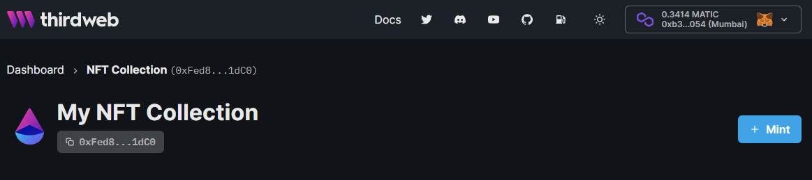

To create a contract that can mint NFTs, implement the `IMintableERC721` contract extension.

When implemented, this contract extension enables:

- The "Mint" button on the thirdweb dashboard
- The `mint` function in the thirdweb SDK
  _(which handles the uploading and pinning of the NFT metadata in IPFS automatically)_.

## How to Implement

To implement the `IMintableERC721` contract extension, set up your Solidity contract as follows:

```solidity
// SPDX-License-Identifier: MIT
pragma solidity ^0.8.4;

import "@thirdweb-dev/contracts/feature/interface/IMintableERC721.sol";

// We add the interface to the contract
contract MyCustomContract is IMintableERC721 {

    // Implement functions here
    function mintTo(address to, string calldata uri) external override returns (uint256) {

    }
}

```

## Required functions

As part of the interface contract, the following functions must be implemented.

1. `function mintTo`

### mintTo

`mintTo` is a function that mints an NFT to a given address.

Within this function, you must emit the `TokensMinted` event for it to work properly with the SDK and dashboard.

Below is an example of how you might implement `mintTo`:

```solidity
// SPDX-License-Identifier: MIT
pragma solidity ^0.8.4;

// In this example, we also use some of openzeppelin's contracts.
// You'll need to run "npm install @openzeppelin/contracts" to use these.
import "@thirdweb-dev/contracts/feature/interface/IMintableERC721.sol";
import "@openzeppelin/contracts/token/ERC721/extensions/ERC721URIStorage.sol";
import "@openzeppelin/contracts/utils/Counters.sol";

// Notice that our contract "is" IMintableERC721
contract MyAwesomeNft is ERC721URIStorage, IMintableERC721 {

    // Using our openzeppelin contract to track the total number of NFTs minted
    using Counters for Counters.Counter;
    Counters.Counter private _tokenIds;

    // This is the name and symbol of our NFT Collection contract.
    constructor() ERC721("Awesome NFTs", "AWSM") {}

    // Here is our implementation of the mintTo function override.
    function mintTo(address to, string calldata uri) external override returns (uint256) {
        // Get the next token ID
        uint256 newTokenId = _tokenIds.current();

        // Mint the token and set the token metadata
        _mint(to, newTokenId);
        _setTokenURI(newTokenId, uri); // this comes from ERC721URIStorage

        // Increment the total number of NFTs minted ready for next mint
        _tokenIds.increment();

        // Emit the TokensMinted event
        emit TokensMinted(to, newTokenId, uri);

        // Return the minted token ID
        return newTokenId;
    }
}
```

## Using Enabled SDK Features

You can now use the `.nft.mint.to()` function in the SDK on your contract to mint NFTs.

```js
const contract = await sdk.getContract("{{contract_address}}");
await contract.nft.mint.to(walletAddress, nftMetadata);
```

As well as mint NFTs via the dashboard using the "Mint" button:


